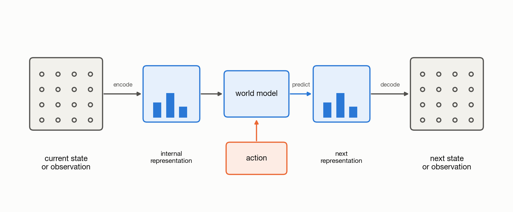

# 1.1 What Is a World Model?

A world is the bounded environment in which a system operates. For example: in a self-driving car, the world includes the road, nearby vehicles, pedestrians, traffic signals, and the car itself. For a computer-use agent, the world might be a browser, its interface, and the applications it can control. A robot, game-playing agent, or software agent each operates in a different world.

The boundary of the world depends on the system and its task.

| System | World | Observation | Action | Predicted future |
|---|---|---|---|---|
| Self-driving car | Road environment | Cameras and vehicle sensors | Steer or brake | Future traffic scene |
| Robot | Robot and workspace | Cameras and joint state | Move, push, or grasp | Future robot and object state |
| Game-playing agent | Game environment | Board state or pixels | Game move | Future game state |
| Video model | Recorded scene | Recent frames | Optional control | Future frames |
| Computer-use agent | Interface and applications | Screen or interface state | Click, type, or tool call | Updated interface state |

A world model learns how that environment changes. It uses what has already been observed, and, when relevant, an action to predict what could happen next. For example: What happens if the car brakes? If the robot moves its arm? If the computer-use agent clicks a button?

Formally, a world model learns the dynamics of an environment. Given a history of
observations and, when applicable, a sequence of actions, it predicts a
distribution over future trajectories:

$$
p_\theta(o_{t+1:t+H} \mid o_{\leq t}, a_{t:t+H-1})
$$

Here, `H` is the prediction horizon. The predicted trajectory contains the
observations from step `t + 1` through step `t + H`. A transition is the change
from one step to the next.



*Figure 1.1: Encode an observation, advance the learned state under an action,
then decode a prediction.*

## Building a Rollout

A rollout is a predicted trajectory. Some models generate the full trajectory
in one operation. Other models predict one transition at a time and use each
prediction as input to the next step.

The following pseudocode shows the second approach:

```python
def rollout(model, observation, actions):
    state = model.encode(observation)
    future = []

    for action in actions:
        state = model.step(state, action)
        future.append(model.decode(state))

    return future
```

## Generalization and Multiple Futures

Training data contains a finite set of observed transitions. A world model
learns patterns from those transitions. It uses those patterns to estimate what
may happen in states that were not recorded exactly in the training data.

A future is not always unique. The same observation and action may lead to
different outcomes. A deterministic model predicts one trajectory. A
probabilistic model represents a distribution over trajectories. Each sampled
rollout is one trajectory from that distribution.

The playground shows one predicted transition at a time. Apply each prediction
as the next observation to build a rollout. You can also compare one predicted
future with several possible futures.

[Open the transition and rollout playground in a new tab](https://nahidalam.github.io/world_model_from_scratch/interactive/chapter_01/transition_playground.html).
