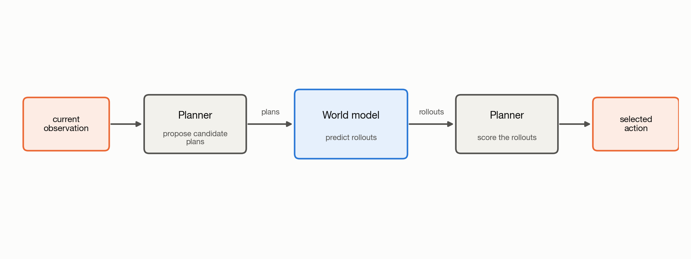
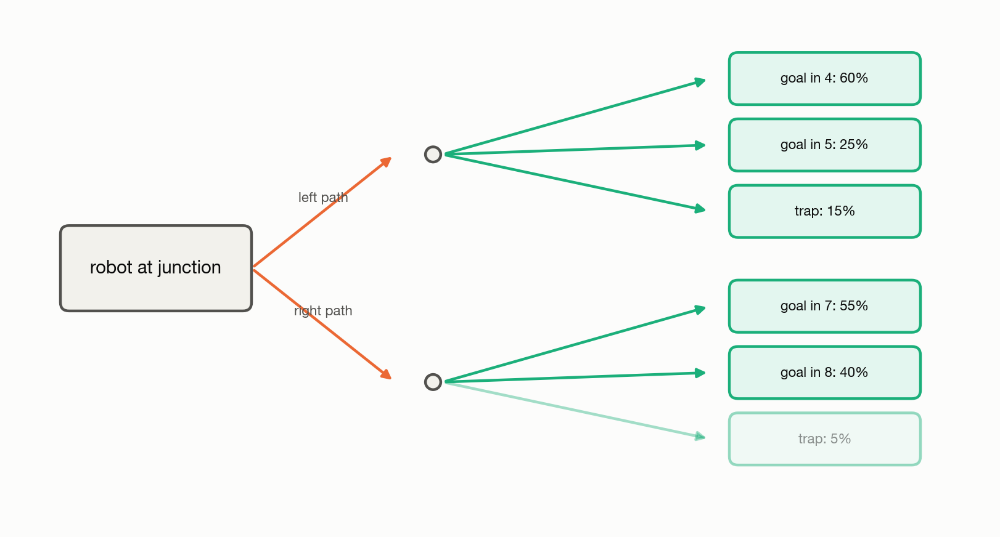

# 1.2 Why Do We Need World Models?

The value of a world model comes from looking beyond the present. It gives us a way to reason about how the world might change over time. An observation tells us what the world is like now, but choosing what to do may require knowing what could happen next.

Consider a robot at a junction. It can go left or right. Before the robot moves, the world model predicts a sequence of future positions for each path. Each predicted sequence is a rollout. The rollouts show how the two choices may develop over several steps.

## Using Rollouts to Choose an Action

To choose between the two paths, the rollouts must be compared. A planner
performs this comparison. It assigns a score to each rollout.

For the robot, the rollout that reaches the goal in four moves receives a higher
score than the rollout that requires seven moves.

The planner selects the path with the highest score and returns the first action
needed to follow it. After receiving a new observation, the process repeats.
This use of a world model is called model-based planning.



*Figure 1.2: The planner proposes candidate plans. The world model predicts a
rollout for each plan. The planner scores the rollouts and selects an action.*

The same process can be written as:

```python
def choose_action(model, observation, candidate_plans, score):
    results = []

    for plan in candidate_plans:
        future = model.rollout(observation, plan)
        results.append((score(future), plan))

    _, selected_plan = max(results, key=lambda item: item[0])
    return selected_plan[0]
```

## When One Plan Has Several Outcomes

The example above produces one rollout for each plan. A probabilistic world
model can produce several rollouts for the same plan.

For example, a robot wheel may slip. An object may move by different amounts
after a push. These differences produce a distribution of possible outcomes.

The planner can compare the average score across the sampled rollouts. It can
also measure the probability of entering a specified state.



*Figure 1.3: Each candidate plan produces a distribution of possible outcomes.
The planner evaluates the distribution for each plan.*
