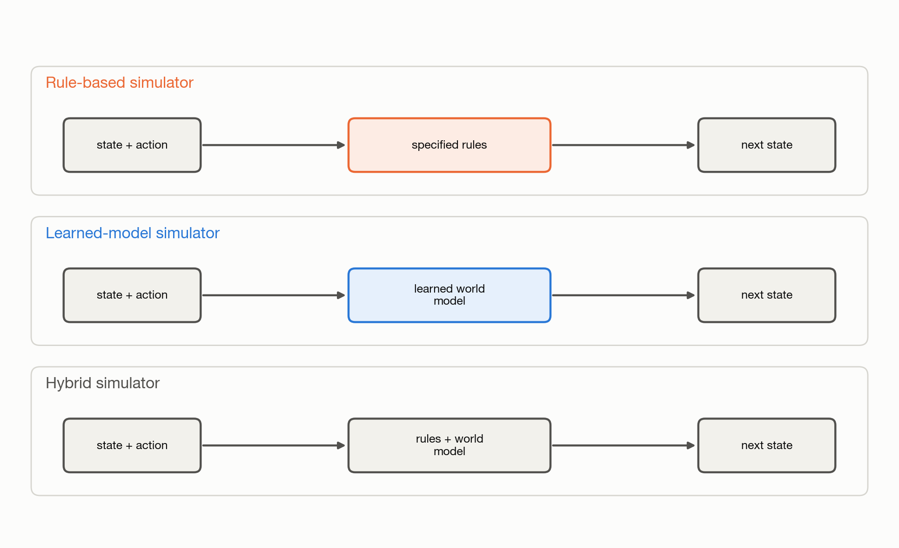

# 1.3 World Models vs. Simulators

A simulator is a program that produces changes in an environment over time. It
takes the current state and, when applicable, an action. It then produces the
next state. Each change is a transition. Repeating this process produces a
rollout.

To produce a transition, the simulator needs a description of the environment
dynamics. That description can come from specified rules, a learned world
model, or both.

A rule-based simulator uses equations or rules written in code. A learned-model
simulator uses a world model trained on recorded transitions. A hybrid
simulator combines the two.

A world model and a simulator are not opposing concepts. A world model is one
possible source of dynamics inside a simulator.

*Figure 1.4: A simulator can produce transitions using specified rules, a
learned world model, or both.*
