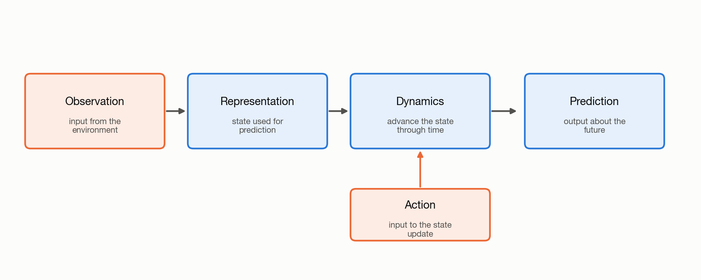

# 1.4 Components of a World Model

A world model must connect information about the present to a prediction about
the future. Conceptually, it does this in three operations: encode the present,
advance an internal state through time, and decode the result. The middle
operation is called **dynamics**.

*Figure 1.5: Dynamics is the learned state update between the representation of
the present and the prediction of the future. An action, when present, enters
this update.*

## Observations and Actions

An observation is information available from the environment at one time step.
It can be an image, a sensor vector, a text sequence, or a structured state.

A sequence of observations forms an observation history. One image can show an
object's position. A sequence can also show how its position changes.

An action is a command applied to the environment. Examples include a steering
command, a robot movement, or a mouse click. Some prediction tasks do not
include actions.

## Representation

An encoder converts the observation history into an internal state. This state
is also called a representation. It contains information used to predict what
happens next. For a moving object, that information may include its position
and motion.

## Dynamics

Environment dynamics describes how the environment changes over time. The
model approximates this process with a dynamics function placed between the
encoder and decoder:

$$
z_t = \operatorname{encode}(o_{\leq t}), \qquad
z_{t+1} \sim \operatorname{dynamics}_\theta(z_t, a_t), \qquad
\hat{o}_{t+1} = \operatorname{decode}(z_{t+1}).
$$

The function uses the current internal state $$z_t$$ and optional action $$a_t$$ to
predict the next state $$z_{t+1}$$. A one-step model repeats this update; a
sequence model may predict several future states jointly without a separate
component named `dynamics`.

## Prediction

The decoder converts the predicted internal state into an output. The output
may be the next image, the next sensor reading, or another observation.

## How the Model Generates a Rollout

Return to the self-driving-car example from Section 1.1:

1. The observation history contains recent camera frames and sensor readings.
2. The encoder represents relevant information such as vehicle motion, lane
   geometry, and nearby traffic in an internal state.
3. A proposed action, such as braking, is supplied to the dynamics update.
4. The dynamics function advances the internal state to represent what may
   happen after that action.
5. The decoder converts the future state into a predicted camera frame, sensor
   reading, or other required output.

The first future observation completes one predicted transition. Repeating the
state update and prediction produces a sequence of future observations. As
defined in Section 1.1, that predicted sequence is a **rollout**. A model may
also generate all the observations in the rollout together rather than expose
these repetitions one by one.

To make this data flow visible, the pipeline walkthrough introduces a small toy
world: a ball moving along a 12-cell line. Select Step to see exactly when the
dynamics update is used. Change the action or switch from a single next state
to several possible next states.

[Open the world-model pipeline in a new tab](https://nahidalam.github.io/world_model_from_scratch/interactive/chapter_01/pipeline_walkthrough.html).

Chapter 2 applies this pipeline using a pretrained world model. It begins by
preparing an observation and generating a rollout.
