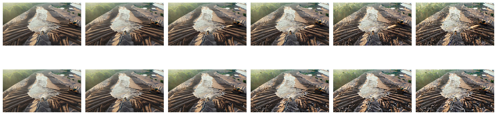

# 2.5 Generate Several Futures

Section 2.4 generated one rollout. Now we will run the model four times with the
same observation and prompt. Only the random seed changes.

## Generate Four Rollouts

If you are generating locally, use the engine from Section 2.4:

```python
futures = [
    engine.generate(
        context,
        prompt=prompt,
        seed=seed,
        num_frames=29,
        guidance_scale=7.0,
        num_inference_steps=15,
    )
    for seed in range(4)
]

future_frames = [future.frames for future in futures]
```

To run the comparison with the included rollouts instead, load their frames:

```python
from pathlib import Path

from world_models.observation import load_video

seeds_dir = Path("assets/chapter_02/seeds")
future_frames = [
    load_video(seeds_dir / f"rollout_seed{seed}.mp4").frames
    for seed in range(4)
]
```

## Compare the Samples

The rollouts begin from the same visual context but diverge as generation
continues. In this example, differences appear in the machinery, water, and
other changing parts of the scene.



*Figure 2.2: Seed 0 (top) and seed 1 (bottom), generated from the same
observation and prompt. The columns advance through each rollout.*

The explorer synchronizes all four rollouts at the same frame index.

[Open the sampled-futures view in a new tab](https://nahidalam.github.io/world_model_from_scratch/interactive/chapter_02/rollout_explorer.html#seeds).

## Where the Rollouts Differ

The four rollouts can also be compared at every pixel:

```python
from world_models.visualize import disagreement_map

disagreement = disagreement_map(future_frames)
```

The function produces one map for each frame. Brighter pixels vary more across
the four rollouts. This variation can come from motion, spatial shifts, or
sampling randomness; it is not a probability or confidence score.

[Open the disagreement view in a new tab](https://nahidalam.github.io/world_model_from_scratch/interactive/chapter_02/rollout_explorer.html#disagreement).
