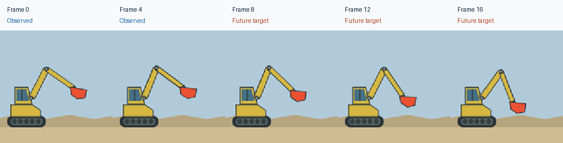

# 4.1 Choose the Model and the World

We want to build a video world model that sees five frames of an excavator
arm in motion and generates the next twelve. Before building it, we choose
the world it learns and the model we train on it.

## The Excavator World

Our world is a simplified excavator above sand. The tracked base stays in
place while the arm lifts and lowers its bucket.



*The first five frames supply the observation. We will train the Transformer
to generate the next twelve.*

Play the [generated trajectory](../../assets/chapter_04/excavator_world/trajectory.mp4)
and follow the two arm segments and the bucket. The camera and sand
background stay fixed, so the only thing that changes is the arm's
kinematics: how its connected parts move.

Each seed selects a starting point in the motion cycle and a speed, which
determine every frame. We can therefore recreate any clip exactly and save
its bucket positions as ground truth for measuring motion in Section 4.9.
Each clip has 17 RGB frames at 128 × 128 pixels.

Generate the preview on a CPU:

```bash
python scripts/chapter_04_train.py preview \
  --output outputs/chapter_04/excavator/preview \
  --seed 0
```

## The Model

For the model, we follow the
[Cosmos flow-matching architecture](https://arxiv.org/html/2511.00062v1#S3):
encode the video, generate future latents with a Transformer, and decode
them back into frames.


*Figure 4.1: The frozen VAE encodes the five observed frames (blue) into two
latent frames. The trained Transformer fills in the three unknown future
latents (dashed orange), and the VAE decodes all 17 frames.*

A latent is a compressed tensor that represents the video. The pretrained
WAN video autoencoder (VAE) maps RGB frames into latents and back. We keep
the VAE frozen and train only the Transformer.

To generate, the VAE encodes the five observed frames into two latent
frames. The three future latent frames start as noise, and the Transformer
refines them a small step at a time. The VAE then decodes all five latent
frames into 17 video frames.

## Model Sizes

We use two model sizes, and Section 4.8 trains both. The `small` model is a
quick first check: we fit it to eight clips to confirm it can learn. The
`base` model is the full training run on 512 clips. You can build a larger
model, but that is beyond the scope of this chapter.

| Setting | `small` | `base` | Purpose |
|---|---:|---:|---|
| Latent channels | 16 | 16 | Match the VAE representation |
| Patch size, time × height × width | 1 × 2 × 2 | 1 × 2 × 2 | Group adjacent latent values |
| Blocks | 6 | 8 | Repeat attention and feature updates |
| Hidden width | 256 | 384 | Features in each video token |
| Approximate parameters | 7.8 million | 21.2 million | Trainable model size |

The two sizes differ in how much computation they apply to each token. Both
fit on an 8 GB GPU.

Next, we turn video frames into the token sequence that attention reads.
