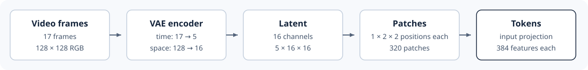

# 4.2 Turn Video into Latent Tokens

A Transformer reads a sequence of tokens. Our input video clip contains 278,528 pixel positions. Because attention compares every token with every other token, using one token per pixel would be far too expensive.

Instead, a frozen VAE compresses the video into a much smaller latent representation. We then group nearby latent positions into patches, producing 320 tokens that the Transformer can process.



_Figure 4.2: The VAE compresses the video in time and space. Grouping neighboring latent positions gives 320 patches, and the input projection turns each patch into a token._

## Compress the Video with the VAE

Nearby pixels and frames look alike. The VAE removes this repetition by compressing the video frames. [WAN2.1's causal VAE](https://github.com/huggingface/diffusers/blob/v0.39.0/src/diffusers/models/autoencoders/autoencoder_kl_wan.py) keeps the first frame. It merges each following group of four frames into one latent frame. It also shrinks height and width by eight. We write video tensors as `[batch, channels, frames, height, width]`:

```python
frames, height, width = 17, 128, 128
latent_frames = (frames - 1) // 4 + 1
latent_height = height // 8
latent_width = width // 8
tokens = latent_frames * (latent_height // 2) * (latent_width // 2)

print((16, latent_frames, latent_height, latent_width))
print(tokens)
```

```
(16, 5, 16, 16)
320
```

The latent has shape `[16, 5, 16, 16]`: 5 × 16 × 16 = 1,280 positions, each holding a vector of 16 numbers. Each position describes an 8 × 8 pixel area of the video. The five observed frames become the first two latent frames, and the model generates the other three.

## Group Latent Positions into Patches

Each of the 1,280 positions could be a token, but we group them to cut the count further. We will make a patch of 2 × 2 neighboring positions in one frame, so we get 320 tokens. Attention compares every pair of tokens, so four times fewer tokens means sixteen times fewer comparisons.

The model learns which value sits where in a patch, so the grouping order must stay fixed. `patchify` does the grouping:

```python
import torch
from torch import Tensor


def patchify(x: Tensor) -> Tensor:
    """[B, C, T, H, W] -> [B, T * H/2 * W/2, 4C], one channel's 2 x 2 values at a time."""
    b, c, t, h, w = x.shape
    x = x.reshape(b, c, t, h // 2, 2, w // 2, 2)
    return x.permute(0, 2, 3, 5, 1, 4, 6).reshape(b, t * (h // 2) * (w // 2), 4 * c)


x = torch.arange(16).reshape(1, 1, 1, 4, 4)  # 4 × 4 positions numbered 0 to 15
print(patchify(x)[0])
```

```
tensor([[ 0,  1,  4,  5],
        [ 2,  3,  6,  7],
        [ 8,  9, 12, 13],
        [10, 11, 14, 15]])
```

Each row is one patch. The first row holds 0, 1, 4, and 5, the top-left 2 × 2 block. Patches go across a row first, then down, then to the next frame. With more channels, each channel's four values come one after another.

Each patch also carries a mask channel that marks the observed frames. So a patch holds `4 × (16 + 1) = 68` values. A linear layer turns these 68 values into one token of 384 features.

## Ungroup Patches Back into the Latent

So far, `patchify` has turned the latent into patches. The Transformer reads one token for each patch. For each token, it predicts how that patch's latent values should change. That is one number per value: 4 positions × 16 channels = 64 numbers. Generation uses these numbers to update the latent. So we ungroup each token's 64 numbers back to their positions in the latent. `unpatchify` does this:

```python
def unpatchify(x: Tensor, frames: int, height: int, width: int) -> Tensor:
    """[B, tokens, 4C] ordered (row, column, channel) -> [B, C, T, H, W]."""
    x = x.reshape(x.shape[0], frames, height // 2, width // 2, 2, 2, -1)
    return x.permute(0, 6, 1, 2, 4, 3, 5).reshape(x.shape[0], -1, frames, height, width)


restored = unpatchify(patchify(x), frames=1, height=4, width=4)
print(torch.equal(restored, x))
```

```
True
```

Next, we let the 320 tokens share information.
