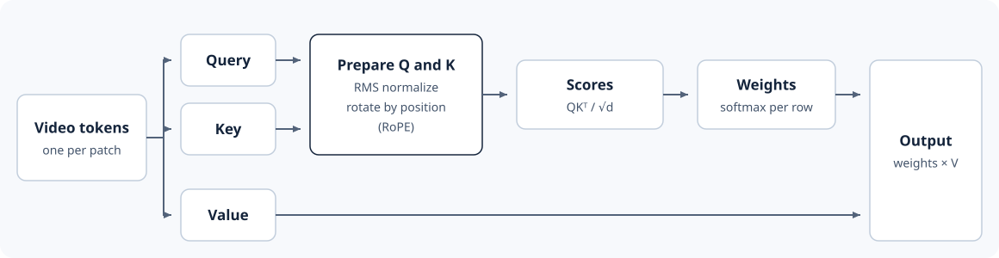

# 4.3 Implement Video Attention

In the previous section, we created tokens from video input. Each token
holds the information of one patch. To predict the motion, we need
information from several patches. For example, the bucket at the end of the
excavator's arm appears in a few patches. To predict where it moves next,
those tokens need information from other tokens: patches that show the arm,
and the bucket's patches in earlier frames. Attention lets each token read
information from the other tokens.



*Figure 4.3: Each token is projected into a query, key, and value. Queries
and keys, rotated by position, give the attention weights, and the weights
combine the values into the output.*

## One Attention Head

Each token must decide which other tokens matter and what to take from
them. Attention splits this into three projections of the token: `query`,
`key`, and `value`. The query says what the token looks for. The key says
what it offers. The value is what it passes on. A token compares its query with every key. Tokens with
higher scores get more weight, so their values count more in its output.

For queries `Q`, keys `K`, and values `V`, one head calculates:

$$
A = \operatorname{softmax}\left(\frac{QK^\top}{\sqrt{d}}\right),
\qquad Y = AV.
$$

Here `d` is the number of features in one head. Dividing by `√d` keeps the
scores from growing with the number of features. Softmax turns the scores
into weights that sum to one. Two tokens let us inspect every weight:

```python
import math
import torch

q = torch.tensor([[1.0, 0.0], [0.0, 1.0]])
k = q.clone()
v = torch.tensor([[10.0, 0.0], [0.0, 20.0]])

scores = q @ k.T / math.sqrt(q.shape[-1])
weights = scores.softmax(dim=-1)
output = weights @ v
print(weights.round(decimals=3))
print(output.round(decimals=3))
```

```text
tensor([[0.6700, 0.3300],
        [0.3300, 0.6700]])
tensor([[ 6.6980,  6.6050],
        [ 3.3020, 13.3950]])
```

The first query equals the first key, so their score is the highest, and
the weights are 0.67 and 0.33. The first output is the weighted average
0.67 × [10, 0] + 0.33 × [0, 20], or about [6.7, 6.6]. This is
[scaled dot-product attention](https://arxiv.org/abs/1706.03762).

In our model, each query compares with every key in the clip, including
keys from later frames. The model refines all future frames at once, so
each future frame uses the current estimate of the others.

## Multi-Head Attention

One head computes one set of attention weights for each token, so the
token's output mixes one selection of other tokens. The bucket's token needs
two kinds of information: the arm's patches and the bucket's earlier frames.
Multi-head attention computes several sets of weights at once. Each head
gets its own slice of the query, key, and value features, so each head can
select different tokens. One head can follow the arm while another follows
the bucket.

The base model splits each token's 384 features into six heads of 64
features. It runs attention in each head, then joins the six results back
into 384 features.

## Token Positions

Attention compares token content. Two patches that look the same in
different frames get the same score. To track motion, the model also needs
each token's frame, row, and column. The model adds this position to each
query and key before comparing them. Before this, it normalizes the scale
of each query and key. Then it rotates each query and key by its token's
position.

First, RMS normalization divides each query and key by its root mean
square. This keeps one large query or key from dominating the scores:

```python
from torch import Tensor, nn
from torch.nn import functional as F


class RMSNorm(nn.Module):
    def __init__(self, dim: int, eps: float) -> None:
        super().__init__()
        self.eps = eps
        self.weight = nn.Parameter(torch.ones(dim))

    def forward(self, x: Tensor) -> Tensor:
        return x * torch.rsqrt(x.float().square().mean(-1, keepdim=True) + self.eps) * self.weight
```

Second, rotary position embeddings, or RoPE, rotate pairs of query and key
features by an angle that depends on the token's position. The score
between two rotated tokens then depends on how far apart they are in time
and space, as the [RoPE derivation](https://arxiv.org/abs/2104.09864) shows.
That is what motion needs: where the bucket is now relative to where it
was. As in Cosmos, each head's features split into time, height, and width
rotations. `rotary_angles` computes the angles for every token, and `rotate`
applies them:

```python
from world_models.complete_small_world import Config, PRESETS


def rotary_angles(cfg: Config, device: torch.device) -> tuple[Tensor, Tensor]:
    """Cosine and sine of each token's rotation, [tokens, head_dim]."""
    dim_hw = cfg.head_dim // 6 * 2
    dims = (cfg.head_dim - 2 * dim_hw, dim_hw, dim_hw)  # time, row, column
    grid = (cfg.frames, cfg.height // 2, cfg.width // 2)
    angles = []
    for axis, (size, dim) in enumerate(zip(grid, dims)):
        frequency = 1.0 / 10000.0 ** (torch.arange(0, dim, 2, device=device).float() / dim)
        axis_angles = torch.outer(torch.arange(size, device=device).float(), frequency)
        shape = [1, 1, 1, dim // 2]
        shape[axis] = size
        angles.append(axis_angles.reshape(shape).expand(*grid, dim // 2))
    phase = torch.cat(angles * 2, dim=-1).flatten(0, 2)
    return phase.cos(), phase.sin()


def rotate(x: Tensor, rotary: tuple[Tensor, Tensor]) -> Tensor:
    """Rotate pairs of features in [B, heads, tokens, head_dim] by position."""
    cosine, sine = rotary
    first, second = x.chunk(2, dim=-1)
    rotated = torch.cat((-second, first), dim=-1)
    return (x.float() * cosine + rotated.float() * sine).to(x.dtype)


cfg = PRESETS["base"]
rotary = rotary_angles(cfg, torch.device("cpu"))
print(rotary[0].shape)
```

```text
torch.Size([320, 64])
```

Each of the 320 tokens gets 64 angles, one per feature in a head.

## The Attention Layer

`Attention` puts the pieces together, so one class serves both kinds of
attention. It projects queries, keys, and values,
splits them into heads, normalizes and rotates queries and keys, and
attends:

```python
class Attention(nn.Module):
    def __init__(self, width: int, heads: int, context_dim: int | None = None) -> None:
        super().__init__()
        self.heads = heads
        context_dim = context_dim or width
        self.to_q = nn.Linear(width, width, bias=False)
        self.to_k = nn.Linear(context_dim, width, bias=False)
        self.to_v = nn.Linear(context_dim, width, bias=False)
        self.norm_q = RMSNorm(width // heads, eps=1e-5)
        self.norm_k = RMSNorm(width // heads, eps=1e-5)
        self.to_out = nn.Linear(width, width, bias=False)

    def forward(self, x: Tensor, context: Tensor | None = None,
                rotary: tuple[Tensor, Tensor] | None = None) -> Tensor:
        context = x if context is None else context
        q = self.to_q(x).unflatten(-1, (self.heads, -1)).transpose(1, 2)
        k = self.to_k(context).unflatten(-1, (self.heads, -1)).transpose(1, 2)
        v = self.to_v(context).unflatten(-1, (self.heads, -1)).transpose(1, 2)
        q, k = self.norm_q(q), self.norm_k(k)
        if rotary is not None:
            q, k = rotate(q, rotary), rotate(k, rotary)
        y = F.scaled_dot_product_attention(q, k, v, is_causal=False)
        return self.to_out(y.transpose(1, 2).flatten(2).to(q.dtype))


torch.manual_seed(0)
tokens = torch.randn(1, 320, cfg.hidden)
self_attention = Attention(cfg.hidden, cfg.heads)
print(self_attention(tokens, rotary=rotary).shape)
```

```text
torch.Size([1, 320, 384])
```

This is self-attention: queries, keys, and values all come from the video
tokens, and each token keeps one 384-feature vector.

## Cross-Attention

Cross-attention lets video tokens read a second input, the context. Queries
still come from the video tokens. Keys and values come from the context.
Cosmos uses the context to read a text prompt.

`Attention` already supports this. Passing `context` to `forward` makes the
line `context = x if context is None else context` use it for keys and
values. `context_dim` sets the input size of `to_k` and `to_v`.

Our model takes its scene and motion from the observed frames, in place of a
prompt. Its context is one vector, `self.context` in `WorldModel` (Section
4.5), which we train with the other weights. With one context token, each
query gives it a weight of one, so every token gets the same output:

```python
cross_attention = Attention(cfg.hidden, cfg.heads, cfg.context_dim)
context = torch.randn(1, 1, cfg.context_dim)  # one context token
out = cross_attention(tokens, context)
print(torch.equal(out[:, 0], out[:, 1]))
```

```text
True
```

We keep this layer so our block matches Cosmos. The same code then loads
the released weights in Section 4.A.

Next, we decide what the model should predict with that information.
