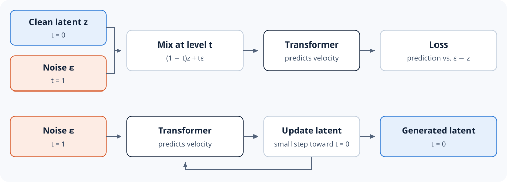

# 4.4 Implement Flow Matching

In the previous section, we used attention so each token can read the other
tokens. Now we decide what the model outputs based on the tokens it read.

To do this, one option is to predict the future latent in one step. In real
video, the same five frames can lead to many futures. A model trained to
predict in one step learns their average. The average of several arm
positions is a blur.

Flow matching takes a different approach. It starts from noise and trains
the model to move the noisy latent a small step toward the clean latent.
The model repeats this step until the latent is clean. Cosmos uses this
method, and so do we.

To train the flow-matching model, we need three things: an input, the
correct output for that input, and a loss that scores the model's output.
This section builds all three from a clean latent.



*Figure 4.4: Top, training: mix a clean latent (blue) with noise (orange) at
level t, and compare the predicted velocity with ε − z. Bottom, generation:
start from noise and take small steps toward t = 0 until a clean latent
remains.*

## Model Input and Target

Each training example starts from a clean latent `z` from our cache. We draw
standard normal noise `ε` and a random noise level `t` between zero and one.
Each example gets its own `t`, so over training the model practices at every
noise level that generation passes through. The model's input
mixes the clean latent and the noise:

$$
z_t=(1-t)z+t\epsilon.
$$

At `t = 0` the input is the clean latent. At `t = 1` it is pure noise. The
correct output, or target, is the direction from the clean latent to the
noise, called the velocity:

$$
v=\epsilon-z.
$$

The sign follows the
[Cosmos flow-matching formulation](https://arxiv.org/html/2511.00062v1#S3.SS1),
and generation uses the same convention. These lines compute the input and
target for a batch shaped like our cache, with one noise level per clip:

```python
import torch

torch.manual_seed(0)
clean = torch.randn(2, 16, 5, 16, 16)  # two cached latents
noise = torch.randn_like(clean)
t = torch.rand(2)  # one noise level per clip
level = t[:, None, None, None, None]
noisy = (1 - level) * clean + level * noise
target = noise - clean
print(noisy.shape, target.shape)
print(torch.allclose(noisy - level * target, clean, atol=1e-6))  # step back to the clean latent
```

```text
torch.Size([2, 16, 5, 16, 16]) torch.Size([2, 16, 5, 16, 16])
True
```

## Loss

We train the model with mean squared error as the loss: the average squared
difference between the predicted and target velocity over every value in
the latent.

```python
prediction = target + 1  # off by one at every value
print((target - target).square().mean().item())
print((prediction - target).square().mean().item())
```

```text
0.0
1.0
```

Next, we build the Transformer that makes the prediction.
