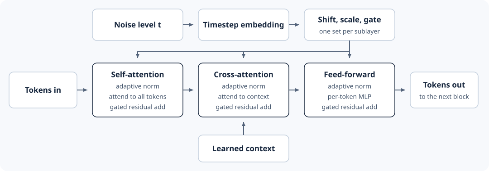

# 4.5 Build the Small Transformer

In the previous section, we defined what the model predicts: the velocity at
a noise level `t`. This section builds the Transformer model that makes the
prediction.

## The Model

The model takes three inputs and returns a velocity with the latent's shape:

* the noisy latent,
* the noise level `t`,
* a mask that marks the observed latent frames with `1` and the frames to
  generate with `0`.

Inside the model, the inputs pass through three stages:

1. The patch layer turns the latent and mask into 320 tokens.
2. A stack of identical layers, called blocks, updates the tokens: six
   blocks in the small model and eight in the base model. Each block takes
   the 320 tokens and returns 320 updated tokens.
3. The output layer turns each token into 64 values, and `unpatchify` puts
   them back in the latent's shape.

`WorldModel` follows these stages. Observed frames hold no noise, so it
gives them a noise level of `0.0001` and the other frames `t`. It also holds
the learned context vector that cross-attention reads:

```python
import math

import torch
from torch import Tensor, nn
from torch.nn import functional as F

from world_models.complete_small_world import (
    PRESETS, Attention, Config, RMSNorm, patchify, rotary_angles, unpatchify,
)


class WorldModel(nn.Module):
    """Predict the velocity of every latent value from a noisy latent and its mask."""

    def __init__(self, cfg: Config = PRESETS["base"]) -> None:
        super().__init__()
        self.cfg = cfg
        width = cfg.hidden
        self.patch_embed = nn.Linear(4 * (cfg.channels + 1), width, bias=False)
        self.time_embed = TimeEmbedding(width)
        self.blocks = nn.ModuleList(Block(cfg) for _ in range(cfg.blocks))
        self.norm_out = AdaptiveNorm(width, cfg.lora_rank, parts=2)
        self.proj_out = nn.Linear(width, 4 * cfg.channels, bias=False)
        nn.init.zeros_(self.proj_out.weight)  # start from zero velocity
        self.context = nn.Parameter(torch.randn(1, 1, cfg.context_dim) * 0.02)

    def forward(self, noisy: Tensor, t: Tensor, mask: Tensor) -> Tensor:
        b, _, frames, height, width = noisy.shape
        # 4.6: observed frames are clean, so they get a near-zero noise level.
        observed = mask[:, 0, :, 0, 0]
        frame_t = observed * 0.0001 + (1 - observed) * t[:, None]
        x = self.patch_embed(patchify(torch.cat((noisy, mask), dim=1)))
        tokens_per_frame = (height // 2) * (width // 2)
        time_features, shared_time = (
            y.view(b, frames, 1, -1).expand(-1, -1, tokens_per_frame, -1).flatten(1, 2)
            for y in self.time_embed(frame_t.flatten()))
        rotary = rotary_angles(self.cfg, noisy.device)
        context = self.context.expand(b, -1, -1)
        for block in self.blocks:
            x = block(x, context, time_features, shared_time, rotary)
        x, _ = self.norm_out(x, time_features, shared_time)
        return unpatchify(self.proj_out(x), frames, height, width)
```

`WorldModel` uses three parts we have not built yet: `Block`,
`TimeEmbedding`, and `AdaptiveNorm`. The rest of this section builds them.

## Inside a Block



*Figure 4.5: Tokens pass through three sublayers. The noise level sets each
sublayer's shift, scale, and gate, and the learned context enters through
cross-attention.*

Each block has three sublayers:

* Self-attention lets each token read the other tokens (Section 4.3).
* Cross-attention reads the context vector (Section 4.3).
* A feed-forward network transforms each token's features. In the base
  model, it expands 384 features to 1,536, applies GELU, and projects back
  to 384.

Each sublayer normalizes the tokens using `t`, computes its output, and adds
that output to the tokens through a gate. `Block` runs the three sublayers
in order:

```python
class Block(nn.Module):
    def __init__(self, cfg: Config) -> None:
        super().__init__()
        width, inner = cfg.hidden, int(cfg.hidden * cfg.mlp_ratio)
        self.norm1 = AdaptiveNorm(width, cfg.lora_rank)
        self.self_attention = Attention(width, cfg.heads)
        self.norm2 = AdaptiveNorm(width, cfg.lora_rank)
        self.cross_attention = Attention(width, cfg.heads, cfg.context_dim)
        self.norm3 = AdaptiveNorm(width, cfg.lora_rank)
        self.feed_forward = nn.Sequential(nn.Linear(width, inner, bias=False), nn.GELU(),
                                          nn.Linear(inner, width, bias=False))

    def forward(self, x: Tensor, context: Tensor, time_features: Tensor, shared_time: Tensor,
                rotary: tuple[Tensor, Tensor]) -> Tensor:
        normalized, gate = self.norm1(x, time_features, shared_time)
        x = x + gate * self.self_attention(normalized, rotary=rotary)
        normalized, gate = self.norm2(x, time_features, shared_time)
        x = x + gate * self.cross_attention(normalized, context)
        normalized, gate = self.norm3(x, time_features, shared_time)
        return x + gate * self.feed_forward(normalized)
```

`rotary` holds the position rotations from Section 4.3. `time_features` and
`shared_time` carry the noise level. The next section shows where they come
from and how `norm1`, `norm2`, and `norm3` use them.

## How a Block Uses the Noise Level

The model's input mixes the clean latent with noise. At `t = 0.1`, the input
is mostly the clean latent. At `t = 0.9`, it is mostly noise. The model must
know how much noise its input holds to predict the velocity. So every
sublayer receives `t`. This takes two steps.

First, the features. The noise level is one number. `timestep_features`
turns it into sine and cosine values at several frequencies. Each frequency
responds to `t` at its own rate, so together they give the network a vector
that describes `t`. `TimeEmbedding` then turns this vector into
`time_features` and `shared_time`:

```python
def timestep_features(t: Tensor, width: int) -> Tensor:
    """Sine and cosine of the noise level at `width / 2` frequencies."""
    half = width // 2
    frequencies = torch.exp(-math.log(10000) * torch.arange(half, device=t.device).float() / half)
    angles = t[:, None].float() * frequencies[None]
    return torch.cat((angles.cos(), angles.sin()), dim=-1)


class TimeEmbedding(nn.Module):
    """Return per-sublayer time features and a shared time projection."""

    def __init__(self, width: int) -> None:
        super().__init__()
        self.linear_1 = nn.Linear(width, width, bias=False)
        self.linear_2 = nn.Linear(width, 3 * width, bias=False)
        self.norm = RMSNorm(width, eps=1e-6)

    def forward(self, t: Tensor) -> tuple[Tensor, Tensor]:
        features = timestep_features(t, self.linear_1.in_features)
        return self.norm(features), self.linear_2(F.silu(self.linear_1(features)))
```

Second, adaptive layer normalization. Layer normalization rescales the
token's features. Then a scale and a shift computed from `t` adjust them:

$$
\widetilde{x}=\operatorname{LayerNorm}(x)(1+s(t))+b(t).
$$

The gate `g(t)` sets how much of the sublayer's output joins the token:

$$
x_{\text{next}}=x+g(t)\odot f(\widetilde{x}).
$$

`AdaptiveNorm` computes the scale, shift, and gate from `time_features`
and adds `shared_time` to them. Its middle layer is narrow, which keeps it
small; Cosmos calls this AdaLN-LoRA:

```python
class AdaptiveNorm(nn.Module):
    """LayerNorm with a shift, scale, and (optionally) gate set by the noise level."""

    def __init__(self, width: int, rank: int, parts: int = 3) -> None:
        super().__init__()
        self.parts = parts
        self.linear_1 = nn.Linear(width, rank, bias=False)  # low rank: AdaLN-LoRA
        self.linear_2 = nn.Linear(rank, parts * width, bias=False)

    def forward(self, x: Tensor, time_features: Tensor, shared_time: Tensor) -> tuple[Tensor, Tensor | None]:
        modulation = self.linear_2(self.linear_1(F.silu(time_features)))
        modulation = modulation + shared_time[..., :modulation.shape[-1]]
        shift, scale, *gate = modulation.chunk(self.parts, dim=-1)
        normalized = F.layer_norm(x, x.shape[-1:], eps=1e-6) * (1 + scale) + shift
        return normalized, (gate[0] if gate else None)


torch.manual_seed(0)
x = torch.randn(1, 6, 24)  # six tokens with 24 features
time_features, shared_time = TimeEmbedding(24)(torch.tensor([0.9]))
norm = AdaptiveNorm(24, rank=8)
normalized, gate = norm(x, time_features[:, None], shared_time[:, None])
print(normalized.shape, gate.shape)
```

```text
torch.Size([1, 6, 24]) torch.Size([1, 1, 24])
```

Each block has three of these, `norm1`, `norm2`, and `norm3`, one per
sublayer.

## Run the Model

All the parts now exist. We run the small model once on a random latent,
with the first two latent frames marked as observed:

```python
model = WorldModel(PRESETS["small"])
latents = torch.randn(1, 16, 5, 16, 16)
mask = torch.zeros(1, 1, 5, 16, 16)
mask[:, :, :2] = 1
velocity = model(latents, torch.tensor([0.5]), mask)
print(velocity.shape)

total = sum(parameter.numel() for parameter in model.parameters())
in_blocks = sum(parameter.numel() for parameter in model.blocks.parameters())
print(total, f"{in_blocks / total:.0%}")
```

```text
torch.Size([1, 16, 5, 16, 16])
7818240 96%
```

The velocity has the latent's shape. The small model has 7,818,240
trainable parameters, and 96% of them are in the blocks.

Next, we give the model the observed frames it must continue to generate a
video.
