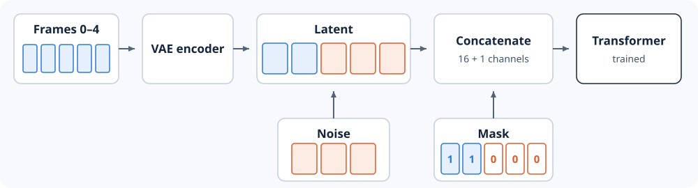

# 4.6 Condition on Observations

A video generator can produce any plausible excavator video. A world model
must continue the video it observed: the arm in the generated frames starts
where it was in the observed frames and keeps moving the same way. Tying
the output to the observed frames is called conditioning. This section adds
it to our model.

The model sees five video frames, 0 to 4, and generates the next twelve,
5 to 16. It works on latent frames. The VAE turns the five observed video
frames into two latent frames. The model generates three more latent
frames, which decode into video frames 5 to 16.



*Figure 4.6: The five observed frames become two observed latent frames
(blue), and the three frames to generate start as noise (orange). A mask
marks observed positions with 1, and we concatenate it with the latent as a
17th channel.*

The model in Section 4.5 takes a mask that marks which latent frames are
observed: `1` for the two observed latent frames and `0` for the three to
generate. `prefix_mask` builds it for a latent of our shape:

```python
import torch
from torch import Tensor


def prefix_mask(latents: Tensor, observed_frames: int) -> Tensor:
    """1 for observed frames, 0 for frames to generate, shaped [B, 1, T, H, W]."""
    mask = latents.new_zeros((latents.shape[0], 1, *latents.shape[2:]))
    mask[:, :, :observed_frames] = 1
    return mask


latent = torch.randn(1, 16, 5, 16, 16)
mask = prefix_mask(latent, observed_frames=2)
print(mask[0, 0, :, 0, 0])
print(torch.cat([latent, mask], dim=1).shape)
```

```text
tensor([1., 1., 0., 0., 0.])
torch.Size([1, 17, 5, 16, 16])
```

The mask has one value per frame. Joined to the latent, it adds a 17th
channel, which gives the 68 values per patch from Section 4.2.

The mask conditions the model in four places:

* Model input. The observed frames sit in the first two latent positions,
  and the mask travels with them, so the model knows which frames are given.
* Noise level. The observed frames hold no noise, so `WorldModel` gives
  them a noise level of `0.0001`, as the
  [Cosmos pipeline](https://github.com/huggingface/diffusers/blob/v0.39.0/src/diffusers/pipelines/cosmos/pipeline_cosmos2_5_predict.py)
  does. The model then treats them as given, not as noise to remove.
* Loss. The observed frames are known, so the loss counts only the frames
  to generate. Training then teaches the model to predict the future from
  the observation.
* Generation. The sampler puts the observed frames back before every step,
  so they stay equal to what we observed.

`training_loss` applies the first three. It builds the input and target from
Section 4.4, places the observed frames in the input, and averages the
squared error over the frames to generate:

```python
from world_models.complete_small_world import PRESETS, WorldModel


def training_loss(model: WorldModel, clean: Tensor, generator: torch.Generator | None = None) -> Tensor:
    noise = torch.randn(clean.shape, generator=generator).to(clean.device)
    t = torch.rand(clean.shape[0], generator=generator).to(clean.device)
    mask = prefix_mask(clean, model.cfg.observed_frames)
    level = t[:, None, None, None, None]
    noisy = (1 - level) * clean + level * noise
    model_input = mask * clean + (1 - mask) * noisy
    prediction = model(model_input, t, mask)
    future = (1 - mask).expand_as(clean)
    return ((prediction - (noise - clean)).square() * future).sum() / future.sum()


torch.manual_seed(0)
model = WorldModel(PRESETS["small"])
clean = torch.randn(2, 16, 5, 16, 16)
loss = training_loss(model, clean, torch.Generator().manual_seed(0))
print(round(loss.item(), 2))
```

```text
2.0
```

The untrained model predicts a velocity of zero, so the loss equals the
average squared target. Noise and clean latent each have variance one, so
the target `noise - clean` has variance two. Training lowers this loss.

Next, we write the loop that runs the model from noise to a finished
video.
