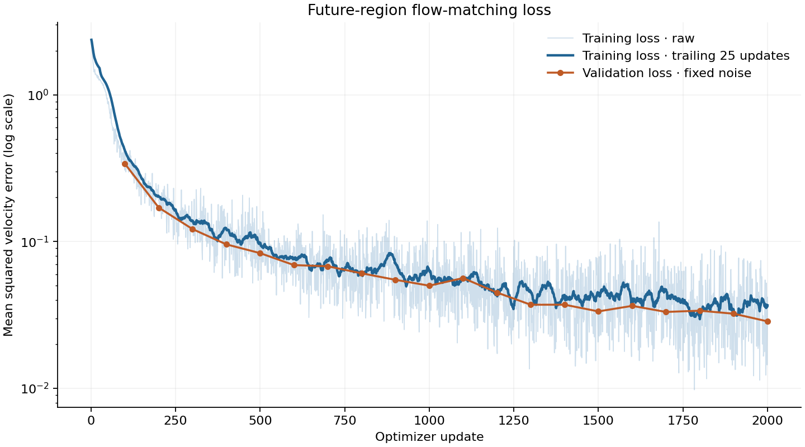

# 4.8 Train a Small World Model

The model from Sections 4.5 to 4.7 has random weights. Training sets them.
We first train on eight clips to check that the model can learn them. Then
we train on 512 clips so the model learns motion it has not seen.

## Training Data

Each clip belongs to one split: training, validation, or test. The model
trains on the training split. Section 4.9 evaluates it on the test split,
which holds clips the model has not seen. We generate 512 training, 64
validation, and 64 test clips:

```bash
python scripts/chapter_04_train.py prepare \
  --output outputs/chapter_04/excavator/data \
  --device cuda \
  --train-clips 512 \
  --val-clips 64 \
  --test-clips 64
```

The VAE stays fixed, so we encode each clip once and cache its
`[16, 5, 16, 16]` latent with its bucket positions.

## Training Step

Each update computes the loss from Sections 4.4 and 4.6 on 32 clips and
takes one AdamW step. The code is `training_loss` and `train` in Section
4.10. The 32 clips arrive as eight microbatches of four
(`--batch-size 4 --accumulation 8`), which keeps memory use low. `--steps`
counts updates.

## Overfitting Test

Before the full run, we check that the model can learn eight clips. When it
reproduces clips it has seen, the data, loss, and sampler work together. We
prepare eight clips per split and train the small model on them:

```bash
python scripts/chapter_04_train.py prepare \
  --output outputs/chapter_04/excavator/data_probe \
  --device cuda \
  --train-clips 8 \
  --val-clips 8 \
  --test-clips 8
```

```bash
python scripts/chapter_04_train.py train \
  --data outputs/chapter_04/excavator/data_probe \
  --output outputs/chapter_04/excavator/overfit \
  --preset small \
  --device cuda \
  --steps 2000 \
  --batch-size 2 \
  --accumulation 4 \
  --overfit-clips 8
```

Then we sample the same eight clips:

```bash
python scripts/chapter_04_train.py sample \
  --data outputs/chapter_04/excavator/data_probe \
  --checkpoint outputs/chapter_04/excavator/overfit/checkpoint.pt \
  --output outputs/chapter_04/excavator/overfit_evaluation \
  --device cuda \
  --split train \
  --examples 8 \
  --sampling-steps 30
```

After 2,000 updates, the generated bucket is 0.44 pixels from its true
position on average. Holding the last observed frame gives 10.62 pixels. The
[training configuration](../../assets/chapter_04/training/overfit_training.json)
and [evaluation report](../../assets/chapter_04/training/overfit_evaluation.json)
contain the settings and the result for each clip.

## Full Training

We train the base model on all 512 clips for 2,000 updates at learning rate
`3e-4`:

```bash
python scripts/chapter_04_train.py train \
  --data outputs/chapter_04/excavator/data \
  --output outputs/chapter_04/excavator/train \
  --preset base \
  --device cuda \
  --steps 2000 \
  --batch-size 4 \
  --accumulation 8
```



*Figure 4.8: Training loss and validation loss over 2,000 updates.*

Training loss falls from `2.386` to `0.0102`, and validation loss falls from
`2.372` to `0.0286`. The validation clips stay out of training, so the
falling validation loss shows the model learning motion beyond the clips it
saw. The [training configuration](../../assets/chapter_04/training/training.json)
records the settings.

Training reserved under 1 GiB of GPU memory. On a smaller GPU, use
`--preset small`, a microbatch of two with 16 accumulation steps, or
`--checkpoint-blocks`, which recomputes activations instead of storing them.

## Resume

The checkpoint stores the model, optimizer, and random state, so a resumed
run continues exactly where it stopped. To continue to 3,000 updates, keep
the other arguments and raise `--steps`:

```bash
python scripts/chapter_04_train.py train \
  --data outputs/chapter_04/excavator/data \
  --output outputs/chapter_04/excavator/train \
  --preset base \
  --device cuda \
  --steps 3000 \
  --batch-size 4 \
  --accumulation 8 \
  --resume outputs/chapter_04/excavator/train/checkpoint.pt
```

Next, we evaluate the model on unseen motion.
