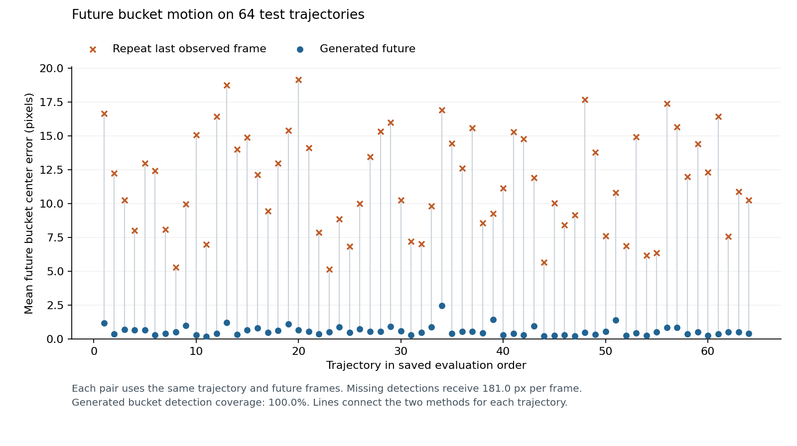
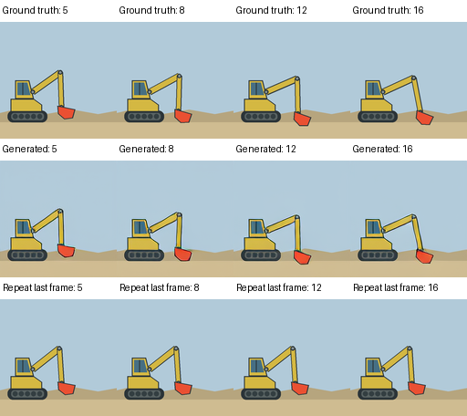

# 4.9 Evaluate the Trained Model

In the previous section, the loss fell on both training and validation
clips. The loss measures velocity, so we also check the videos. We generate
futures for the test clips and measure how far the bucket is from its true
position. Holding the last observed frame still gives the reference.

## Test Rollouts

We choose the checkpoint and sampling settings on the validation clips:

```bash
python scripts/chapter_04_train.py sample \
  --data outputs/chapter_04/excavator/data \
  --checkpoint outputs/chapter_04/excavator/train/checkpoint.pt \
  --output outputs/chapter_04/excavator/validation \
  --device cuda \
  --split val \
  --examples 64 \
  --sampling-steps 30
```

Then we run the 64 test clips once, with those settings fixed:

```bash
python scripts/chapter_04_train.py sample \
  --data outputs/chapter_04/excavator/data \
  --checkpoint outputs/chapter_04/excavator/train/checkpoint.pt \
  --output outputs/chapter_04/excavator/evaluation \
  --device cuda \
  --split test \
  --examples 64 \
  --sampling-steps 30
```

For each clip, the model receives the two observed latent frames, generates
three more, and decodes all 17 frames into a rollout. Each rollout's
directory holds `rollout.mp4`, the true video, the baseline video, and
`manifest.json`. The manifest is the same `RunManifest` that Chapters 2 and
3 use: it records the checkpoint, seed, sampling steps, and observation.

## Baseline and Metrics

The baseline gives the error a scale. It repeats the fifth observed frame,
keeping the excavator at its last pose. A detector finds the bucket as the
largest orange-red region in each frame, and we compare its position with
the true one over the twelve generated frames.

## Results

| Measurement | What it measures | Generated future | Repeat last frame |
|---|---|---:|---:|
| Mean bucket error | Average distance from the true bucket position | 0.59 px | 11.68 px |
| Final bucket error | Distance in the last frame | 1.00 px | 20.52 px |
| Pixel RMSE | Difference across the whole image, values scaled to 0–1 | 0.0341 | 0.0936 |
| Bucket detection | Frames where the detector finds the bucket | 100% | 100% |

The model beats the baseline on all 64 test clips. The
[test report](../../assets/chapter_04/training/evaluation.json) holds the
result for each clip, and the
[validation report](../../assets/chapter_04/results/base_training_validation.json)
holds the results used to choose the settings.



*Figure 4.9: Mean bucket error on each test clip, for the generated video
and for holding the last frame.*

Mean bucket error ranges from 0.17 to 2.46 pixels:

| Example | Seed | Mean error | Inspect |
|---|---:|---:|---|
| Lowest error | 2000010 | 0.17 px | [Frames](../../assets/chapter_04/training/examples/main/trajectory_2000010/comparison.png) · [Video](../../assets/chapter_04/training/examples/main/trajectory_2000010/rollout.mp4) |
| Median error | 2000061 | 0.51 px | [Frames](../../assets/chapter_04/training/examples/main/trajectory_2000061/comparison.png) · [Video](../../assets/chapter_04/training/examples/main/trajectory_2000061/rollout.mp4) |
| Highest error | 2000033 | 2.46 px | [Frames](../../assets/chapter_04/training/examples/main/trajectory_2000033/comparison.png) · [Video](../../assets/chapter_04/training/examples/main/trajectory_2000033/rollout.mp4) |



*Figure 4.10: The median example follows the bucket as the arm extends to
the right. Compare the connected arm segments and bucket position at each
time.*

The lowest-error example follows the bucket through its turning point. In
the highest-error example, the arm follows the upward sweep but the bucket
ends slightly below its target, 4.15 pixels away.

Decoding the true latents already gives 0.183 pixels of bucket error, so
part of the model's error comes from the frozen VAE rather than the
Transformer.

The model continues the arm's motion on clips outside its training set,
with the bucket about half a pixel from its true path on average. Section
4.10 collects the whole model in one file.
