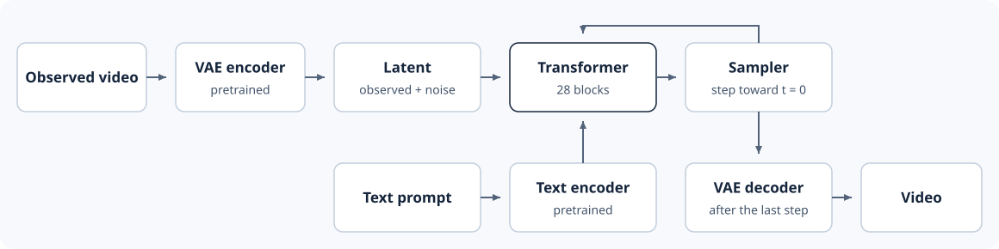
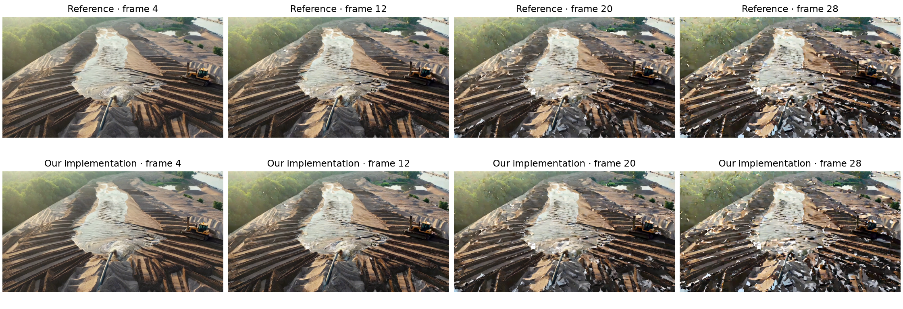

# Optional 4.A: Reproduce a Released Cosmos Checkpoint

This optional section checks our code against the released 2B Cosmos model.
If our implementation, loaded with the released weights, computes exactly
what the reference computes, every component matches Cosmos. We test one
forward pass layer by layer, then a full continuation of the Chapter 2
sand-mining video, using the [Chapter 2 GPU setup](../chapter_02/02-choose-a-setup.md).

The released weights need the parameter names and extra inputs of the full
Cosmos model. The library class `ScratchCosmosTransformer` has them. At our
model's sizes, it computes exactly what the `WorldModel` we built computes,
as `tests/test_complete_small_world.py` checks. So matching the released
model with `ScratchCosmosTransformer` also checks our code.



*Figure 4.A.1: The released pipeline adds a pretrained text encoder, which the
Transformer reads through cross-attention. The Transformer and sampler repeat
until t = 0, and the VAE decoder produces the video.*

## Released Configuration

Released weights fit only a model with the same shapes. The
`diffusers/base/post-trained` release of
[`nvidia/Cosmos-Predict2.5-2B`](https://huggingface.co/nvidia/Cosmos-Predict2.5-2B)
uses 16 latent channels and `1 × 2 × 2` patches, like our model. The rest is
larger:

| Setting | Released | Our base |
|---|---:|---:|
| Blocks | 28 | 8 |
| Hidden width | 2,048 | 384 |
| Heads × features per head | 16 × 128 | 6 × 64 |
| Feed-forward width | 8,192 | 1,536 |
| AdaLN-LoRA width | 256 | 64 |

Three parts of the released model go beyond ours, and
`ScratchCosmosTransformer` supports each when it loads this
[configuration](https://github.com/nvidia-cosmos/cosmos-predict2.5/blob/main/cosmos_predict2/_src/predict2/configs/video2world/defaults/net.py):

* Text instead of a learned context vector. The text encoder produces
  features of width 100,352, which a projection reduces to 1,024 for
  cross-attention.
* A spatial padding channel beside the mask, giving 72 values per patch
  instead of 68, as in the
  [video conditioning wrapper](https://github.com/nvidia-cosmos/cosmos-predict2.5/blob/main/cosmos_predict2/_src/predict2/networks/minimal_v1_lvg_dit.py).
* A different sampler. The pipeline adds text guidance and uses
  `UniPCMultistepScheduler`; `sample_cosmos_latents` reproduces it.

## Weight Loading

With identical weights, any mismatch points to our code. Matching parameter
names and shapes let us reuse the weights Diffusers loads:

```python
from world_models.models.cosmos_transformer import ScratchCosmosTransformer

# reference is the loaded pipeline's transformer.
scratch = ScratchCosmosTransformer.from_reference(reference)
```

`from_reference` checks the mapping and shares the weights, while the
forward pass runs through our classes. Run the comparison:

```bash
python scripts/chapter_04_experiments.py verify \
  --device cuda \
  --output outputs/chapter_04/verify
```

## Layer-by-Layer Comparison

We give both implementations identical inputs and compare their
activations at the first block, the last block, and the output. Comparing at
three points locates a difference if one appears. For each tensor, we record
the largest absolute difference:

| Noise level | Block 0 maximum error | Block 27 maximum error | Velocity maximum error |
|---:|---:|---:|---:|
| 0.05 | 0.0 | 0.0 | 0.0 |
| 0.50 | 0.0 | 0.0 | 0.0 |
| 0.95 | 0.0 | 0.0 | 0.0 |

The tensors match exactly at every noise level, through all 28 blocks. The
[saved comparison](../../assets/chapter_04/results/verify.json) used:

* all 569 parameter tensors (2,059,174,912 parameters) from revision
  `0d37c7498f54cee3c599d438d895a0a4a8608064`,
* `bfloat16` precision,
* a `[1, 16, 3, 4, 6]` latent and eight synthetic text vectors of width
  100,352.

## Video Comparison

One forward pass skips conditioning, text guidance, and many sampler steps.
A full continuation exercises them all. Both implementations get the same
observation, prompt, seed, frame count, guidance, and step count:

```bash
python scripts/chapter_04_experiments.py generate \
  --implementation reference \
  --frames 29 \
  --steps 15 \
  --offload \
  --output outputs/chapter_04/reference

python scripts/chapter_04_experiments.py generate \
  --implementation scratch \
  --frames 29 \
  --steps 15 \
  --offload \
  --output outputs/chapter_04/scratch
```

Both use the frozen VAE and text encoder. In the scratch run, our
Transformer and sampler generate the latents. Each run saves its video, its
latents after updates 1, 8, and 15, and a `manifest.json` with its
`RunManifest`. Video encoding can change pixel values, so we compare
latents and decoded frames before MP4 encoding:

```bash
python scripts/chapter_04_experiments.py compare \
  --reference outputs/chapter_04/reference \
  --scratch outputs/chapter_04/scratch \
  --output outputs/chapter_04/comparison
```

With seed 0, guidance 7, 15 steps, and the last five frames of the
observation, each output has 29 frames at 704 × 1,280 pixels:

| Compared output | Maximum absolute difference | RMSE |
|---|---:|---:|
| Latents after update 1 | 0.0 | 0.0 |
| Latents after update 8 | 0.0 | 0.0 |
| Latents after update 15 | 0.0 | 0.0 |
| All decoded frames, uint8 pixels | 0.0 | 0.0 |

Latents and frames match exactly, as the
[comparison report](../../assets/chapter_04/results/comparison.json) records.



*Figure 4.A.2: Both implementations produce the same frames and the same
changes in ground and water texture toward the end of this short run.*

From frame 20, the ground and water break into small texture patches that
spread by frame 28. Both implementations produce the same patches, so they
come from the checkpoint and sampling settings, not our code. Compare the
[reference video](../../assets/chapter_04/reference_rollout.mp4) with
[ours](../../assets/chapter_04/scratch_rollout.mp4) in motion.

In both tests, every component we built matches the released model
exactly. The same architecture, trained from random weights, is the model
of [Section 4.8](08-train-a-small-world-model.md).
