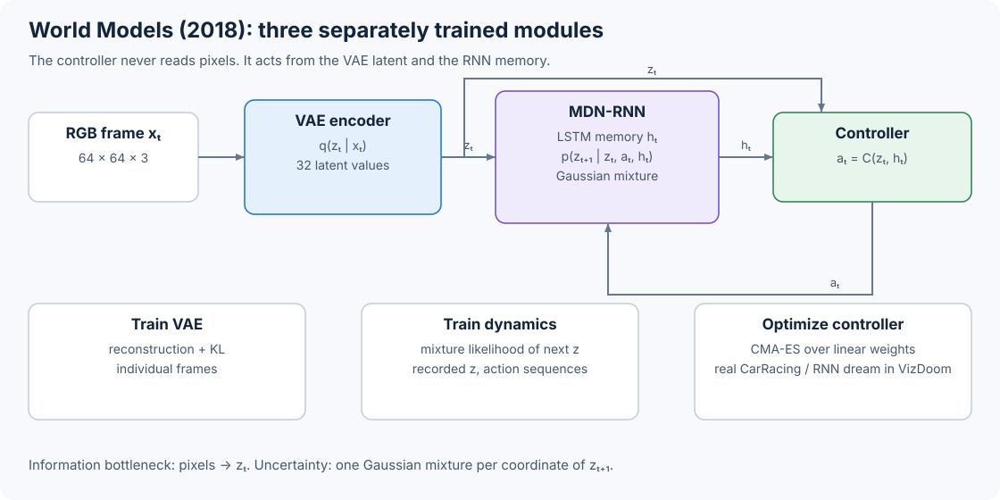

# 10.1 World Models: Separate Vision, Memory, and Control

The 2018 World Models agent separates visual control into three trainable components:

* Vision (V) compresses one image into a latent vector.
* Memory (M) predicts a distribution for the next latent vector.
* Controller (C) maps the current latent and recurrent memory to an action.

Ha and Schmidhuber tested the design on CarRacing and VizDoom. We will use CarRacing to trace the tensor dimensions, then use VizDoom to see how the same components create a learned environment. The dimensions below come from the [authors' CarRacing implementation](https://github.com/hardmaru/WorldModelsExperiments/tree/fd982b9691a941b52c6addbde29bc801ca6202c8/carracing) and the [paper's interactive version](https://worldmodels.github.io/).



_Figure 10.1: During a real rollout, the controller reads the current latent and LSTM output. The MDN output describes possible next latents; its recurrent state carries temporal information into the next decision._

## Compress One Frame with the VAE

The VAE receives an RGB frame $$x_t\in[0,1]^{64\times64\times3}$$. For CarRacing, its encoder uses four stride-2 convolutions and produces two 32-value vectors:

$$
(\mu_t,\log\sigma_t^2)=E_\phi(x_t), \qquad
z_t=\mu_t+\sigma_t\odot\epsilon, \qquad
\epsilon\sim\mathcal N(0,I).
$$

The decoder reconstructs the frame from $$z_t$$. To see how the encoder reaches this compact representation, follow the spatial sizes in the authors' TensorFlow implementation:

| Operation                       | Channels |          Spatial size |
| ------------------------------- | -------: | --------------------: |
| RGB input                       |        3 |               64 × 64 |
| 4 × 4 convolution, stride 2     |       32 |               31 × 31 |
| 4 × 4 convolution, stride 2     |       64 |               14 × 14 |
| 4 × 4 convolution, stride 2     |      128 |                 6 × 6 |
| 4 × 4 convolution, stride 2     |      256 |                 2 × 2 |
| flatten, two linear projections |  32 + 32 | mean and log variance |

The decoder starts with a linear map from 32 values to 1,024 values, reshapes them to $$1\times1\times1024$$, and uses four transposed convolutions to return to $$64\times64\times3$$. We train this reconstruction with a loss that adds pixel reconstruction error to a KL term:

$$
\mathcal L_V=
\lVert x_t-D_\phi(z_t)\rVert_2^2+
\max\!\left(
D_{\mathrm{KL}}\left[q_\phi(z_t\mid x_t)\,\|\,\mathcal N(0,I)\right],
0.5D_z
\right).
$$

Notice the floor on the KL term, which follows the released code. Once the total KL for an example falls below $$0.5D_z$$, that term stops pushing it lower. For the VizDoom experiment, the same structure uses $$D_z=64$$. The [released VAE source](https://github.com/hardmaru/WorldModelsExperiments/blob/fd982b9691a941b52c6addbde29bc801ca6202c8/carracing/vae/vae.py) shows the convolution sizes, reparameterization, and loss.

## Predict a Distribution over the Next Latent

The current image and action can lead to more than one possible future. To represent that uncertainty, the memory model predicts a mixture distribution. At time $$t$$, its LSTM reads the 35-value concatenation $$[z_t,a_t]$$:

$$
h_{t+1},c_{t+1}=\operatorname{LSTM}([z_t,a_t],h_t,c_t).
$$

For each of the 32 coordinates in $$z_{t+1}$$, a linear head emits five mixture weights, five means, and five log standard deviations. The complete head emits $$32\times5\times3=480$$ values at each step. It defines a factorized distribution:

$$
p(z_{t+1}\mid z_t,a_t,h_t)
=\prod_{d=1}^{32}\sum_{k=1}^{5}
\pi_{t,d,k}\,
\mathcal N\!\left(z_{t+1,d};\mu_{t,d,k},\sigma_{t,d,k}^2\right).
$$

Let's build this output and calculate its negative log-likelihood in PyTorch. The example uses a smaller recurrent width while preserving the published tensor layout.

```python
import math

import torch
from torch import nn

torch.manual_seed(7)
B, T, D_Z, D_A, D_H, K = 2, 4, 32, 3, 64, 5

latents = torch.randn(B, T, D_Z)
actions = torch.randn(B, T, D_A)
next_latents = torch.randn(B, T, D_Z)

lstm = nn.LSTM(D_Z + D_A, D_H, batch_first=True)
mdn_head = nn.Linear(D_H, D_Z * K * 3)

hidden, _ = lstm(torch.cat([latents, actions], dim=-1))
raw = mdn_head(hidden).view(B, T, D_Z, K, 3)
mixture_logits, means, log_stds = raw.unbind(dim=-1)

target = next_latents.unsqueeze(-1)
component_log_prob = (
    -0.5 * ((target - means) / log_stds.exp()).square()
    - log_stds
    - 0.5 * math.log(2 * math.pi)
)
log_prob = torch.log_softmax(mixture_logits, dim=-1) + component_log_prob
loss_m = -torch.logsumexp(log_prob, dim=-1).mean()

print(mixture_logits.shape)
print(torch.isfinite(loss_m).item())
```

```
torch.Size([2, 4, 32, 5])
True
```

To train the memory model, we use teacher forcing. A stored trajectory supplies $$z_t$$ and the action the agent actually took. The next latent, $$z_{t+1}$$, is the likelihood target. The authors resample $$z_t$$ from the VAE distribution each time they construct a batch, so the recurrent model cannot memorize one fixed sample per frame. The [MDN-RNN training script](https://github.com/hardmaru/WorldModelsExperiments/blob/fd982b9691a941b52c6addbde29bc801ca6202c8/carracing/rnn_train.py) makes this one-step shift explicit.

## Read Memory without Sampling a Future

The CarRacing controller joins the current latent with the LSTM output to choose an action:

$$
a_t=\operatorname{bounds}\!\left(W_C[z_t,h_t]+b_C\right).
$$

The input has $$32+256=288$$ values and the action has three values, so the linear controller contains only $$288\times3+3=867$$ trainable parameters. Its outputs control steering, throttle, and brake:

```python
import torch
from torch import nn

features = torch.randn(1, 32 + 256)
controller = nn.Linear(32 + 256, 3)
raw_action = torch.tanh(controller(features))

steering = raw_action[:, 0]                 # [-1, 1]
throttle = (raw_action[:, 1] + 1.0) / 2.0  # [0, 1]
brake = raw_action[:, 2].clamp(0.0, 1.0)   # [0, 1]
action = torch.stack([steering, throttle, brake], dim=-1)
print(action.shape)
```

```
torch.Size([1, 3])
```

Follow the order during a real CarRacing rollout. The controller reads $$h_t$$, which already summarizes the sequence processed by the LSTM. It does not need a sampled $$z_{t+1}$$ for this decision. After selecting $$a_t$$, the agent sends $$[z_t,a_t]$$ through the LSTM to prepare the memory for the next decision. The [controller source](https://github.com/hardmaru/WorldModelsExperiments/blob/fd982b9691a941b52c6addbde29bc801ca6202c8/carracing/model.py) shows this order directly.

Ha and Schmidhuber optimize the controller's 867 parameters with CMA-ES. Each candidate controller runs complete episodes, and its fitness is the average cumulative reward. Gradients do not pass through the environment, VAE, or MDN-RNN during this stage.

## Turn the Memory Model into an Environment

The VizDoom experiment uses the MDN-RNN as the environment in which the controller trains. We begin with a latent sampled from a recorded initial frame, then run the rest of the loop in latent space:

```
sample initial z and reset LSTM state
repeat until predicted termination:
    action = controller(z, LSTM state)
    mixture parameters, next state = MDN-RNN(z, action, state)
    z = sample one next latent from the mixture
    fitness += one survived step
```

The VizDoom memory model also predicts whether the episode has ended. This provides the termination signal needed by the learned environment. Rendering is optional during controller training because the next controller input comes straight from the sampled latent.

The sampling temperature controls how varied those predicted transitions are. It changes both parts of the mixture draw: the released code divides mixture logits by $$\tau$$ and scales Gaussian noise by $$\sqrt{\tau}$$:

$$
\widetilde{\pi}_{d}=\operatorname{softmax}(\log\pi_d/\tau),
\qquad
z'_d=\mu_{d,k}+\sigma_{d,k}\sqrt{\tau}\,\epsilon_d.
$$

This matters because the controller can find trajectories where an imperfect learned environment assigns high return. Increasing $$\tau$$ exposes it to a wider set of predicted transitions. In the reported VizDoom transfer experiment, the authors trained the controller with $$\tau=1.15$$ and then evaluated it in the real game. The paper also shows why transfer must be measured in the real environment, since return inside the learned environment can reward model errors.

## Follow the Complete Training Sequence

We can now put the three components together. Train them in this order:

1. Collect 10,000 trajectories with a random policy and store frames and actions.
2. Train V on individual frames using reconstruction and KL losses.
3. Encode every trajectory and store the VAE means and log variances.
4. Train M on $$([z_t,a_t],z_{t+1})$$ sequences with mixture negative log-likelihood.
5. Freeze V and M, then evolve C using episode return.

CarRacing evaluates candidate controllers in the real environment during step 5. The VizDoom experiment performs step 5 in the learned latent environment, then measures the selected controller in the real environment.

Next, we will see how MuZero trains a latent state for search targets without reconstructing the observation.
