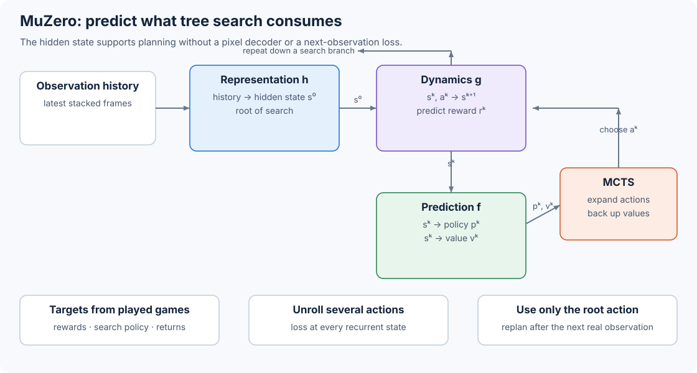

# 10.2 MuZero: Learn Only What Search Uses

MuZero builds a search tree without calling the environment inside that tree. Its learned model advances hidden states under hypothetical actions and predicts three quantities that Monte Carlo tree search needs: reward, policy, and value.

We will follow those predictions through three functions:

$$
\begin{aligned}
s_t^0 &= h_\theta(o_1,\ldots,o_t), &&\text{representation},\\
(r_t^k,s_t^k) &= g_\theta(s_t^{k-1},a_t^k), &&\text{dynamics},\\
(p_t^k,v_t^k) &= f_\theta(s_t^k), &&\text{prediction}.
\end{aligned}
$$

The superscript $$k$$ counts imagined steps from the current real time $$t$$. At $$k=0$$, the representation function processes the observation history once. Every branch below the root operates on hidden states and hypothetical actions. The [MuZero paper](https://arxiv.org/html/1911.08265v2) defines this interface, and its [official pseudocode](https://arxiv.org/src/1911.08265v2/anc/pseudocode.py) separates `initial_inference` from `recurrent_inference` in the same way.



_Figure 10.2: MuZero encodes the real history at the root. The dynamics and prediction functions then evaluate action sequences without generating future pixels._

## Give Each Function a Precise Output

Before tracing the network, let's connect each prediction to its job in search and to the target used to train it:

| Output         | Meaning                               | How search uses it                  | Training target                                           |
| -------------- | ------------------------------------- | ----------------------------------- | --------------------------------------------------------- |
| Reward $$r^k$$ | Reward on the transition into $$s^k$$ | Adds immediate return during backup | Reward emitted by the real environment                    |
| Policy $$p^k$$ | Prior probability for each action     | Directs tree exploration            | Normalized MCTS visit counts                              |
| Value $$v^k$$  | Expected return from $$s^k$$          | Evaluates a newly expanded leaf     | Bootstrapped return from rewards and a later search value |

These three prediction losses train the hidden state to retain information that changes rewards, action choices, and long-term return. No decoder maps $$s^k$$ back to an image, so no reconstruction target asks it to preserve every visible detail.

We can make the three functions concrete with a small PyTorch model. Its two residual blocks and scalar reward/value heads keep the example runnable; the published Atari network uses deeper convolutional towers and categorical reward and value heads. The example stacks four RGB frames into 12 input channels, uses 32 hidden channels, and exposes six actions.

```python
import torch
from torch import nn
from torch.nn import functional as F


class ResidualBlock(nn.Module):
    def __init__(self, channels: int):
        super().__init__()
        self.conv1 = nn.Conv2d(channels, channels, 3, padding=1)
        self.conv2 = nn.Conv2d(channels, channels, 3, padding=1)

    def forward(self, x: torch.Tensor) -> torch.Tensor:
        y = F.relu(self.conv1(x))
        return F.relu(x + self.conv2(y))


class TinyMuZero(nn.Module):
    def __init__(self, observation_channels=12, hidden=32, actions=6):
        super().__init__()
        self.actions = actions
        self.representation = nn.Sequential(
            nn.Conv2d(observation_channels, hidden, 3, padding=1),
            nn.ReLU(),
            ResidualBlock(hidden),
        )
        self.dynamics = nn.Sequential(
            nn.Conv2d(hidden + actions, hidden, 3, padding=1),
            nn.ReLU(),
            ResidualBlock(hidden),
        )
        self.reward_head = nn.Linear(hidden, 1)
        self.policy_head = nn.Linear(hidden, actions)
        self.value_head = nn.Linear(hidden, 1)

    @staticmethod
    def normalize_state(state: torch.Tensor) -> torch.Tensor:
        axes = tuple(range(1, state.ndim))
        low = state.amin(dim=axes, keepdim=True)
        high = state.amax(dim=axes, keepdim=True)
        return (state - low) / (high - low).clamp_min(1e-5)

    @staticmethod
    def pool(state: torch.Tensor) -> torch.Tensor:
        return state.mean(dim=(-2, -1))

    def predict(self, state: torch.Tensor):
        features = self.pool(state)
        return self.policy_head(features), self.value_head(features)

    def initial_inference(self, observation_history: torch.Tensor):
        state = self.normalize_state(self.representation(observation_history))
        policy, value = self.predict(state)
        reward = torch.zeros_like(value)
        return state, reward, policy, value

    def recurrent_inference(self, state: torch.Tensor, action: torch.Tensor):
        action_planes = F.one_hot(action, self.actions).float()
        action_planes = action_planes[:, :, None, None].expand(
            -1, -1, state.shape[-2], state.shape[-1]
        )
        next_state = self.normalize_state(
            self.dynamics(torch.cat([state, action_planes], dim=1))
        )
        reward = self.reward_head(self.pool(next_state))
        policy, value = self.predict(next_state)
        return next_state, reward, policy, value


torch.manual_seed(4)
model = TinyMuZero()
history = torch.randn(2, 12, 8, 8)

state, reward, policy, value = model.initial_inference(history)
state, reward, policy, value = model.recurrent_inference(
    state, torch.tensor([1, 4])
)
print(state.shape, reward.shape, policy.shape, value.shape)
```

```
torch.Size([2, 32, 8, 8]) torch.Size([2, 1]) torch.Size([2, 6]) torch.Size([2, 1])
```

Follow the inputs to `recurrent_inference`: it receives one hidden state and one proposed action. It returns the next hidden state, predicted reward, policy logits, and value. This is how search can explore another step without receiving a new observation.

## Trace the Published Atari Tensors

In the published Atari network, the representation input contains 32 RGB frames and the 32 actions that led to them. Each action index, divided by 18, becomes one constant-valued spatial plane, giving $$32\times3+32=128$$ input planes at $$96\times96$$ resolution.

The published representation network first reduces this history, then applies its residual tower:

```
[B, 128, 96, 96]
  -> stride-2 convolution, 128 planes                 [B, 128, 48, 48]
  -> 2 residual blocks                                [B, 128, 48, 48]
  -> stride-2 convolution, 256 planes                 [B, 256, 24, 24]
  -> 3 residual blocks                                [B, 256, 24, 24]
  -> average pool, stride 2                           [B, 256, 12, 12]
  -> 3 residual blocks                                [B, 256, 12, 12]
  -> average pool, stride 2                           [B, 256,  6,  6]
  -> 16 residual blocks and state scaling             [B, 256,  6,  6]
```

The representation and dynamics functions each contain a 16-block residual tower with 3 × 3 convolutions and 256 hidden planes. The representation adds the downsampling stages shown above before that tower. At an imagined step, the chosen Atari action becomes an 18-plane one-hot tensor tiled over the 6 × 6 grid. Concatenating it with the state gives the dynamics function a $$[B,274,6,6]$$ input. The next state returns to $$[B,256,6,6]$$. The [network architecture appendix](https://arxiv.org/html/1911.08265v2#A6) specifies these dimensions.

Atari rewards and values can have different scales across games. To handle these scales, MuZero first applies the invertible scalar transform

$$
q(x)=\operatorname{sign}(x)
\left(\sqrt{|x|+1}-1+0.001x\right),
$$

then represents the transformed value on 601 integer supports from -300 to 300. A target between two integers splits its mass between the neighboring supports. The reward and value heads output 601 logits, and their losses use cross-entropy. Search converts each distribution back to a scalar through its expected support value and the inverse transform. The policy head outputs one logit per action.

## Expand One Leaf with the Learned Model

With the model outputs in place, we can follow one search simulation. Search keeps track of what it has already explored by storing five quantities on each edge:

$$
\{N(s,a), Q(s,a), P(s,a), R(s,a), S(s,a)\}.
$$

These are the visit count, mean backed-up value, policy prior, predicted reward, and predicted next state. One simulation uses them in three operations:

```
SELECT
    start at the root state
    follow the action with the largest Q + exploration bonus
    stop at an unexpanded edge

EXPAND
    next_state, reward = dynamics(parent_state, selected_action)
    policy, value = prediction(next_state)
    create children from the policy prior

BACK UP
    walk from the new leaf to the root
    add predicted rewards and discounted leaf value
    update every traversed edge's visit count and mean value
```

Selection decides which action to explore next. MuZero scores each action with its normalized value and a prior bonus:

$$
\operatorname{score}(s,a)=
\overline Q(s,a)+P(s,a)
\frac{\sqrt{\sum_b N(s,b)}}{1+N(s,a)}
\left[
c_1+\log\left(\frac{\sum_bN(s,b)+c_2+1}{c_2}\right)
\right].
$$

The paper uses $$c_1=1.25$$ and $$c_2=19652$$. Min-max normalization maps the values observed in the current tree to $$[0,1]$$ for domains without known value bounds. When a simulation expands a leaf at depth $$l$$, backup starts from the leaf value and includes the predicted reward on every traversed edge:

$$
G^k=\sum_{\tau=0}^{l-1-k}\gamma^\tau r_{k+1+\tau}
+\gamma^{l-k}v^l.
$$

After the simulations, normalized root visit counts form the search policy $$\pi_t$$. The agent selects a real action from this distribution, sends that single action to the real environment, and records the resulting reward and next observation. All other branches remain hypothetical.

## Train through Five Hypothetical Steps

To train predictions several steps into the future, we unroll the model along a recorded trajectory. A replay sample begins at real time $$t$$. The representation function encodes the stored observation history once. We then apply the dynamics function to the five recorded actions that followed that history. At every unrolled state, the prediction heads receive a supervised target:

$$
\mathcal L_t(\theta)=\sum_{k=0}^{K}
\left[
\ell_r(u_{t+k},r_t^k)
+\ell_v(z_{t+k},v_t^k)
+\ell_p(\pi_{t+k},p_t^k)
\right]+c\lVert\theta\rVert^2,
\qquad K=5.
$$

For Atari, the value target is a 10-step return bootstrapped from the MCTS root value stored later in the same real trajectory:

$$
z_t=u_{t+1}+\gamma u_{t+2}+\cdots+
\gamma^{n-1}u_{t+n}+\gamma^n\nu_{t+n},
\qquad n=10.
$$

The policy loss compares the network policy with $$\pi$$, the visit distribution produced by search. Search therefore supplies an improved action target to the policy head. The reward target comes directly from the real environment. The value target combines real rewards with a later search estimate.

We can follow the full calculation in this compact version of the official pseudocode:

```
state, _, policy, value = initial_inference(observation_history)
accumulate(value_loss + policy_loss)

for action, targets in five_recorded_steps:
    state, reward, policy, value = recurrent_inference(state, action)
    accumulate(reward_loss + value_loss + policy_loss)

backpropagate the sum through representation, dynamics, and prediction
```

To keep gradient magnitudes stable as the recurrent model is unrolled, the published training setup scales each unrolled step's head loss by $$1/K$$ and scales the gradient entering each dynamics application by $$1/2$$. It also rescales every hidden state to $$[0,1]$$. The [training appendix](https://arxiv.org/html/1911.08265v2#A7) and [`update_weights` in the official pseudocode](https://arxiv.org/src/1911.08265v2/anc/pseudocode.py) show both operations.

## Connect Self-Play, Search, and Learning

Search produces both the actions the agent takes and targets for the next training update. MuZero connects these jobs in one repeating loop:

1. Self-play actors load a recent network checkpoint.
2. At each real state, an actor runs MCTS with that network.
3. The actor executes an action, then stores rewards, actions, root values, and root visit distributions in replay.
4. The learner samples trajectory segments and unrolls the model through the recorded actions.
5. Updated checkpoints return to the actors.

DeepMind's public release consists of detailed pseudocode and architecture specifications. The snippets in this section implement those interfaces at small scale in PyTorch. Reproducing the paper's training run also requires its distributed actors, replay service, domain environments, and accelerator setup.

Next, we will look at [IRIS](03-iris.md), which keeps a decodable visual state and trains an actor inside token-generated episodes.
