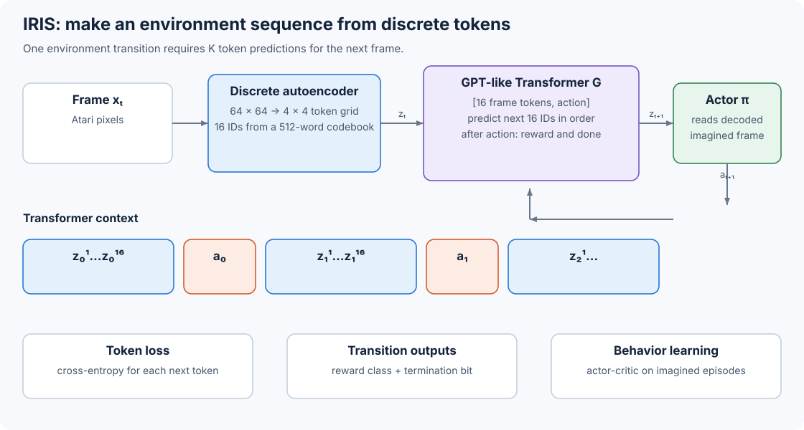

# 10.3 IRIS: Predict the World as Tokens

IRIS uses a VQ-VAE-style discrete autoencoder to convert each Atari frame into 16 integers. A causal Transformer reads frame tokens and actions as one sequence, then predicts the next frame, reward, and episode end. This gives us a connection to language models: the vocabulary represents image patches and actions, and each rollout extends an environment trajectory.

The account below follows the [IRIS paper](https://arxiv.org/html/2209.00588) and the authors' [released implementation](https://github.com/eloialonso/iris/tree/24326aaaa283c527f42b89b44cfdecf2665a7a16).



_Figure 10.3: IRIS joins a discrete image tokenizer, a causal Transformer, and an actor-critic inside one imagination loop._

## Compress a Frame into 16 Symbols

IRIS receives an RGB frame $x\_t\in\mathbb{R}^{3\times64\times64}$. Its convolutional encoder produces a $4\times4$ grid of feature vectors. For each grid position, the tokenizer selects the nearest vector from a learned codebook of 512 entries:

$$
z_t^k=\underset{i\in\{1,\ldots,512\}}{\operatorname{argmin}}
\left\lVert y_t^k-e_i\right\rVert_2,
\qquad k\in\{1,\ldots,16\}.
$$

The output is a sequence of indices $z\_t=(z\_t^1,\ldots,z\_t^{16})$. The codebook maps each index back to a 512-dimensional vector before the convolutional decoder reconstructs a frame.

Let's perform that nearest-codebook lookup in PyTorch:

```python
import torch

torch.manual_seed(0)
batch, grid_h, grid_w, code_dim, vocab_size = 2, 4, 4, 8, 512
encoder_features = torch.randn(batch, grid_h, grid_w, code_dim)
codebook = torch.randn(vocab_size, code_dim)

flat_features = encoder_features.reshape(-1, code_dim)
distances = (
    flat_features.square().sum(dim=1, keepdim=True)
    + codebook.square().sum(dim=1)
    - 2 * flat_features @ codebook.T
)
tokens = distances.argmin(dim=1).reshape(batch, grid_h * grid_w)
quantized = codebook[tokens].reshape(batch, grid_h, grid_w, code_dim)

print(tokens.shape)
print(quantized.shape)
```

```
torch.Size([2, 16])
torch.Size([2, 4, 4, 8])
```

The example uses eight-dimensional code vectors so it runs quickly; IRIS uses 512 dimensions. Notice the flattening order: it follows the spatial grid, so these 16 entries define the token order the Transformer must learn.

To train the encoder, codebook, and decoder, the tokenizer combines four loss terms:

$$
\begin{aligned}
\mathcal{L}_{\text{tokenizer}}
={}&\lVert x-D(z_q)\rVert_1
+\lVert \operatorname{sg}(y)-z_q\rVert_2^2 \\
&+\lVert y-\operatorname{sg}(z_q)\rVert_2^2
+\mathcal{L}_{\text{perceptual}}(x,D(z_q)).
\end{aligned}
$$

Here $y$ contains the continuous encoder features, $z\_q$ contains their codebook vectors, and $\operatorname{sg}$ stops a gradient. We still need to train the encoder through the discrete nearest-neighbor choice. The straight-through estimator handles this by sending reconstruction gradients to the encoder. IRIS removes the adversarial discriminator used by VQGAN and retains the perceptual term. The exact loss appears in the [tokenizer source](https://github.com/eloialonso/iris/blob/24326aaaa283c527f42b89b44cfdecf2665a7a16/src/models/tokenizer/tokenizer.py).

## Place Frames and Actions in One Sequence

The model also needs to know which action follows each frame. IRIS appends that action to the image tokens, giving one environment step 17 tokens:

$$
B_t=[z_t^1,z_t^2,\ldots,z_t^{16},a_t].
$$

Twenty steps produce a sequence of $20\times17=340$ positions:

$$
[B_0,B_1,\ldots,B_{19}]
=[z_0^1,\ldots,z_0^{16},a_0,z_1^1,\ldots,z_{19}^{16},a_{19}].
$$

Image indices and action indices use separate embedding tables because the two vocabularies have different meanings. A learned positional embedding then marks each of the 340 sequence positions.

We can build this ordering by concatenating each frame's tokens with its action:

```python
import torch

batch, steps, tokens_per_frame = 2, 20, 16
frame_tokens = torch.randint(0, 512, (batch, steps, tokens_per_frame))
actions = torch.randint(0, 18, (batch, steps, 1))

sequence = torch.cat((frame_tokens, actions), dim=-1).flatten(1)
print(sequence.shape)
print(sequence[0, :17].shape)  # one frame block plus its action
```

```
torch.Size([2, 340])
torch.Size([17])
```

Although the sequence is now flat, the two token types must still reach their own embedding tables. The official model constructs a repeated 17-position mask: positions 0 through 15 select the image table, and position 16 selects the action table. See the [world-model implementation](https://github.com/eloialonso/iris/blob/24326aaaa283c527f42b89b44cfdecf2665a7a16/src/models/world_model.py).

## Read the Sequence with Causal Attention

When predicting the next token, the model can use only the tokens that came before it. The released Atari configuration enforces this with a GPT-style Transformer with ten layers, four attention heads, and width 256. Every block applies pre-normalized causal self-attention followed by a pre-normalized MLP:

$$
h'=h+\operatorname{Attention}(\operatorname{LN}(h)),
\qquad
h''=h'+\operatorname{MLP}(\operatorname{LN}(h')).
$$

The causal mask lets position $j$ read positions $i\leq j$. During training, the Transformer processes all 340 positions together. During a rollout, a key-value cache retains earlier attention keys and values as the model appends one token at a time.

We can now connect positions in the sequence to predictions. IRIS attaches three prediction heads at selected positions, so each head uses the information available at that point:

| Hidden state after                | Prediction                                          |
| --------------------------------- | --------------------------------------------------- |
| $z\_t^1,\ldots,z\_t^{15}$         | $z\_t^2,\ldots,z\_t^{16}$                           |
| $a\_t$                            | $z\_{t+1}^1$, reward $r\_t$, and episode end $d\_t$ |
| $z\_{t+1}^1,\ldots,z\_{t+1}^{15}$ | $z\_{t+1}^2,\ldots,z\_{t+1}^{16}$                   |

Notice that the action marks the start of a transition. Once the Transformer has read $a\_t$, it can predict what the action changes, the reward it produces, and whether the episode ends. The remaining 15 image tokens fill in the next frame from left to right through the flattened $4\times4$ grid.

We can write this token-by-token generation as a product of conditional probabilities:

$$
p_G(z_{t+1}\mid z_{\leq t},a_{\leq t})
=\prod_{k=1}^{16}
p_G(z_{t+1}^k\mid z_{\leq t},a_{\leq t},z_{t+1}^{<k}).
$$

The reward and termination heads use the hidden state after the action:

$$
p_G(r_t\mid z_{\leq t},a_{\leq t}),
\qquad
p_G(d_t\mid z_{\leq t},a_{\leq t}).
$$

## Train Three Predictions Together

To learn these predictions, the Transformer receives the true frame and action tokens through teacher forcing. The next-image head uses cross-entropy over 512 codebook entries, and the termination head uses cross-entropy over two classes. Atari rewards are clipped to ${-1,0,1}$, shifted to class indices ${0,1,2}$, and trained with a three-class cross-entropy loss:

$$
\mathcal{L}_{G}
=\mathcal{L}_{\text{tokens}}
+\mathcal{L}_{\text{reward}}
+\mathcal{L}_{\text{end}}.
$$

Padding positions receive an ignore index, so they do not contribute to any of the three terms. The implementation computes these targets in [`compute_labels_world_model`](https://github.com/eloialonso/iris/blob/24326aaaa283c527f42b89b44cfdecf2665a7a16/src/models/world_model.py#L84).

When inspecting a prediction error, we need to consider both parts of the model. The tokenizer determines which visual information reaches the sequence. The Transformer learns how those symbols change after an action. Increasing the token grid from 16 to 64 can retain smaller objects, but it also makes every frame four times longer for the causal Transformer.

## Generate One Environment Step

We can now use the trained model as a generated environment. Start with the current 16 image tokens already stored in the attention cache. The policy selects an action from the decoded frame, and the model advances the environment as follows:

```
append action a[t]
predict reward r[t] and episode end d[t]

for k = 1 ... 16:
    sample next image token z[t + 1, k]
    append z[t + 1, k] to the Transformer cache

decode z[t + 1, 1:16] into frame x[t + 1]
```

The way we choose each token affects the rollout. Categorical sampling can produce different futures from the same initial frame. Greedy decoding always chooses the largest logit and produces one fixed continuation.

The cache has room for 340 positions. When the next step would exceed that limit, the released environment discards the old cache and initializes a new one from the latest frame tokens. This bounds attention memory to the configured context. The rollout mechanics are implemented in [`WorldModelEnv.step`](https://github.com/eloialonso/iris/blob/24326aaaa283c527f42b89b44cfdecf2665a7a16/src/envs/world_model_env.py#L47).

## Train the Policy in the Generated World

To improve the policy, IRIS alternates real experience with training in the generated environment. It repeats three operations:

1. Run the current policy in the real Atari environment and add transitions to replay memory.
2. Train the tokenizer and Transformer on sequences sampled from replay memory.
3. Start from a replay frame and train the actor-critic for 20 imagined steps.

Follow what the policy sees during this loop. It receives decoded $64\times64$ frames through a convolutional network and a 512-unit LSTM, rather than Transformer hidden states. The value head shares that visual and recurrent trunk with the policy head. Before an imagined rollout, 20 preceding frames initialize the policy's recurrent state.

IRIS also passes real observations through the tokenizer and decoder before the policy sees them. The policy therefore receives reconstructed images during both real interaction and imagination. This keeps its input distribution tied to the same visual channel.

Next, we will see how [DIAMOND](04-diamond.md) replaces discrete image tokens with diffusion to predict the next frame.

Use the table below to connect each sequence design choice to what happens during training or a rollout:

| Design choice                         | Consequence                                                                                             |
| ------------------------------------- | ------------------------------------------------------------------------------------------------------- |
| 16 discrete tokens per frame          | The Transformer models short image sequences, while the tokenizer selects the retained visual details.  |
| Causal token prediction               | Training processes a full sequence in parallel; rollout generation samples 16 image tokens in order.    |
| Action at the end of each frame block | One hidden state drives the first next-frame token, reward, and termination predictions.                |
| Decoded images for the policy         | The actor uses one observation format during real interaction and imagination.                          |
| 340-position context                  | Memory and attention cost remain bounded; a refresh retains only the latest frame when the cache fills. |

## Sources

* [Micheli, Alonso, and Fleuret, _Transformers are Sample-Efficient World Models_](https://arxiv.org/abs/2209.00588)
* [Official IRIS repository at revision `24326aa`](https://github.com/eloialonso/iris/tree/24326aaaa283c527f42b89b44cfdecf2665a7a16)
* [Tokenizer configuration](https://github.com/eloialonso/iris/blob/24326aaaa283c527f42b89b44cfdecf2665a7a16/config/tokenizer/default.yaml)
* [Transformer configuration and causal attention](https://github.com/eloialonso/iris/blob/24326aaaa283c527f42b89b44cfdecf2665a7a16/src/models/transformer.py)
