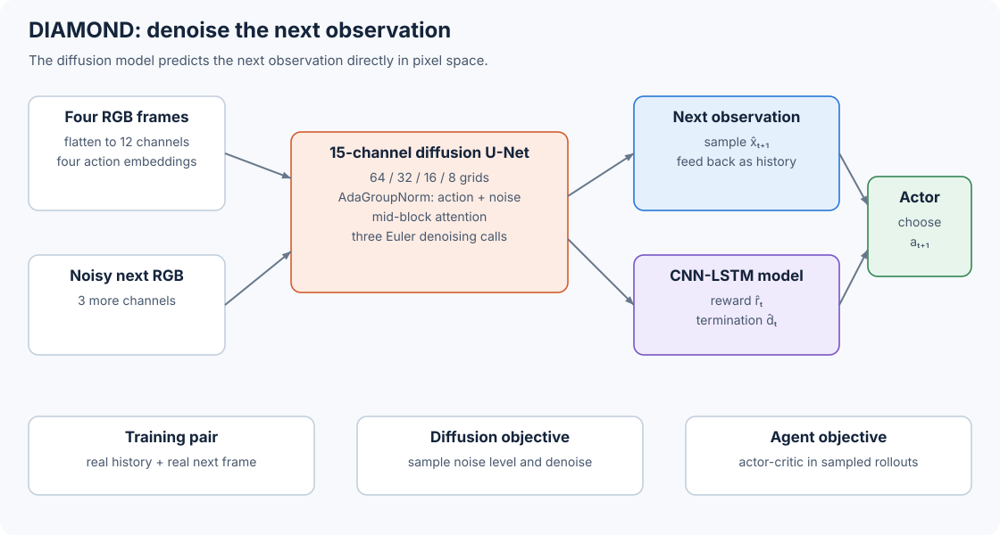

# 10.4 DIAMOND: Denoise the Next Frame

[IRIS](03-iris.md) first decides which details fit into 16 discrete symbols. DIAMOND keeps the transition in pixel space and predicts a denoised RGB image.

DIAMOND takes four recent frames and four actions, starts the next frame from noise, and runs a U-Net three times to obtain the next observation. Separate recurrent networks predict reward, episode end, policy, and value.

The description below follows the [DIAMOND paper](https://arxiv.org/html/2405.12399) and the authors' [released implementation](https://github.com/eloialonso/diamond/tree/5bcd1599755b4f2fae8e5e079e02f0728e174965).



_Figure 10.4: DIAMOND generates an observation with diffusion, then uses a second model to generate its reward and termination._

## Define the Conditional Prediction

Given observation history $x\_{\leq t}$ and action history $a\_{\leq t}$, a world model represents

$$
p(x_{t+1}\mid x_{\leq t},a_{\leq t}).
$$

DIAMOND approximates the relevant history with a four-step window. For Atari, each image has shape $\[3,64,64]$. Four frames contribute 12 channels. The current noisy candidate for the next frame contributes three more:

```python
import torch

batch, history, channels, height, width = 2, 4, 3, 64, 64
past_frames = torch.randn(batch, history, channels, height, width)
noisy_next_frame = torch.randn(batch, channels, height, width)

stacked_history = past_frames.flatten(1, 2)
unet_input = torch.cat((stacked_history, noisy_next_frame), dim=1)

print(stacked_history.shape)
print(unet_input.shape)
```

```
torch.Size([2, 12, 64, 64])
torch.Size([2, 15, 64, 64])
```

Notice that stacking frames preserves their pixel coordinates. A ball at row 30, column 18 in each context frame remains at that location in four different input channels. The Atari transition model feeds these normalized RGB arrays directly to the U-Net. The first convolution projects the 15 channels to 64 features.

## Join Action and Noise Conditions

The U-Net must answer two questions: which transition did the agent request, and how much noise remains in the candidate image? DIAMOND builds one 256-dimensional conditioning vector from both answers.

Each action in the four-step history receives a 64-dimensional embedding. The Atari configuration supports up to 18 action IDs. The model concatenates the four selected vectors to form 256 features. It also maps the noise coordinate $c\_{\text{noise\}}$ to 256 random Fourier features. After adding the action and noise features, a two-layer MLP produces the U-Net condition:

$$
c=\operatorname{MLP}\left(
\operatorname{Fourier}(c_{\text{noise}})
+[E_a(a_{t-3});E_a(a_{t-2});E_a(a_{t-1});E_a(a_t)]
\right).
$$

Let's trace how the action embeddings become one conditioning vector:

```python
import torch
from torch import nn

batch, history, num_actions, condition_width = 2, 4, 18, 256
actions = torch.randint(0, num_actions, (batch, history))
action_embedding = nn.Embedding(num_actions, condition_width // history)
action_condition = action_embedding(actions).flatten(1)

noise_condition = torch.randn(batch, condition_width)
condition_projection = nn.Sequential(
    nn.Linear(condition_width, condition_width),
    nn.SiLU(),
    nn.Linear(condition_width, condition_width),
)
condition = condition_projection(action_condition + noise_condition)

print(action_embedding(actions).shape)
print(action_condition.shape, condition.shape)
```

```
torch.Size([2, 4, 64])
torch.Size([2, 256]) torch.Size([2, 256])
```

To make the action and noise level available throughout denoising, every residual block receives this vector through adaptive group normalization. For normalized feature map $h$, a learned linear projection of $c$ supplies a channel-wise scale and shift:

$$
\operatorname{AdaGN}(h,c)
=\operatorname{GN}(h)\odot(1+s(c))+b(c).
$$

The action can therefore change features at every resolution of the U-Net. The noise condition uses the same route. The exact construction lives in [`inner_model.py`](https://github.com/eloialonso/diamond/blob/5bcd1599755b4f2fae8e5e079e02f0728e174965/src/models/diffusion/inner_model.py), and the scale-and-shift operation lives in [`blocks.py`](https://github.com/eloialonso/diamond/blob/5bcd1599755b4f2fae8e5e079e02f0728e174965/src/models/blocks.py#L28).

## Build the Pixel U-Net

We can now follow the conditioned features through the U-Net. The Atari denoiser uses four resolution levels. Each downward level contains two residual blocks with 64 channels. Downsampling reduces the spatial dimensions, and the upward branch restores them. At each resolution, the upward branch applies one block for each of the three stored skip features.

| Stage            | Spatial size | Channels | Operation                                          |
| ---------------- | -----------: | -------: | -------------------------------------------------- |
| Input            | $64\times64$ |       15 | Four RGB frames plus one noisy RGB frame           |
| Input projection | $64\times64$ |       64 | $3\times3$ convolution                             |
| Down levels      | $64,32,16,8$ |       64 | Two conditioned residual blocks per level          |
| Middle           |   $8\times8$ |       64 | Two residual blocks with spatial attention         |
| Up levels        | $8,16,32,64$ |       64 | Skip concatenation and conditioned residual blocks |
| Output           | $64\times64$ |        3 | Group norm, SiLU, and $3\times3$ convolution       |

The released Atari configuration disables attention in the four encoder and decoder levels. The middle block still applies two-dimensional self-attention.

The U-Net predicts three channels, so one network evaluation updates the whole candidate frame. Compare this with IRIS: DIAMOND makes several denoising passes over all pixels, while IRIS makes a sequence of categorical choices over a compressed grid.

## Train with EDM Preconditioning

To train the denoiser, we give it corrupted versions of a clean next frame. DIAMOND uses the Elucidating the Design Space of Diffusion-Based Generative Models, or EDM, formulation. Given a clean next frame $x^0$ and Gaussian noise $\epsilon$, we construct

$$
x^{\sigma}=x^0+\sigma\epsilon.
$$

The implementation samples noise levels with

$$
\log\sigma\sim\mathcal{N}(-0.4,1.2^2),
$$

then clips $\sigma$ to $\[0.002,20]$. It sets $\sigma\_{\text{data\}}=0.5$ and calculates four coefficients:

$$
c_{\text{in}}=\frac{1}{\sqrt{\sigma^2+\sigma_{\text{data}}^2}},
\qquad
c_{\text{skip}}=\frac{\sigma_{\text{data}}^2}
{\sigma^2+\sigma_{\text{data}}^2},
$$

$$
c_{\text{out}}=\frac{\sigma\sigma_{\text{data}}}
{\sqrt{\sigma^2+\sigma_{\text{data}}^2}},
\qquad
c_{\text{noise}}=\frac{1}{4}\log\sigma.
$$

These coefficients control how the noisy input and raw U-Net output combine to form the denoiser. We write the raw network as $F\_\theta$:

$$
D_\theta(x^\sigma,c)
=c_{\text{skip}}x^\sigma
+c_{\text{out}}F_\theta(c_{\text{in}}x^\sigma,c_{\text{noise}},c).
$$

We can calculate the four coefficients at different noise levels:

```python
import torch

def edm_coefficients(sigma, sigma_data=0.5):
    denominator = (sigma.square() + sigma_data**2).sqrt()
    return {
        "c_in": 1 / denominator,
        "c_skip": sigma_data**2 / denominator.square(),
        "c_out": sigma * sigma_data / denominator,
        "c_noise": sigma.log() / 4,
    }

sigma = torch.tensor([0.002, 0.5, 5.0])
coefficients = edm_coefficients(sigma)
for name, value in coefficients.items():
    print(name, value.round(decimals=4))
```

The U-Net training target follows from the denoiser equation:

$$
y=\frac{x^0-c_{\text{skip}}x^\sigma}{c_{\text{out}}},
\qquad
\mathcal{L}_{\text{diffusion}}=\lVert F_\theta-y\rVert_2^2.
$$

The released implementation also adds spatially constant offset noise to every image channel. Its configured standard deviation is 0.3. It folds that amount into the effective noise level used by the EDM coefficients. The paper presents the core EDM derivation, while the code records this training detail; see [`Denoiser.apply_noise`](https://github.com/eloialonso/diamond/blob/5bcd1599755b4f2fae8e5e079e02f0728e174965/src/models/diffusion/denoiser.py#L48).

## Recover a Frame in Three Euler Steps

Start with a Gaussian image $x$ and a descending noise schedule. DIAMOND uses $\sigma\_{\max}=5$, $\sigma\_{\min}=0.002$, $\rho=7$, three denoiser evaluations, and a final zero. For schedule coordinate $u\_i\in\[0,1]$:

$$
\sigma_i=\left(
\sigma_{\max}^{1/\rho}
+u_i(\sigma_{\min}^{1/\rho}-\sigma_{\max}^{1/\rho})
\right)^\rho.
$$

The Euler direction points from the denoiser's clean estimate toward the current noisy image:

$$
d_i=\frac{x_i-D_\theta(x_i,\sigma_i,c)}{\sigma_i},
\qquad
x_{i+1}=x_i+(\sigma_{i+1}-\sigma_i)d_i.
$$

This code builds the schedule and implements that update without assuming a particular model class:

```python
import torch

def make_schedule(steps=3, sigma_min=0.002, sigma_max=5.0, rho=7):
    u = torch.linspace(0, 1, steps)
    sigmas = (
        sigma_max ** (1 / rho)
        + u * (sigma_min ** (1 / rho) - sigma_max ** (1 / rho))
    ).pow(rho)
    return torch.cat((sigmas, torch.zeros(1)))

def euler_denoise(x, denoise, condition, sigmas):
    for sigma, next_sigma in zip(sigmas[:-1], sigmas[1:]):
        clean = denoise(x, sigma, condition)
        direction = (x - clean) / sigma
        x = x + (next_sigma - sigma) * direction
    return x

sigmas = make_schedule()
target = torch.tensor([[-0.5, 0.25]])
initial = target + sigmas[0] * torch.tensor([[0.2, -0.1]])
oracle = lambda noisy, sigma, clean: clean
recovered = euler_denoise(initial, oracle, target, sigmas)

print(sigmas.round(decimals=4))
print(recovered)
```

```
tensor([5.0000e+00, 2.8310e-01, 2.0000e-03, 0.0000e+00])
tensor([[-0.5000,  0.2500]])
```

In this example, the oracle returns the exact clean frame at every noise level, so Euler reaches the target. A trained denoiser supplies an estimate, and its error accumulates across the three updates.

The four context frames and four actions remain fixed through the three denoising calls. After each call, the official sampler clamps the clean estimate to $\[-1,1]$ and quantizes it to an eight-bit pixel grid. This makes the images fed back into an autoregressive rollout match the representation of replay frames.

## Predict Reward and Termination Separately

A generated frame tells the policy what it sees. To train from that interaction, we also need a reward and a signal that the episode has ended. DIAMOND predicts these with a second network $R\_\psi$. It concatenates $x\_t$ and $x\_{t+1}$ into six image channels, uses an embedding of $a\_t$ to condition its residual encoder, and flattens the encoded features for a 512-unit LSTM. Two output heads produce a three-class clipped reward and a two-class termination distribution.

Before imagination begins, the four context frames and actions initialize the LSTM state. After the denoiser generates $x\_{t+1}$, the reward model reads the transition around $(x\_t,a\_t,x\_{t+1})$ and samples $r\_t$ and $d\_t$.

The actor and value function use another convolutional LSTM. They share its trunk and split into policy and value heads. Training uses an imagination horizon of 15 steps and the same three-stage cycle as IRIS: collect real experience, update the world model from replay, then update the actor-critic in generated trajectories.

## Roll the Generated Environment Forward

We have the components needed for an imagined interaction. Put them together in this order for each environment step:

```
write the policy's action a[t] into the four-action buffer
sample x[t + 1] with three conditioned denoising calls
sample reward r[t] and termination d[t] from the recurrent reward model
shift the four-frame and four-action buffers left
append x[t + 1] to the frame buffer
repeat until d[t] = 1 or the 15-step imagination horizon ends
```

Notice that the predicted frame becomes part of the next diffusion condition. An object rendered at one step can therefore influence every later step. Long rollouts test how stable these transitions are, because each generated observation becomes input to the model again.

DIAMOND's pixel-space target includes small visual structures that a short discrete code may omit. The paper's comparisons associate this retained detail with stronger behavior learning. Its Atari model operates at $64\times64$; the paper's later Counter-Strike experiment uses a larger diffusion model and a separate upsampler.

We can connect the architecture to its costs and behavior during a rollout:

| Design choice                 | Consequence                                                                                                             |
| ----------------------------- | ----------------------------------------------------------------------------------------------------------------------- |
| Pixel-space transition        | Small objects remain available to the dynamics model; computation grows with the image grid.                            |
| Four-frame input              | The U-Net receives a fixed transition context; generated frames carry earlier effects into later windows.               |
| Three-step EDM sampler        | Each world step requires three U-Net evaluations.                                                                       |
| Autoregressive frame feedback | The policy can interact with each generated frame; every prediction becomes context for the next one.                   |
| Separate reward and end model | The visual denoiser focuses on pixels; reward and termination require their own training objective and recurrent state. |

## Sources

* [Alonso et al., _Diffusion for World Modeling: Visual Details Matter in Atari_](https://arxiv.org/abs/2405.12399)
* [Official DIAMOND repository at revision `5bcd159`](https://github.com/eloialonso/diamond/tree/5bcd1599755b4f2fae8e5e079e02f0728e174965)
* [Atari model configuration](https://github.com/eloialonso/diamond/blob/5bcd1599755b4f2fae8e5e079e02f0728e174965/config/agent/default.yaml)
* [Training and sampler configuration](https://github.com/eloialonso/diamond/blob/5bcd1599755b4f2fae8e5e079e02f0728e174965/config/trainer.yaml)
* [EDM denoiser and training objective](https://github.com/eloialonso/diamond/blob/5bcd1599755b4f2fae8e5e079e02f0728e174965/src/models/diffusion/denoiser.py)
* [Three-step Euler sampler](https://github.com/eloialonso/diamond/blob/5bcd1599755b4f2fae8e5e079e02f0728e174965/src/models/diffusion/diffusion_sampler.py)
* [Reward and termination model](https://github.com/eloialonso/diamond/blob/5bcd1599755b4f2fae8e5e079e02f0728e174965/src/models/rew_end_model.py)
* [Generated-environment step](https://github.com/eloialonso/diamond/blob/5bcd1599755b4f2fae8e5e079e02f0728e174965/src/envs/world_model_env.py#L58)
* [Karras et al., _Elucidating the Design Space of Diffusion-Based Generative Models_](https://arxiv.org/abs/2206.00364)

Next, in [Section 10.5](05-dreamer-lineage.md), we will follow how the Dreamer family trains agents in imagination. The first versions use compact recurrent states, and the fourth moves to a causal video Transformer.
