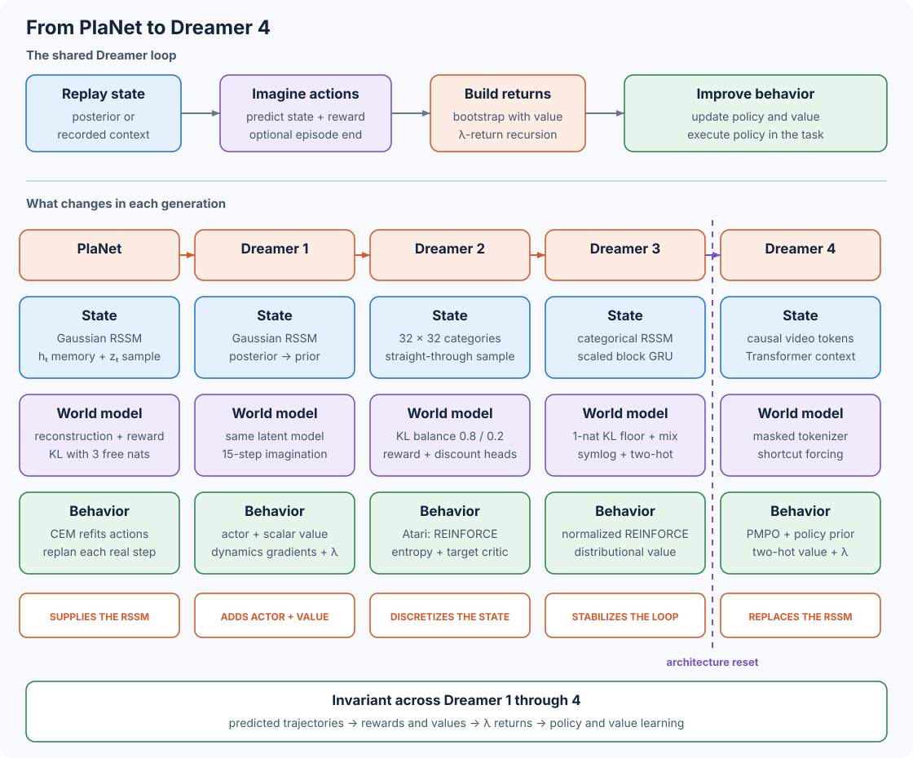

# 10.5 Dreamer 1 to 4: Follow the Architecture Changes

Across four versions, Dreamer changes its latent state, training losses, and policy gradient while keeping imagination at the center of each design.



_Figure 10.5: Dreamer 1 through 3 revise the same recurrent state-space model and imagination loop. Dreamer 4 retains imagination training and replaces the predictive architecture._

As you read, use the diagram to track the state in blue, world-model training in purple, and behavior learning in green. The orange label names each version's main change.

## Start with the RSSM from PlaNet

PlaNet supplies the recurrent state-space model, or RSSM, used by the first three Dreamer versions. At time $t$, this model combines deterministic memory $h\_t$ with a stochastic state $z\_t$:

$$
\begin{aligned}
h_t &= f(h_{t-1},z_{t-1},a_{t-1}),\\
p(z_t\mid h_t) &\quad\text{prior used to imagine},\\
q(z_t\mid h_t,e(o_t)) &\quad\text{posterior corrected by an observation},\\
s_t &= [h_t,z_t].
\end{aligned}
$$

The distinction between posterior and prior tells us how imagination starts. The posterior sees the encoded observation $e(o\_t)$ and creates the states used to start training rollouts from replay. The prior sees the recurrent memory and action, and predicts every later state after imagination begins. PlaNet trains this state through observation reconstruction, reward prediction, and a posterior-to-prior KL loss. Its final agent clips that KL below three free nats. The paper studies latent overshooting separately; the final agent uses the base one-step RSSM objective.

To choose an action, PlaNet searches online with the cross-entropy method. It samples action sequences, predicts their rewards, refits a Gaussian to the elite sequences, and repeats. It executes the current-step mean from the final Gaussian and replans after the next observation.

## Dreamer 1 Replaces Online Search with Actor and Value Networks

Dreamer 1 learns to choose actions through actor and value networks trained in imagination. These replace PlaNet's repeated CEM search. The model keeps the Gaussian RSSM: in the published implementation, $h\_t$ has 200 values and $z\_t$ is a 30-dimensional diagonal Gaussian. Its world-model loss reconstructs the observation, predicts reward, and applies the same three-free-nat floor to the posterior-to-prior KL.

After each world-model update, we start 15-step imagined trajectories from replay posterior states. The actor samples each action, and the RSSM prior advances the state. Because these trajectories have a finite horizon, a value network estimates discounted future return at every imagined state and supplies the bootstrap beyond that horizon:

```
states = rssm.observe(replay.observations, replay.actions)
update rssm, decoder, and reward model on the replay sequence

for start in states:
    repeat for 15 imagined steps:
        action = actor(start)
        start = rssm.prior(start, action)
        reward = reward_head(start)
        value = value_head(start)
        continuation = continue_head(start) if the task can terminate else 1

targets = lambda_return(reward, value, continuation)
update value head toward stopped targets
update actor to maximize lambda returns through the frozen world model
```

The actor learns through the imagined transitions. Reparameterized Gaussian actions and latent states carry its gradients, while Dreamer freezes the world-model parameters during this behavior update.

To calculate the value target, we combine short and long backups. Let $v\_{t+1}$ predict the next state's value. Let $c\_t$ equal one for a continuing transition and zero for a terminal transition. A task with early termination can learn $c\_t$ from the latent state. The backward recursion is

$$
R_t^\lambda=r_t+\gamma c_t
\left((1-\lambda)v_{t+1}+\lambda R_{t+1}^\lambda\right).
$$

Let's calculate the targets for one imagined sequence in PyTorch:

```python
import torch
from world_models.architecture_examples import lambda_returns

rewards = torch.tensor([[1.0, 2.0]])
values = torch.tensor([[0.0, 10.0, 20.0]])
continues = torch.ones_like(rewards)

targets = lambda_returns(
    rewards,
    values,
    continues,
    discount=0.5,
    lambda_=0.5,
)
print(targets)
```

```
tensor([[ 6.5000, 12.0000]])
```

At the last transition, the target is $2+0.5\times20=12$. One step earlier, it mixes the next value $10$ with that longer return: $1+0.5(0.5\times10+0.5\times12)=6.5$. The published control experiments use $\gamma=0.99$, $\lambda=0.95$, and 15 imagined steps. The smaller numbers above make it easier to follow the calculation.

## Dreamer 2 Makes the Stochastic State Discrete

Dreamer 2 keeps $s\_t=\[h\_t,z\_t]$ and still starts from the posterior before imagining with the prior. It changes $z\_t$ from one Gaussian vector to 32 categorical variables with 32 classes each. A sampled state becomes a flattened 1,024-value vector with 32 active entries. The reported Atari model uses 600 deterministic GRU units. Image, reward, and discount heads read the combined deterministic and categorical state.

To train through a categorical sample, it uses a straight-through gradient:

```python
import torch
import torch.nn.functional as F

logits = torch.zeros(4, 32, 32)
probs = logits.softmax(dim=-1)
index = torch.distributions.Categorical(probs=probs).sample()
hard = F.one_hot(index, num_classes=32).to(probs.dtype)
state = hard + probs - probs.detach()

print(state.shape, state.sum(dim=(-1, -2)))
```

```
torch.Size([4, 32, 32]) tensor([32., 32., 32., 32.])
```

The forward pass receives `hard`. The backward pass follows `probs`. This lets the model sample categorical states and train them with backpropagation.

Dreamer 2 also splits the KL gradient between the prior and posterior:

$$
\mathcal{L}_{\mathrm{KL}}
=\alpha D_{\mathrm{KL}}[\operatorname{sg}(q)\,\|\,p]
+(1-\alpha)D_{\mathrm{KL}}[q\,\|\,\operatorname{sg}(p)],
\qquad \alpha=0.8.
$$

The first term trains the prior to match posterior states. The second term trains the posterior toward the prior. The 0.8 weight puts most of this update into the predictor. Dreamer 2 uses this balance in place of Dreamer 1's three-free-nat floor.

The actor update also depends on the task. Dreamer 2 supports REINFORCE and backpropagation through the learned dynamics. Atari uses REINFORCE plus entropy regularization; continuous control uses the dynamics gradient. A target critic copied every 100 gradient steps supplies the lambda-return bootstraps. The categorical state, KL balancing, actor update, and larger model form the configuration that the paper evaluates across all 55 Atari games.

## Dreamer 3 Makes One Configuration Work Across Domains

For one configuration to work across domains, the updates need to handle different probability and reward scales. Dreamer 3 keeps the categorical RSSM and stabilizes these quantities. Its default 200-million-parameter model uses 32 categorical variables with 64 classes and an 8-block GRU with 8,192 deterministic units. Its training changes control the scale of probabilities, targets, KL terms, and policy gradients:

| Mechanism                       | Calculation                                                                                                  | Role in training                                                                          |
| ------------------------------- | ------------------------------------------------------------------------------------------------------------ | ----------------------------------------------------------------------------------------- |
| Mixed categorical probabilities | $p'=0.99p+0.01/K$ for $K$ classes                                                                            | Keeps every RSSM and categorical-policy class above zero probability.                     |
| Split KL with one free nat      | $\max(1,D\_{\mathrm{KL\}}\[\operatorname{sg}(q)\|p])+0.1\max(1,D\_{\mathrm{KL\}}\[q\|\operatorname{sg}(p)])$ | Combines KL balancing with a one-nat floor on each stopped-gradient term.                 |
| `symlog` vector observations    | $\operatorname{sign}(x)\log(1+                                                                               | x                                                                                         |
| `symexp` two-hot predictions    | 255 bins between $\operatorname{symexp}(-20)$ and $\operatorname{symexp}(20)$                                | Trains reward and value heads as distributions while preserving continuous signed values. |
| Return-range normalization      | divide advantages by $\max(1,\operatorname{EMA}(P\_{95}-P\_5))$                                              | Keeps the actor update on a comparable scale across reward ranges.                        |

We can see which parts of the model learn from each KL term by writing out the world-model loss:

$$
\begin{aligned}
\mathcal{L}_{\mathrm{dyn}}
&=\max\left(1,D_{\mathrm{KL}}[\operatorname{sg}(q_t)\,\|\,p_t]\right),\\
\mathcal{L}_{\mathrm{rep}}
&=\max\left(1,D_{\mathrm{KL}}[q_t\,\|\,\operatorname{sg}(p_t)]\right),\\
\mathcal{L}_{\mathrm{WM}}
&=\mathcal{L}_{\mathrm{pred}}+\mathcal{L}_{\mathrm{dyn}}
+0.1\mathcal{L}_{\mathrm{rep}}.
\end{aligned}
$$

$\mathcal{L}\_{\mathrm{pred\}}$ contains observation, reward, and continuation prediction losses. The stopped gradients make the first KL update the prior and the second update the posterior.

For the actor, Dreamer 3 uses REINFORCE for both discrete and continuous actions. To control the scale of this update, it divides the advantage by an exponential moving average of the 95th-to-5th-percentile return range and adds an entropy term with weight $3\times10^{-4}$. Its categorical actor also uses the one-percent uniform mixture. A two-hot critic predicts $\lambda$ returns. Replay-state targets and an exponential-moving-average critic regularize the value model.

Block GRUs, RMSNorm, SiLU activations, adaptive gradient clipping, and LaProp support the 200-million-parameter network. The paper uses one set of algorithmic hyperparameters on more than 150 tasks, with compute and data collection settings chosen for each benchmark.

## Dreamer 4 Replaces the RSSM

The first three versions keep refining the RSSM. Dreamer 4 keeps policy and value learning in generated trajectories, then changes the model that generates those trajectories. Compare the parts that make this possible:

| Part               | Dreamer 1 through 3                                | Dreamer 4                                                                        |
| ------------------ | -------------------------------------------------- | -------------------------------------------------------------------------------- |
| State              | recurrent memory $h\_t$ plus sampled latent $z\_t$ | continuous tokenizer representations plus causal Transformer context             |
| Dynamics           | recurrent prior predicts one latent state          | block-causal Transformer denoises the next representation                        |
| World-model target | observation, reward, continuation, and KL losses   | tokenizer reconstruction, shortcut prediction, then action and reward prediction |
| Generated step     | one RSSM prior sample                              | four shortcut updates for one frame representation                               |
| Policy input       | RSSM feature $\[h\_t,z\_t]$                        | output embedding of a task-conditioned agent token                               |

To connect video generation to behavior learning, Dreamer 4 first trains the tokenizer and video dynamics. It then inserts agent tokens and fits task-conditioned action and reward heads to recorded trajectories. Imagination starts from contexts in that dataset. The generated representations, actions, rewards, and values give us the same kind of $\lambda$-return target used by earlier Dreamers.

For the policy update, Dreamer 4 uses PMPO. It assigns imagined states to positive and negative sets according to the sign of their advantage, then balances both sets. A reverse KL term keeps the learned policy near a frozen copy of the behavior policy. During the default imagination phase, only the policy and value heads update. The tokenizer, dynamics Transformer, reward head, and behavior-policy copy stay frozen. In the paper's Minecraft diamond experiment, this complete training process uses a fixed offline dataset.

## Compare the Four Versions Directly

We can now compare the state each version predicts, how it learns that state, and how the actor uses imagined trajectories:

| Version   | Predictive state                             | World-model change                                                                             | Actor and value update                                                                              | Evaluation scope in the paper                                                     |
| --------- | -------------------------------------------- | ---------------------------------------------------------------------------------------------- | --------------------------------------------------------------------------------------------------- | --------------------------------------------------------------------------------- |
| Dreamer 1 | Gaussian RSSM                                | Keeps PlaNet's recurrent stochastic state and three free nats                                  | Dynamics gradients through 15-step imagination; scalar critic and $\lambda$ returns                 | 20 visual continuous-control tasks; appendix tests Atari and DeepMind Lab subsets |
| Dreamer 2 | $32\times32$ categorical RSSM for Atari      | Adds straight-through categories and replaces free nats with KL balancing                      | REINFORCE for Atari, dynamics gradients for continuous control, entropy bonus, copied target critic | 55 Atari games; one pixel-based humanoid demonstration                            |
| Dreamer 3 | Scaled categorical RSSM                      | Combines split KL and one free nat; adds mixed probabilities, two-hot targets, and a block GRU | REINFORCE with return-range scaling; distributional critic                                          | More than 150 tasks across several domains                                        |
| Dreamer 4 | Causal continuous tokenizer plus Transformer | Adds shortcut-forcing video generation and task tokens                                         | PMPO with a behavior prior; distributional value head and $\lambda$ returns                         | Offline Minecraft diamond task and real-time human interaction                    |

## Trace the Papers and Code

* [PlaNet paper](https://arxiv.org/abs/1811.04551) and [project page](https://danijar.com/project/planet/) introduce the RSSM and latent CEM planning.
* [Dreamer 1 paper](https://arxiv.org/abs/1912.01603) and the [paper-linked implementation at revision `d517542`](https://github.com/google-research/dreamer/tree/d517542f9777c53864ff6f2683cea88be9ea98ac) define actor and value learning through latent imagination.
* [Dreamer 2 paper](https://arxiv.org/abs/2010.02193) and the [official implementation at revision `07d906e`](https://github.com/danijar/dreamerv2/tree/07d906e9c4322c6fc2cd6ed23e247ccd6b7c8c41) show the categorical RSSM, KL balance, and Atari behavior objective.
* [Dreamer 3 paper](https://doi.org/10.1038/s41586-025-08744-2), its [formula-readable preprint](https://arxiv.org/abs/2301.04104), and the [author-maintained implementation at revision `e3f0224`](https://github.com/danijar/dreamerv3/tree/e3f02248693a79dc8b0ebd62c93683888ddaccfe) show the robust losses and scaled RSSM. The repository identifies itself as a reimplementation based on the Dreamer 2 code.
* [Dreamer 4 paper](https://arxiv.org/abs/2509.24527) and [project page](https://danijar.com/project/dreamer4/) define the causal video model and offline imagination-training system.

To follow a component into code, use these fixed revisions for the first three versions:

| Version   | State and dynamics                                                                                                              | World-model and behavior update                                                                                     | Configuration                                                                                                                            |
| --------- | ------------------------------------------------------------------------------------------------------------------------------- | ------------------------------------------------------------------------------------------------------------------- | ---------------------------------------------------------------------------------------------------------------------------------------- |
| Dreamer 1 | [`models.py`](https://github.com/danijar/dreamer/blob/56d4d444dfd0582b0e79dab80aebbea74c0ce40d/models.py)                       | [`dreamer.py`](https://github.com/danijar/dreamer/blob/56d4d444dfd0582b0e79dab80aebbea74c0ce40d/dreamer.py)         | [paper-era presets](https://github.com/google-research/dreamer/blob/d517542f9777c53864ff6f2683cea88be9ea98ac/dreamer/scripts/configs.py) |
| Dreamer 2 | [`common/nets.py`](https://github.com/danijar/dreamerv2/blob/07d906e9c4322c6fc2cd6ed23e247ccd6b7c8c41/dreamerv2/common/nets.py) | [`agent.py`](https://github.com/danijar/dreamerv2/blob/07d906e9c4322c6fc2cd6ed23e247ccd6b7c8c41/dreamerv2/agent.py) | [`configs.yaml`](https://github.com/danijar/dreamerv2/blob/07d906e9c4322c6fc2cd6ed23e247ccd6b7c8c41/dreamerv2/configs.yaml)              |
| Dreamer 3 | [`rssm.py`](https://github.com/danijar/dreamerv3/blob/e3f02248693a79dc8b0ebd62c93683888ddaccfe/dreamerv3/rssm.py)               | [`agent.py`](https://github.com/danijar/dreamerv3/blob/e3f02248693a79dc8b0ebd62c93683888ddaccfe/dreamerv3/agent.py) | [`configs.yaml`](https://github.com/danijar/dreamerv3/blob/e3f02248693a79dc8b0ebd62c93683888ddaccfe/dreamerv3/configs.yaml)              |

> Try it yourself
>
> Copy the lambda-return example above into a Python session. Set `lambda_` to 0 to recover one-step value targets, then set it to 1 to propagate every imagined reward. Set one continuation value to 0 and confirm that rewards after that transition no longer enter earlier targets.

In [Section 10.6](06-dreamer-4.md), we will build the Dreamer 4 components in more detail: implement the block-causal mask and shortcut update, then connect the tokenizer and agent tokens to the behavior heads.
