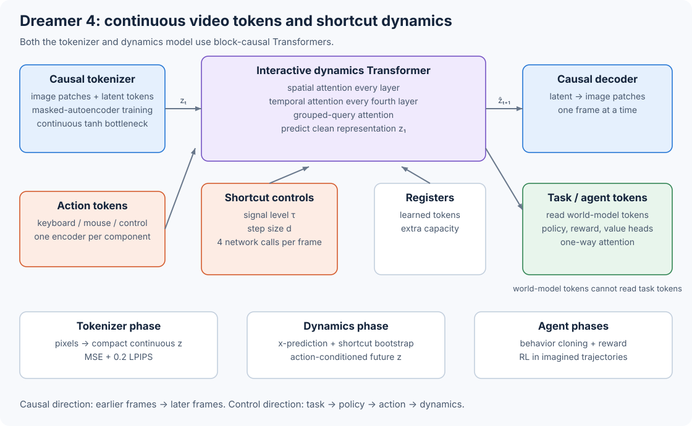

# 10.6 Dreamer 4: Generate and Act in One Transformer

We will build Dreamer 4 by following four pieces:

1. a causal video tokenizer,
2. an action-conditioned dynamics Transformer,
3. shortcut forcing for four-step generation, and
4. policy, reward, and value heads used during imagined interaction.



_Figure 10.6: The tokenizer supplies continuous representations. The dynamics model predicts their future under an action, then task tokens supply the policy and learning signals._

We will follow the [Dreamer 4 paper](https://arxiv.org/html/2509.24527v1). Public [PyTorch](https://github.com/nicklashansen/dreamer4/tree/b8abafbf4da72c59b6aa09f8499ccde0d6a37fd6) and [JAX](https://github.com/edwhu/dreamer4-jax/tree/8144b940d801971f12ec5633553b95001e555949) implementations provide runnable code for studying the components. Both are community implementations. The PyTorch README marks the agent code as incomplete.

## Compress Each Frame Causally

The tokenizer processes image patches and learned latent tokens. Its encoder lets latent tokens read the visible image patches, then a narrow projection followed by `tanh` forms the continuous bottleneck. The decoder expands those latents to reconstruct the image patches.

The temporal attention mask exposes only the current and earlier frames. Dreamer 4 also applies a modality mask: encoder latents can read every modality, while image tokens attend within their own modality; the decoder reverses that information flow so each output modality can read the latents. The calculation below isolates the temporal part of this mask. It treats every token in a frame as one time step:

```python
import torch

def block_causal_mask(num_frames, tokens_per_frame):
    frame = torch.arange(num_frames).repeat_interleave(tokens_per_frame)
    return frame[None, :] <= frame[:, None]

mask = block_causal_mask(num_frames=3, tokens_per_frame=4)
print(mask.int())
```

Inspect the upper-left 4 × 4 block. It contains ones because all four tokens belong to the first frame. The next four query rows can also read that complete block. This temporal mask lets the tokenizer decode one frame at a time. The modality mask then controls which token types exchange information inside each visible frame.

To train these latent tokens to reconstruct an image, Dreamer 4 uses a masked autoencoder. It replaces a random fraction of image patches with a learned mask embedding, then minimizes pixel MSE plus a perceptual reconstruction term:

$$
\mathcal{L}_{\mathrm{tokenizer}}
=\mathcal{L}_{\mathrm{MSE}}+0.2\mathcal{L}_{\mathrm{LPIPS}}.
$$

The equation gives the relative weights. To balance the terms during optimization, Dreamer 4 divides each one by a running estimate of its root-mean-square value. It applies the same normalization to dynamics, policy, reward, and value losses when they share the Transformer.

The paper samples a separate masking probability for each image from $U(0,0.9)$. This trains the latent tokens to collect enough information to reconstruct missing patches. At inference time, the tokenizer receives all patches.

## Interleave Representations and Actions

Once the tokenizer is trained, we freeze it and train the dynamics model on its representations. For every environment step, we project the continuous representation into spatial tokens and arrange the dynamics input as follows:

```
frame t:
    action tokens
    corrupted representation tokens
    register tokens
    one token encoding signal level and shortcut step size

frame t+1:
    action tokens
    corrupted representation tokens
    register tokens
    one signal/step token
```

Each action component has its own encoder: a categorical key press uses an embedding lookup, and a continuous control uses a linear projection. Summing the component encodings creates the action tokens. When training on video without action labels, a learned action embedding takes their place.

To connect information within and across frames, the Transformer alternates spatial and temporal attention. Spatial attention mixes tokens inside one time step. Temporal attention connects time steps and runs once every four layers. Grouped-query attention reduces the size of the temporal key-value cache. The blocks use RMSNorm, QK normalization, rotary position embeddings, SwiGLU feed-forward layers, and capped attention logits. [Section 3.4](https://arxiv.org/html/2509.24527v1#S3.SS4) explains these choices.

## Predict the Clean Representation

We train the dynamics model to recover a clean representation from a noisy one. Let $z\_0$ be Gaussian noise and $z\_1$ a clean tokenizer representation. Dreamer 4 defines signal level $\tau=0$ as noise and $\tau=1$ as data:

$$
\widetilde z=(1-\tau)z_0+\tau z_1.
$$

The dynamics network receives $\widetilde z$, $\tau$, a shortcut step size $d$, and the action sequence. It predicts the clean endpoint:

$$
\widehat z_1=f_\theta(\widetilde z,\tau,d,a).
$$

This is x-prediction. Compare it with Chapter 4's Cosmos implementation, which predicts velocity. Dreamer 4 predicts the clean representation because small errors in a high-frequency velocity can accumulate during long frame-by-frame rollouts. When the sampler needs an update, we convert the endpoint estimate to a velocity:

```python
def endpoint_to_velocity(noisy, predicted_clean, signal_level):
    remaining = 1 - signal_level
    return (predicted_clean - noisy) / remaining

def shortcut_step(noisy, predicted_clean, signal_level, step_size):
    velocity = endpoint_to_velocity(noisy, predicted_clean, signal_level)
    return noisy + step_size * velocity
```

Here, `step_size` moves toward the data endpoint. Keep this sign convention separate from Chapter 4, where the Cosmos sampler moves from $t=1$ noise to $t=0$ data with negative time increments.

## Learn Large Sampling Steps

A flow model trained only on small steps usually needs many network calls. To generate a frame in fewer calls, shortcut forcing also teaches the network what a larger step should do. For the smallest step, we train the endpoint prediction directly against $z\_1$. For a larger step $d$, we take two half steps with a stop-gradient teacher and train one full-step prediction to match their average velocity:

```python
def shortcut_target(model, noisy, tau, step, actions):
    half = step / 2

    endpoint_1 = model(noisy, tau, half, actions)
    velocity_1 = endpoint_to_velocity(noisy, endpoint_1, tau)
    midpoint = noisy + half * velocity_1

    endpoint_2 = model(midpoint, tau + half, half, actions)
    velocity_2 = endpoint_to_velocity(midpoint, endpoint_2, tau + half)
    return ((velocity_1 + velocity_2) / 2).detach()
```

Follow the difference between the teacher and student inputs: the student receives the original noisy representation and the full step size. The loss compares its implied velocity with the target and multiplies the squared error by $(1-\tau)^2$. The paper also applies the ramp $w(\tau)=0.9\tau+0.1$ so training emphasizes signal levels with more useful information. Read the complete target in [Equation 7](https://arxiv.org/html/2509.24527v1#S3.E7).

At inference, Dreamer 4 sets $d=1/4$ and calls the dynamics model four times for each new frame representation. The next environment action conditions the next four calls, giving us an interactive loop:

```
encode observed frames
repeat for each imagined time step:
    action = policy(current context, task)
    latent = Gaussian noise
    signal = 0
    repeat 4 shortcut updates with step = 1/4:
        clean = dynamics(context, action, latent, signal, step)
        latent = shortcut_step(latent, clean, signal, step)
        signal = signal + step
    append latent to context
```

The paper also corrupts past context representations to signal level $\tau\_{\mathrm{ctx\}}=0.1$ during sampling. This makes the dynamics model handle small errors left by earlier generated frames.

## Insert an Agent Without Leaking the Task

The agent needs to know its task when choosing actions, while the dynamics should predict the consequences of those actions. After dynamics pretraining, Dreamer 4 inserts task-conditioned agent tokens at each time step. Policy, reward, and value heads read those tokens. A one-way attention mask controls how this task information flows:

* agent tokens read observations, actions, registers, and other agent tokens;
* video and action tokens cannot read agent tokens.

With this mask, the task can change which action the policy selects, and that action can change the next representation. The task label itself cannot directly change the predicted physics.

During agent finetuning, Dreamer 4 continues the dynamics loss while updating the Transformer, task tokens, and policy and reward heads on recorded trajectories. During its standard imagination phase, it freezes the Transformer and updates the policy and value heads. A frozen copy of the behavior policy supplies the policy prior. The full training sequence is:

```
1. Train the causal tokenizer on videos.
2. Freeze it; train action-conditioned latent dynamics.
3. Add task tokens; jointly finetune dynamics, policy, and reward predictions.
4. Freeze the Transformer; train value and policy heads in imagination.
```

To train the value head, we calculate a $\lambda$ return for each imagined trajectory. Index $v\_{t+1}$ by the state reached after reward $r\_t$:

$$
R_t^\lambda=r_t+\gamma c_t
\left((1-\lambda)v_{t+1}+\lambda R_{t+1}^\lambda\right),
\qquad \gamma=0.997.
$$

The value head represents this target with the symexp two-hot distribution introduced by Dreamer 3. [Section 10.5](05-dreamer-lineage.md) implements the return recursion and shows which earlier Dreamer components carry forward.

The policy head uses PMPO to learn from the advantages of imagined actions. Compute $A\_t=R\_t^\lambda-v\_t$, split all imagined states into $\mathcal{D}^+={i:A\_i\geq0}$ and $\mathcal{D}^-={i:A\_i<0}$, and minimize

$$
\mathcal{L}_{\mathrm{policy}}
=\frac{1-\alpha}{|\mathcal{D}^-|}\sum_{i\in\mathcal{D}^-}\log\pi(a_i\mid s_i)
-\frac{\alpha}{|\mathcal{D}^+|}\sum_{i\in\mathcal{D}^+}\log\pi(a_i\mid s_i)
+\frac{\beta}{N}\sum_i
D_{\mathrm{KL}}[\pi(\cdot\mid s_i)\,\|\,\pi_{\mathrm{prior}}(\cdot\mid s_i)],
$$

with $\alpha=0.5$ and $\beta=0.3$. The first two terms use the sign of the advantage and balance positive and negative states. The KL term constrains the policy to actions represented by the recorded behavior.

The paper reports that updating the full Transformer during imagination gives a small additional benefit at higher compute cost. That variant must retain the dynamics, reward, and policy-prior losses while it trains.

## Trace the Public Implementations

We can study runnable versions of these components in two public projects. The [PyTorch implementation](https://github.com/nicklashansen/dreamer4/tree/b8abafbf4da72c59b6aa09f8499ccde0d6a37fd6) supplies tokenizer and dynamics checkpoints plus an interactive viewer for 30 continuous-control tasks. It applies the architecture to $128\times128$ DMControl videos. The [JAX implementation](https://github.com/edwhu/dreamer4-jax/tree/8144b940d801971f12ec5633553b95001e555949) separates the complete four-phase pipeline and verifies it on a controlled bouncing-square environment.

| Paper component               | PyTorch code                                                                                                                                   | JAX code                                                                                                                                       |
| ----------------------------- | ---------------------------------------------------------------------------------------------------------------------------------------------- | ---------------------------------------------------------------------------------------------------------------------------------------------- |
| Causal tokenizer and dynamics | [`dreamer4/model.py`](https://github.com/nicklashansen/dreamer4/blob/b8abafbf4da72c59b6aa09f8499ccde0d6a37fd6/dreamer4/model.py)               | [`dreamer/models.py`](https://github.com/edwhu/dreamer4-jax/blob/8144b940d801971f12ec5633553b95001e555949/dreamer/models.py)                   |
| Tokenizer training            | [`train_tokenizer.py`](https://github.com/nicklashansen/dreamer4/blob/b8abafbf4da72c59b6aa09f8499ccde0d6a37fd6/dreamer4/train_tokenizer.py)    | [`scripts/train_tokenizer.py`](https://github.com/edwhu/dreamer4-jax/blob/8144b940d801971f12ec5633553b95001e555949/scripts/train_tokenizer.py) |
| Dynamics training             | [`train_dynamics.py`](https://github.com/nicklashansen/dreamer4/blob/b8abafbf4da72c59b6aa09f8499ccde0d6a37fd6/dreamer4/train_dynamics.py)      | [`scripts/train_dynamics.py`](https://github.com/edwhu/dreamer4-jax/blob/8144b940d801971f12ec5633553b95001e555949/scripts/train_dynamics.py)   |
| Imagined rollout              | interactive sampler in [`model.py`](https://github.com/nicklashansen/dreamer4/blob/b8abafbf4da72c59b6aa09f8499ccde0d6a37fd6/dreamer4/model.py) | [`dreamer/imagination.py`](https://github.com/edwhu/dreamer4-jax/blob/8144b940d801971f12ec5633553b95001e555949/dreamer/imagination.py)         |

The JAX project implements behavior cloning, reward learning, and policy training on its small environment. The paper remains the source for the reported Minecraft system; the repositories make its components executable at smaller scale.

## Compare Dreamer 4 with Cosmos

Compare these choices with the Cosmos generator we studied earlier:

| Design decision      | Cosmos-Predict2.5              | Dreamer 4                                          |
| -------------------- | ------------------------------ | -------------------------------------------------- |
| Generated unit       | A video latent block           | One continuous frame representation at a time      |
| Primary conditioning | Text and observed image/video  | Previous representations and actions               |
| Attention over time  | Joint video-token attention    | Block-causal axial attention                       |
| Network output       | Latent velocity                | Clean representation                               |
| Sampling             | Multi-step flow scheduler      | Four learned shortcut steps per frame              |
| Decision mechanism   | External to the base generator | Policy, reward, and value heads in the Transformer |

[MIRA](07-mira.md) keeps action-conditioned latent generation and changes the interface: four external players act inside one shared generated world.

> Try it yourself
>
> Run the block-causal mask with two frames and three tokens per frame. Confirm that a query from frame 0 cannot read frame 1. Then deliberately allow video tokens to read task tokens. Explain how direct task information in the dynamics could weaken the pressure to use the supplied action tokens.
