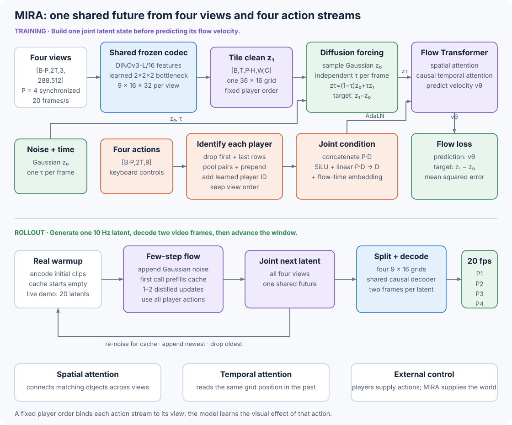

# 10.7 MIRA: Generate Four Player Views from Joint Actions

With several players, their views need to agree: a ball that moves in one camera should move consistently in the others. MIRA receives four players' views and four action streams at the same time. It generates every view in one joint latent grid.

Developed by General Intuition, Kyutai, and Epic Games, MIRA combines four ideas:

1. a video representation codec built on frozen DINOv3 features,
2. a flow-matching Transformer trained with diffusion forcing,
3. tiled views and ordered action embeddings for multiplayer conditioning, and
4. a distilled streaming loop that produces video at the rate of play.

The published system models 2v2 Rocket League. The flagship contains about 5 billion world-model parameters and a 600-million-parameter codec. The report trains it on roughly 10,000 match-hours of Nexto self-play, with four synchronized player views for each match. The [technical report](https://arxiv.org/pdf/2607.05352v2), [project page](https://mira-wm.com/), and [official code](https://github.com/mira-wm/mira/tree/3d739ec2d31daf83559d33eb01727cea48fe90f7) provide the architecture, data loader, training loops, and streaming inference implementation.



_Figure 10.7: MIRA encodes each view separately and joins the four latent grids for cross-view attention. It integrates the predicted velocity into the next grid, which the multiplayer wrapper splits before decoding. The rolling cache feeds each generated latent back into the next step._

## Define One Future for All Players

We can describe this shared prediction by grouping the players' views and actions. Let $p\in{1,\ldots,P}$ index a player. Player $p$ supplies a video stream $x^p$ and actions $a^p$. The codec maps video frames to latent frames $z^p$ at a lower spatial and temporal resolution. MIRA models the next latent for every player jointly:

$$
p_\theta\left(
 z_{t+1}^{1:P}
 \mid z_{\leq t}^{1:P},a_{\leq t}^{1:P}
\right).
$$

For the reported 2v2 system, $P=4$. Every output therefore represents four views of the same next game state. MIRA learns this distribution from rendered video and keyboard actions. The training pipeline records the game engine's physical state, but the world model never receives that state. The authors use it later to test what the learned activations encode.

Here, multiplayer means that four external action streams control the generated future. MIRA has no reward head, value head, or actor network. When an action stream is hidden, the video model predicts that player's likely behavior from the information it receives.

## Build a Predictive Video Representation

Before predicting the next views, MIRA compresses the video into a continuous representation. We want this representation to preserve what we see and make future changes easier to predict. Its codec starts with a frozen DINOv3-L/16 image encoder. For each frame, it reads intermediate blocks

$$
\mathcal{S}=\{11,13,15,17,19,21,23\}
$$

and combines their patch features as

$$
\bar f=\frac{1}{|\mathcal{S}|}\sum_{\ell\in\mathcal{S}}f_\ell
+f_{\max(\mathcal{S})}.
$$

The average retains information from several depths. Adding the deepest block keeps its semantic features prominent.

A learned linear bottleneck patchifies $\bar f$ by $2\times2$ in space and by 2 in time. It also projects the DINO feature dimension from 1,024 to 32. Since DINOv3 already uses $16\times16$ image patches, one final latent vector covers a $32\times32$ pixel region. A 20 fps input becomes a 10 Hz latent sequence. For one $288\times512$ view, one latent frame has shape

$$
9\times16\times32.
$$

The bottleneck is deterministic. It uses no codebook, Gaussian sampling, KL loss, or latent-noise regularizer. Each 32-value latent vector later becomes one world-model token.

The decoder reverses the compression in two stages. It first upsamples the latent grid from one token per $32\times32$ pixels to DINO's $16\times16$ patch grid. A vision Transformer then applies bidirectional attention across space and causal attention across time. The final unpatchification maps each 10 Hz latent frame to two 20 fps video frames.

To learn the compression and reconstruction, MIRA trains the codec with three terms that compare the input and reconstructed video:

$$
\mathcal{L}_{\mathrm{codec}}
=\|x-\widehat{x}\|_1
+\lambda_p\operatorname{LPIPS}(x,\widehat{x})
+\lambda_d\|\phi(x)-\phi(\widehat{x})\|_2^2.
$$

Here, $\phi$ stacks features from several frozen DINOv3 layers and normalizes each patch feature along its channel dimension before computing MSE. The released configuration samples one quarter of the frames for LPIPS and a separately sampled quarter for DINO feature consistency. At each update, the training code rescales each perceptual term so its gradient norm at the last decoder layer matches the L1 gradient norm. This keeps both terms on a comparable training scale. The codec uses these three terms without a discriminator.

We need to test this representation by predicting with it. A codec can reconstruct sharp frames and still produce a latent space that a dynamics model struggles to predict. MIRA's ablation gives the from-scratch encoder higher reconstruction PSNR than frozen DINOv3, 32.2 versus 29.7. The world model trained on frozen DINOv3 latents reaches gFID 10.7; the from-scratch latent reaches 22.5.

## Trace Every Tensor Through the Multiplayer Model

Let's follow the views and actions through a training clip with 80 video frames at 20 fps. Let $B$ count matches in a batch. The data loader places each match's four views next to one another in player-ID order:

| Stage              | Shape                | Meaning                                                       |
| ------------------ | -------------------- | ------------------------------------------------------------- |
| Video batch        | $\[4B,80,3,288,512]$ | Four synchronized camera streams per match                    |
| Codec output       | $\[4B,40,9,16,32]$   | Per-view continuous latents at 10 Hz                          |
| Tiled latent       | $\[B,40,36,16,32]$   | Four height blocks in one joint grid                          |
| Spatial tokens     | $\[B,40,576,4096]$   | Flagship projection to Transformer width                      |
| Raw actions        | $\[4B,80,9]$         | Nine binary keyboard controls per player                      |
| Action slice       | $\[4B,78,9]$         | Dropping the first and last rows leaves 39 aligned pairs      |
| Encoded actions    | $\[4B,40,4096]$      | Pool pairs into 39 embeddings, then prepend the initial token |
| Joint action       | $\[B,40,4096]$       | Ordered player embeddings combined once per step              |
| Predicted velocity | $\[B,40,36,16,32]$   | One flow vector for every latent value                        |
| Split latent       | $\[4B,40,9,16,32]$   | Restore one grid for each player                              |
| Decoded video      | $\[4B,80,3,288,512]$ | Two output frames from each latent frame                      |

The four-player tile has $4\times9\times16=576$ spatial tokens per latent frame. Full spatial attention can therefore connect the ball in one view to the same ball in the other three views.

The following small example lets us see where each player's values go. It reproduces the tiling, splitting, and action combination in the pinned `MultiWrapperWorldModel` implementation:

```python
import torch
from world_models.architecture_examples import (
    combine_player_actions,
    split_player_latents,
    tile_player_latents,
)

players = 4

# One match, one time step, one row per player. Each scalar identifies a view.
per_player = torch.arange(1, 5, dtype=torch.float32).reshape(4, 1, 1, 1, 1)
tiled = tile_player_latents(per_player, num_players=players)
restored = split_player_latents(tiled, num_players=players)

print(tiled.shape)
print(tiled[0, 0, :, 0, 0].tolist())
print(torch.equal(restored, per_player))

# One match, four players, one time step, two action features.
actions = torch.tensor(
    [[[1.0, 2.0]], [[3.0, 4.0]], [[5.0, 6.0]], [[7.0, 8.0]]]
)
player_embedding = torch.zeros(players, 2)
projection_weight = torch.zeros(2, players * 2)
projection_weight[0, 0] = 1.0   # first feature from player 1
projection_weight[1, -1] = 1.0  # second feature from player 4

joint_action = combine_player_actions(
    actions,
    players,
    player_embedding,
    projection_weight,
)
print(joint_action.shape)
print(joint_action.round(decimals=4))
```

```
torch.Size([1, 1, 4, 1, 1])
[1.0, 2.0, 3.0, 4.0]
True
torch.Size([1, 1, 2])
tensor([[[0.7311, 7.9973]]])
```

The tile operation maps `(batch player) time height width channel` to `batch time (player height) width channel`. Splitting applies the exact inverse. The action helper follows the official code in three steps:

1. reshape $\[BP,T,D]$ to $\[B,P,T,D]$,
2. add one learned $D$-value player embedding to each stream, and
3. concatenate players into $\[B,T,PD]$, apply SiLU, and project back to $D$.

The fixed player order ties each action embedding to the matching height block. The projection in the small example selects two positions so we can see that order directly. The trained model learns every projection weight.

## Join Views Before Applying Attention

With the views joined, the Transformer needs to know where each token sits in space and time. MIRA first applies a linear input projection to every continuous latent vector, then adds factorized rotary position encodings:

* two-dimensional axial RoPE marks locations in the joint spatial grid;
* temporal RoPE marks time in seconds.

RoPE introduces no learned table tied to one image height, so the single-player Transformer can initialize the multiplayer Transformer even though the multiplayer grid is four times taller.

The Transformer stack separates space and time. Every block runs spatial attention. The released 1-billion-parameter configuration runs temporal attention in layers 1, 5, 9, 13, and the final layer:

```
joint latent tokens
    -> full bidirectional spatial attention within one latent frame
    -> optional causal temporal attention at each spatial location
    -> AdaLN-modulated SwiGLU feed-forward layer
    -> next block
```

Spatial attention crosses all four height blocks. Temporal attention reads the same joint-grid location in current and earlier frames. The reported network also uses grouped-query attention, QK normalization, sigmoid attention-output gates, and learned register tokens.

The flagship model has width 4,096, 16 Transformer layers, 32 query heads, and 8 key-value heads. The official repository's default Hydra configuration builds a smaller 1-billion-parameter model with width 2,048. The report's Table 11 specifies the 5-billion-parameter demo configuration.

## Bind Four Actions to the Joint Grid

Next, we need to connect each player's controls to the right view and time step. Each player supplies a nine-value multi-hot keyboard state:

```
W A S D Q E SPACE LSHIFT LCTRL
```

The action encoder learns a separate embedding for the on and off state of each key. For an 80-frame training clip, it drops the first and last action rows and pools the middle 78 rows into 39 embeddings at 10 Hz. It prepends a learned initial-action token so the action and latent sequences both contain 40 steps.

After the multiplayer wrapper combines the ordered player streams, it adds the joint action embedding to a sinusoidal flow-time embedding. An MLP turns this condition $c\_t$ into scale and shift values for adaptive layer normalization:

$$
\operatorname{AdaLN}(u,c_t)
=\left(1+\gamma(c_t)\right)\operatorname{LN}(u)+\beta(c_t).
$$

Every spatial token at time $t$ receives the same joint action condition. The Transformer learns the spatial effect of each player's controls from the ordered view and action pairs. It can connect one player's boost to that car's motion in all cameras and to the resulting collision with another car.

During training, action dropout hides a player's controls on selected examples. The model then predicts that player's motion from the visible scene and the other players. At inference, the demo uses the same missing-action state for an autopilot player. This behavior comes from patterns learned by the video model, which has no separate policy network.

The pinned implementation applies dropout per player with probability 0.1. For a selected player, one branch hides the complete action input and another hides a subset containing Q, E, Space, Shift, and Control. The report describes the core mechanism as replacement with a learned absent-action token.

## Train Every Frame with Its Own Flow Time

During a rollout, MIRA will condition on its own predictions. Training with imperfect context helps prepare it for that setting. Let $z\_1$ denote a clean joint latent and let $z\_0\sim\mathcal{N}(0,I)$. MIRA samples one flow time for each latent frame:

$$
\tau_{b,t}\sim U(0,1),\qquad
z_\tau=\tau z_1+(1-\tau)z_0.
$$

The Transformer predicts the velocity from noise to data:

$$
\mathcal{L}_{\mathrm{flow}}
=\mathbb{E}\left[
\left\|v_\theta(z_\tau,\tau,a)-(z_1-z_0)\right\|_2^2
\right].
$$

In this example, we choose four flow times so we can see how much noise each frame receives:

```python
import torch

clean = torch.ones(1, 4, 1, 1, 1)
noise = torch.zeros_like(clean)
tau = torch.tensor([0.0, 0.25, 0.75, 1.0]).reshape(1, 4, 1, 1, 1)

corrupted = tau * clean + (1 - tau) * noise
velocity_target = clean - noise

print(corrupted.flatten().tolist())
print(velocity_target.flatten().tolist())
```

```
[0.0, 0.25, 0.75, 1.0]
[1.0, 1.0, 1.0, 1.0]
```

One training sequence now contains a noise frame, two partially corrupted frames, and a clean frame. Causal attention lets later frames use earlier frames at their sampled noise levels. This scheme is diffusion forcing. It trains the model on context with different noise levels while supervising all time steps in one forward pass.

The paper compares this objective with clean-context teacher forcing in a matched 1-billion-parameter single-player experiment at the 4-second training horizon. Diffusion forcing records gFID 10.7, gFVD 163.1, and gFDD 0.55. Teacher forcing records 32.5, 944.1, and 2.21. Across a measured five-minute rollout, diffusion forcing keeps gFID close to its early value, while the teacher-forced model's gFID rises sharply.

## Distill Several Flow Steps into One

To keep up with play, MIRA needs to generate each update with few Transformer calls. A flow sampler integrates the predicted velocity from $s=0$ noise to $t=1$ data, and every integration step costs another call. MIRA trains a step-conditioned velocity $v\_\theta(z\_s,s,\Delta)$ so one call can cover a larger interval.

For $s\<t$, set the midpoint $u=(s+t)/2$. The student predicts one velocity over the full interval. The teacher takes two half steps, with gradients stopped through its target:

```
v_su = model(z_s, flow_time=s, step=u-s, actions)
z_u = z_s + (u-s) * v_su
v_ut = model(z_u, flow_time=u, step=t-u, actions)

target = stop_gradient(0.5 * v_su + 0.5 * v_ut)
student = model(z_s, flow_time=s, step=t-s, actions)
loss_psd = mean_squared_error(student, target)
```

The average teacher velocity reaches the same endpoint as its two sequential updates. Progressive self-distillation makes the single large-step prediction match that endpoint. The report evaluates a version that applies this loss on 10 percent of updates and finds that it improves one-step and two-step samples. The released implementation supports either stochastic PSD updates or a fixed PSD loss weight.

## Roll the Model Forward at 10 Hz

We can now put the codec, actions, and sampler together into an interactive loop. A session starts with a short clip from the real game, which the codec encodes as the initial context. The live 5-billion-parameter demo uses a rolling window of 20 latent frames:

```
context = init_streaming_inference(initial video from all four players)
actions_history = initial actions from all four players
cache = none

repeat at 10 Hz:
    held_controls = read the latest controls for players 1 through 4
    action_rows = repeat(held_controls, two rows at 20 Hz)
    actions_history = append(actions_history, action_rows)
    context, cache = streaming_inference_step(context, actions_history, cache)

    decoder_context = split(context[:, -3:], players=4)
    decoded_video = decode_to_video(decoder_context)
    two_frames_per_player = newest two frames from decoded_video
    display(two_frames_per_player at 20 fps)
```

`streaming_inference_step` drops the oldest latent, appends Gaussian noise, selects and combines the aligned action rows, and calls `denoise_streaming`. The cache lets later steps reuse attention keys and values from the context. On the first call, `denoise_streaming` fills the key-value cache from the window's context positions. Later calls denoise only the newest token against that cache. The function runs the distilled flow updates internally. It uses `noise_level=0.2` by default, so it computes the newest cached keys and values from the completed latent re-noised to $\tau=0.8$. With `noise_level=None`, it skips this extra cache-update pass and retains the keys and values from the final denoising input, before the last Euler update. The cache keeps the per-step attention cost fixed as play continues. The codec decoder reads its three most recent latent frames. Since each world-model step produces one 10 Hz latent and the decoder expands it into two frames, the user receives a 20 fps video stream.

Each 10 Hz latent covers two 20 Hz video frames and consumes two action rows. The live loop cannot request a new action after the first frame because it has not displayed that frame yet. It therefore holds each player's current control for both rows.

The released 1-billion-parameter multiplayer configuration uses an 80-frame video window, which produces 40 latent frames. During autoregressive inference, the first 78 video frames form 39 context latents and the sampler appends one generated latent. Diffusion-forcing training processes all 40 latents without marking 39 as context. When following these settings, check whether you are using this released configuration or the live demo's 20-latent serving window.

The reported serving stack combines the distilled sampler with TorchInductor, CUDA graphs, CuDNN attention during spatial attention and prefill, and Triton kernels during temporal decode. On one NVIDIA B200, one 5-billion-parameter world-model step plus decoding takes about 70 ms and produces two frames. The producer places those frames in a bounded queue, and a separate sender displays them 50 ms apart.

## Warm Start the Four-Player Model

MIRA first learns from individual views, then uses those weights to begin multiplayer training. Follow that progression through the training stages:

```
1. Train the DINOv3 representation codec on individual player clips.
2. Freeze the codec.
3. Train the latent world model on single-player views.
4. Copy the single-player Transformer into the four-player wrapper.
5. Initialize the player embeddings and joint-action projection.
6. Continue training on four synchronized views and action streams.
7. For the few-step variant, train the step-conditioned flow field with
   progressive self-distillation.
```

The flagship report lists 30,000 single-player pretraining steps followed by 100,000 multiplayer steps. A fixed-compute ablation shows why the warm start matters. Four-player examples contain four times as many views per optimization step, so a fixed player-view budget yields fewer multiplayer updates. At the smaller budget, multiplayer training from a fresh initialization collapses; single-player pretraining followed by multiplayer training recovers the model. At twice that budget, multiplayer can train from scratch. A mix with 25 percent single-player pretraining and 75 percent multiplayer training reaches gFID 9.4, compared with 9.9 for pure multiplayer training.

## Measure Appearance, Control, and State

We need to check both what the videos look like and how they respond to players. MIRA's evaluation separates these concerns into four questions:

| Question                                     | Measurement                                     | What the report finds                                                      |
| -------------------------------------------- | ----------------------------------------------- | -------------------------------------------------------------------------- |
| Do frames and short clips resemble the data? | gFID, gFVD, and gFDD over generated windows     | Frozen pretrained representations and diffusion forcing improve all three. |
| Does the codec preserve its input?           | PSNR, SSIM, LPIPS, P-DINO, rFID, rFVD, and rFDD | Reconstruction scores alone do not select the best predictive latent.      |
| Do commands cause visible actions?           | Action Recoverability Ratio                     | Action fidelity continues to improve after gFID has stabilized.            |
| Do activations preserve physical state?      | MLP probe for car and ball pose and velocity    | Probe error falls as model size grows.                                     |

To measure whether controls are visible in the output, the Action Recoverability Ratio, or ARR, uses a probe trained to recognize each of the nine controls from an eight-frame video window. For action $k$,

$$
\operatorname{ARR}(k)
=\frac{\operatorname{AP}_{\mathrm{generation}}(k)}
{\operatorname{AP}_{\mathrm{reconstruction}}(k)}.
$$

The reconstruction calibrates how well the probe and codec expose that action. A ratio of one means the generated action is as recoverable as the action in a codec reconstruction. Across the models used in the human study, ARR correlates with human action-adherence judgments at Pearson $r=0.84$ and Spearman $\rho=0.93$. The report also finds a relationship between action frequency and ARR: common actions approach the reconstruction score before rare air-roll and reverse actions.

The physical-state probe checks what the model's activations preserve about the game. It reads the last world-model layer, pools each player's region, concatenates the four vectors, and predicts position, orientation, and velocity for four cars and the ball. The probe trains on real encoded sequences and runs on generated sequences at evaluation time. It tests whether generated activations preserve state information that a readout learned from real trajectories.

## Read the Ablations as Design Decisions

The ablations help us understand why MIRA uses this combination of components. The report tests each major component under a controlled training budget. The representation, pixel, temporal-rate, and diffusion-forcing comparisons below use matched 1-billion-parameter single-player models:

| Change                               | Result                                                                                       | Architecture decision                                              |
| ------------------------------------ | -------------------------------------------------------------------------------------------- | ------------------------------------------------------------------ |
| Generate pixels directly             | gFID 104.9 for plain pixels and 81.0 for the JiT recipe, versus 10.7 for the latent model    | Generate the compact representation.                               |
| Train the image encoder from scratch | Better PSNR, but gFID rises from 10.7 to 22.5                                                | Build the latent on pretrained DINOv3 features.                    |
| Keep a 20 Hz latent                  | Similar generation scores to the 10 Hz latent                                                | Compress time by two and cut the temporal sequence length in half. |
| Remove either perceptual codec loss  | LPIPS and DINO feature consistency each improve different generation metrics                 | Keep both perceptual terms.                                        |
| Use clean-context teacher forcing    | gFVD rises from 163.1 to 944.1 at four seconds                                               | Train with independent per-frame flow times.                       |
| Increase model size from 100M to 5B  | Generation and physical-state probes improve; gains narrow between 2.5B and 5B at fixed data | Scale after fixing the representation and objective.               |

The model learns realistic frames early in training. It keeps improving action adherence after image quality has stabilized, which is why the report measures appearance and control separately.

## State the Model's Memory and Data Limits

The rolling window also determines how far back MIRA can directly look. The live demo's 20-latent window gives the model about two seconds of direct latent context. A goal replay lasts longer. MIRA can generate a plausible replay, but it cannot recover the actual earlier goal after that event leaves the window. The report shows replay content errors and occasional multiplayer divergence.

The training distribution also shapes the learned dynamics. The data uses self-play from the Nexto bot family in three arenas. A resting ball appears rarely, so a generated ball can begin moving without contact. Kickoffs often contain the same boost pattern, so the model sometimes boosts or jumps without the corresponding human command. Rare controls receive lower ARR. Clock and score changes can drift because each transition appears only a few times per match.

Four synchronized views expose most of the field. This helps the multiplayer model retain cars that leave one player's camera. The single-player ablation loses off-screen cars more often and sometimes merges a car with the ball. MIRA therefore demonstrates how extra views reduce hidden state as well as how joint attention enforces agreement.

The report measures rollout distribution quality through five minutes. The authors also report sessions that continue for hours. Treat five minutes as the measured horizon and the longer sessions as observations from the live system.

## Trace the Official Implementation

To follow a component into the code, use the corresponding module below. The official repository uses Hydra configurations and exposes each stage as a separate module:

| Architecture component                         | Pinned implementation                                                                                                                                             |
| ---------------------------------------------- | ----------------------------------------------------------------------------------------------------------------------------------------------------------------- |
| DINOv3 encoder and linear bottleneck           | [`rae_encoder.py`](https://github.com/mira-wm/mira/blob/3d739ec2d31daf83559d33eb01727cea48fe90f7/src/mira/codec/rae_encoder.py)                                   |
| Codec wrapper and decoder interface            | [`codec_model.py`](https://github.com/mira-wm/mira/blob/3d739ec2d31daf83559d33eb01727cea48fe90f7/src/mira/codec/codec_model.py)                                   |
| Flow inputs, PSD loss, and streaming denoising | [`latent_world_model.py`](https://github.com/mira-wm/mira/blob/3d739ec2d31daf83559d33eb01727cea48fe90f7/src/mira/world_model/latent_world_model.py)               |
| Space-time diffusion Transformer               | [`diffusion_transformer.py`](https://github.com/mira-wm/mira/blob/3d739ec2d31daf83559d33eb01727cea48fe90f7/src/mira/world_model/diffusion_transformer.py)         |
| Ordered actions and per-player dropout         | [`action_encoder.py`](https://github.com/mira-wm/mira/blob/3d739ec2d31daf83559d33eb01727cea48fe90f7/src/mira/world_model/layers/action_encoder.py)                |
| View tiling and joint action projection        | [`multi_wrapper_world_model.py`](https://github.com/mira-wm/mira/blob/3d739ec2d31daf83559d33eb01727cea48fe90f7/src/mira/world_model/multi_wrapper_world_model.py) |
| Codec configuration                            | [`raev2_codec_tdown.yaml`](https://github.com/mira-wm/mira/blob/3d739ec2d31daf83559d33eb01727cea48fe90f7/configs/model/raev2_codec_tdown.yaml)                    |
| Multiplayer configuration                      | [`multi_wrapper_world_model.yaml`](https://github.com/mira-wm/mira/blob/3d739ec2d31daf83559d33eb01727cea48fe90f7/configs/model/multi_wrapper_world_model.yaml)    |
| Training entry point                           | [`train_world_model.py`](https://github.com/mira-wm/mira/blob/3d739ec2d31daf83559d33eb01727cea48fe90f7/scripts/train_world_model.py)                              |

The repository releases training and inference code under Apache 2.0. Codec training requires access to DINOv3-L weights. The [Rocket Science dataset](https://huggingface.co/datasets/kyutai/rocket-science) contains synchronized video, actions, events, and physical state under a CC BY-NC-SA 4.0 license with access conditions. The repository commands expect paths to codec and world-model checkpoints; the README does not link a public 5-billion-parameter checkpoint.

The pinned implementation also contains details added beyond the report's main method description, including clean-past conditioning, AdaLN in attention sublayers, and subset-key action dropout. The paper remains the source for the reported 5-billion-parameter experiment. The pinned code shows how the released training system represents those choices.

MIRA combines numeric controls from four players before generating their next views. [H3-World](08-h3-world.md) converts a scheduled keyboard state into a language instruction and routes it to one matching video-latent interval.

> Try it yourself
>
> Swap two action rows in the tensor example while keeping the latent rows in their original order. Inspect how the concatenated action values change. Explain why this breaks the action-slot and height-block alignment that the Transformer learned, even though the helper itself does not model the visual consequence.
