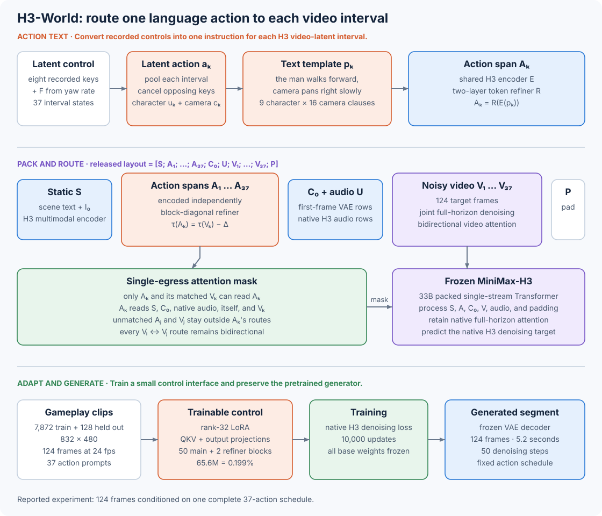

# 10.8 H3-World: Route Language Actions to Video Latents

H3-World starts with a video generator that already understands language. To tell it when a character or camera should move, H3-World writes each keyboard state as a short sentence and connects it to the matching video interval. It learns this control through low-rank updates inside the pretrained video Transformer.

Open [H3-World in the architecture explorer](https://github.com/nahidalam/world_model_from_scratch_private/tree/main/interactive/chapter_10/architecture_explorer.html#left%3Dmira%26right%3Dh3-world). Trace one action sentence into its matching video interval before reading the attention-mask code below.



_Figure 10.8: H3-World adds a semantic action interface to MiniMax-H3. The single-egress mask gives action sentence $A\_k$ a direct connection to video interval $V\_k$. Video tokens then exchange information bidirectionally across the segment._

## Start with the Input and Output

H3-World receives three inputs:

| Input      | Meaning                                            |
| ---------- | -------------------------------------------------- |
| $I\_0$     | First RGB frame                                    |
| $s$        | Text that describes the subject and scene          |
| $a\_{1:K}$ | Complete schedule of character and camera controls |

It generates all $K$ future video-latent intervals in one denoising process:

$$
\hat V_{1:K}
\sim
p_{\theta,\phi}(V_{1:K}\mid I_0,s,a_{1:K}).
$$

The released pipeline jointly predicts an audio stream. This chapter examines the visual action control learned from recorded gameplay.

Here, $\theta$ denotes the frozen MiniMax-H3 parameters and $\phi$ denotes the learned LoRA parameters. The released experiment uses 124 RGB frames at 24 frames per second, which gives a 5.17-second segment and $K=37$ video-latent intervals.

We choose the full action schedule before sampling starts. MiniMax-H3 then denoises the complete video block with bidirectional attention. The released inference script accepts no controls during denoising, so changing the schedule means running another full generation pass.

## Separate the Generator from the Action Adapter

H3-World reuses MiniMax-H3's generation capabilities and trains an adapter for scheduled actions. The adapter is small relative to the generator: the H3-Omni-Transformer alone has 33B parameters, and the generation pipeline also loads the H3 Encoder and VAEs.

| MiniMax-H3 supplies                                     | H3-World adds                                 |
| ------------------------------------------------------- | --------------------------------------------- |
| Multimodal text and image encoder                       | Deterministic keys-to-language rules          |
| Temporally causal visual VAE; separate stereo audio VAE | One action sentence per video-latent interval |
| 50-block audio-video flow Transformer                   | Mirrored temporal positions                   |
| Two-layer token refiner                                 | Single-egress attention routing               |
| Video and audio decoders                                | Rank-32 LoRA in attention projections         |

The next table shows the architecture of the frozen base:

| Component           | Published H3 configuration                                                                              | Role in H3-World                                           |
| ------------------- | ------------------------------------------------------------------------------------------------------- | ---------------------------------------------------------- |
| H3 Encoder          | Full Qwen3-VL-32B weights; take layer-50 states with width 5,120                                        | Encode the scene, first image, and action sentences        |
| Visual VAE          | Temporally causal `f16t4d24` codec; 16-fold spatial and 4-fold temporal compression; 24 latent channels | Encode the first frame and target video; decode the result |
| Audio VAE           | 32 kHz stereo input; 40 Hz latents with 32 channels                                                     | Retain the native H3 audio stream                          |
| Token refiner       | Two bidirectional attention blocks                                                                      | Refine the text rows before the main Transformer           |
| H3 Omni Transformer | 50 dense single-stream blocks; width 5,376; 56 heads of width 128; FFN width 14,336                     | Jointly predict video and audio flow fields                |

The Transformer projects every modality into one width, packs the rows into one sequence, and uses multimodal three-dimensional rotary positions. Each of the 50 blocks applies self-attention to this sequence. Input/output projections and AdaLN branches remain modality-specific; the AdaLN branches account for about 13B of the Omni Transformer's parameters.

The study uses 8,000 recorded [ABot-World-Explorer-500h](https://huggingface.co/datasets/acvlab/ABot-World-Explorer-500h) gameplay clips: 7,872 train the adapter and 128 are held out. At inference, the adapted MiniMax-H3 backbone generates the predicted rollouts.

## Turn Each Keyboard State into One Sentence

To turn keyboard controls into language, H3-World first groups them by video interval. It builds one nine-bit control vector for every latent interval. Eight bits come from recorded keys. During training, the mapper derives the ninth bit, `F`, from the estimated camera yaw rate; at inference, the user sets it:

| Keys     | Control                               |
| -------- | ------------------------------------- |
| `W`, `S` | Walk forward or backward              |
| `A`, `D` | Strafe left or right                  |
| `J`, `L` | Pan the camera left or right          |
| `I`, `K` | Tilt the camera down or up            |
| `F`      | Use a sharp pan instead of a slow pan |

For each VAE interval, the mapper marks a key active if it appears in any RGB frame assigned to that interval. It then cancels the `W`/`S`, `A`/`D`, `J`/`L`, and `I`/`K` conflicts and factors the result into character motion $u\_k$ and camera motion $c\_k$:

$$
a_k=(u_k,c_k),
\qquad
p_k=T_{\text{char}}(u_k)\;\Vert\;T_{\text{cam}}(c_k).
$$

A fixed sentence template turns the character and camera controls into text. Run the chapter helper to see the sentences for two control states:

```python
from world_models.architecture_examples import h3_action_instruction

print(h3_action_instruction([]))
print(h3_action_instruction(["S", "A", "L", "F", "I"]))
```

```
the man stands still, camera holds steady
the man walks backward and strafes left, camera pans right sharply and tilts down
```

This rule produces nine character clauses and sixteen camera clauses. Their Cartesian product contains 144 nominal pairs. `holds steady` pairs only with the idle character clause, while `follows him` pairs only with the eight moving clauses, which leaves 135 structurally valid pairs. The training set contains 83 of them and leaves 52 unseen, creating a compositional transfer test.

Because this translation is deterministic, the same key state always produces the same sentence. Training and inference therefore share an exact control vocabulary. The released [`action_script.py`](https://github.com/Danzer1xxxxChan/H3-World/blob/e46d64f1e62a1514ccdb797d4014ed04ab9735cc/code/abot/action_script.py) contains the complete table.

## Match 37 Instructions with 37 Video Intervals

Each instruction needs to line up with the part of the video it controls. Let's follow how the visual VAE and video patch projection divide one training clip into intervals and tokens:

```
RGB clip             [B, 3, 124, 480, 832]
VAE latents          [B, 24, 37, 30, 52]
patches per interval 15 x 26 = 390
video token rows     37 x 390 = 14,430
audio latents        [2, 32, 207] -> [414, 32] packed rows
Transformer width    5,376
```

The first frame provides both scene information and fine image detail through two routes. The multimodal encoder reads $I\_0$ with the scene description and produces static semantic tokens $S$. The visual VAE also encodes $I\_0$ into 390 first-frame condition rows $C\_0$, which preserve fine image detail.

H3-World encodes each action sentence independently with the shared H3 encoder and the shared two-layer token refiner:

$$
A_k=R(E(p_k)).
$$

Encoding the sentences independently keeps their information separate until the main Transformer. It also gives repeated sentences identical embeddings.

The paper writes the packed sequence as

$$
X=[S;A_1;\ldots;A_K;C_0;V_1;\ldots;V_K;P],
$$

where $P$ contains padding. The released MiniMax-H3 implementation also keeps the base model's audio rows:

```
[static text + action spans | first-frame condition | audio | video | padding]
```

The action spans stay inside the text region. H3-World gives them mirrored temporal positions:

$$
\tau(A_k)=\tau(V_k)-\Delta,
\qquad \Delta>0.
$$

This offset lets H3-World align instructions with video while retaining the text-before-video layout MiniMax-H3 saw during pretraining. The constant offset preserves the order $A\_1,\ldots,A\_K$ and keeps every text position before its video position.

## Give Each Action One Direct Exit

We also need attention to send an instruction directly to its matching interval. Temporal positions suggest a match between $A\_k$ and $V\_k$; the single-egress mask enforces that match. Read the mask in `[query, key]` order:

| Query                         | Can read                                                   | Cannot read                          |
| ----------------------------- | ---------------------------------------------------------- | ------------------------------------ |
| Static text, $C\_0$, or audio | Static text, $C\_0$, audio, all video rows                 | Every action span                    |
| $A\_k$                        | Static context, $C\_0$, audio, $A\_k$, and $V\_k$          | Other action spans and $V\_{j\ne k}$ |
| $V\_k$                        | Static context, $C\_0$, audio, every video row, and $A\_k$ | $A\_{j\ne k}$                        |

Use the chapter helper to inspect these allowed connections in a small packed sequence:

```python
import torch
from world_models.architecture_examples import single_egress_attention_mask

labels = ["scene", "A0", "A1", "first", "V0", "V1"]
action_ids = torch.tensor([-1, 0, 1, -1, -1, -1])
video_ids = torch.tensor([-1, -1, -1, -1, 0, 1])

mask = single_egress_attention_mask(action_ids, video_ids)
print(mask.int())
```

```
# columns are keys; rows are queries
#          scene A0 A1 first V0 V1
tensor([[    1, 0, 0,    1, 1, 1],   # scene
        [    1, 1, 0,    1, 1, 0],   # A0
        [    1, 0, 1,    1, 0, 1],   # A1
        [    1, 0, 0,    1, 1, 1],   # first
        [    1, 1, 0,    1, 1, 1],   # V0
        [    1, 0, 1,    1, 1, 1]])  # V1
```

Look at the `A0` column: only queries in `A0` and `V0` can read it directly. In later Transformer blocks, any video interval can read `V0`, so the action signal can spread across the full video block.

The released code builds this relation with PyTorch FlexAttention. It also makes each padding row attend only to itself, which keeps padding out of every real token's softmax denominator.

## Train Low-Rank Attention Updates

The routing mask determines where action information can enter. LoRA teaches the existing attention projections how to use it. MiniMax-H3 uses 50 main Transformer blocks and a two-layer token refiner. Each attention unit has a combined QKV projection and an output projection:

| Projection | Weight shape            |
| ---------- | ----------------------- |
| QKV        | $21{,}504\times5{,}376$ |
| Output     | $5{,}376\times7{,}168$  |

A rank-$r$ LoRA update for an $m\times n$ weight adds $r(m+n)$ parameters. H3-World sets $r=32$ for both projections in all 52 attention units:

```python
rank = 32
attention_units = 50 + 2

qkv_lora = rank * (5_376 + 21_504)
out_lora = rank * (7_168 + 5_376)
trainable = attention_units * (qkv_lora + out_lora)

print(f"{trainable:,}")
print(f"{100 * trainable / 33_000_000_000:.3f}% of 33B")
```

```
65,601,536
0.199% of 33B
```

The visual VAE, audio VAE, multimodal encoder, and original Transformer weights stay fixed. The temporal positions and routing mask add no learned parameters.

To train these updates, the released implementation keeps MiniMax-H3's flow-matching objective. For clean latents $z$, Gaussian noise $\epsilon$, and noise level $\sigma$, it constructs

$$
z_\sigma=(1-\sigma)z+\sigma\epsilon
$$

and trains the Transformer to predict the velocity $\epsilon-z$. The loss covers the video stream and the base model's audio stream. The released data preparation supplies stereo silence for ABot clips, so the control evidence covers video motion.

We can now put the control mapping, routing, and training loss together:

```
for recorded_clip, key_schedule, scene_text in ABot:
    clean_video = visual_vae.encode(recorded_clip)
    clean_audio = audio_vae.encode(stereo_silence)
    first_frame = visual_vae.encode(recorded_clip[0])

    noisy_video, video_target = flow_training_pair(clean_video)
    noisy_audio, audio_target = flow_training_pair(clean_audio)

    prompts = map_each_key_state_to_sentence(key_schedule)
    action_spans = [token_refiner(h3_encoder(p)) for p in prompts]
    static_tokens = h3_encoder(scene_text, recorded_clip[0])

    packed = pack(static_tokens, action_spans, first_frame,
                  noisy_audio, noisy_video, padding)
    positions = mirror_action_positions(action_spans, clean_video)
    mask = build_single_egress_mask(action_spans, clean_video)

    pred_video, pred_audio = minimax_h3(packed, positions, mask, lora=rank_32)
    loss = weighted_flow_loss(pred_video, video_target)
    loss += weighted_flow_loss(pred_audio, audio_target)
    update_only_lora(loss)
```

## Read the Experiment at the Right Scale

To reproduce the reported experiment, use the configuration below from the [H3-World paper](https://arxiv.org/html/2609.01560v1). The [official repository](https://github.com/Danzer1xxxxChan/H3-World/tree/e46d64f1e62a1514ccdb797d4014ed04ab9735cc) publishes the matching `step-10000.safetensors` checkpoint:

| Item                   | Value                                 |
| ---------------------- | ------------------------------------- |
| Recorded clips         | 8,000                                 |
| Train / held-out split | 7,872 / 128                           |
| Clip format            | 124 frames, 24 fps, $832\times480$    |
| Action annotations     | 37 per clip                           |
| Optimization           | 10,000 steps, learning rate $10^{-4}$ |
| Trainable weights      | Rank-32 LoRA, 65.6M parameters        |
| Inference              | 50 denoising steps                    |

When using the training launcher, check the stopping point: it schedules 20 epochs without a maximum-step argument. Stop at or load `step-10000.safetensors` to match the reported model.

The repository's fixed example loads the MiniMax-H3 FL2VA weights and the released `step-10000.safetensors` LoRA:

```bash
git clone https://github.com/Danzer1xxxxChan/H3-World.git
cd H3-World
git checkout e46d64f1e62a1514ccdb797d4014ed04ab9735cc

python3 code/abot/infer.py \
  --checkpoint checkpoints/H3-World/step-10000.safetensors \
  --first-frame examples/first_frame.png \
  --scene-prompt "A man stands in a concrete parking garage." \
  --action-preset forward \
  --seed 2 \
  --steps 50 \
  --num-frames 124 \
  --cfg-scale 1.0 \
  --out outputs/example_forward.mp4
```

Follow the repository's [setup instructions](https://github.com/Danzer1xxxxChan/H3-World/blob/e46d64f1e62a1514ccdb797d4014ed04ab9735cc/README.md) before running this command. They pin DiffSynth-Studio at commit `300e3e4da76e881d5e6bd97d897810c18f6e4893` and apply the attention-routing patch required by the released checkpoint.

## Measure Whether the Schedule Changes Motion

We want to know whether an instruction changes motion at the requested time. The paper tests this by holding the first frame, random seed, and sampling settings fixed, then changing only the action schedule.

One diagnostic requests a sharp left pan for the first 15 latent intervals and a sharp right pan for the remaining 22. Dense horizontal optical flow measures the two parts of the result:

| Conditioning method              | First 15 intervals | Last 22 intervals |
| -------------------------------- | -----------------: | ----------------: |
| One global prompt with frozen H3 |                0.0 |             -17.3 |
| Per-latent text with zero LoRA   |               -0.1 |               0.0 |
| Trained H3-World                 |              +52.7 |            -106.0 |

Reversing the schedule gives H3-World -58.7 followed by +121.0. In both schedule orders, accumulated flow has the requested sign on each side of the boundary. A constant-action control reports similar directional separation for global prompting and H3-World, 301.8 and 300.5. Together, these tests support the claim that the adapter learns when to apply the coarse camera motion already present in H3.

The paper also shows paired videos that follow recorded controls on held-out gameplay clips, one unseen combination of familiar character and camera clauses, and six new first-frame scenes. Its learned additive-bias and FiLM comparison variants produce weaker or inconsistent control in the examples. The released model uses the language spans, single-egress routing, and plain attention LoRA described above.

These results help us assess whether scheduled actions control motion in this setup. To compare visual quality across models, we would need a common benchmark, more scenes, more seeds, and aggregate success criteria.

## Know What One Rollout Represents

When using H3-World, treat each output as one scheduled video segment. The following properties define what we can ask that segment to do:

| Property              | H3-World behavior                                                                  |
| --------------------- | ---------------------------------------------------------------------------------- |
| Horizon               | One fixed 124-frame segment in the reported experiments                            |
| Action timing         | All 37 controls arrive before denoising                                            |
| State across segments | None in the released model                                                         |
| Decision making       | An external system chooses the action schedule; H3-World renders it                |
| Control vocabulary    | Character locomotion and camera movement                                           |
| Model scale           | 33B Omni Transformer plus the H3 Encoder and VAEs; 65.6M trainable LoRA parameters |

H3-World adds this scheduled control with a 65.6M-parameter LoRA. Its interface ends at the generated segment: the release includes no persistent state, live-input loop, streaming sampler, planner, or policy. The paper does not test long-session consistency.

## Trace the Released Implementation

Use the following sources to follow each part of the architecture into its implementation:

| Component                           | Source                                                                                                                                                  |
| ----------------------------------- | ------------------------------------------------------------------------------------------------------------------------------------------------------- |
| Method and evaluation               | [H3-World paper](https://arxiv.org/html/2609.01560v1)                                                                                                   |
| Complete released pipeline          | [H3-World repository at `e46d64f`](https://github.com/Danzer1xxxxChan/H3-World/tree/e46d64f1e62a1514ccdb797d4014ed04ab9735cc)                           |
| Key-to-language rules               | [`action_script.py`](https://github.com/Danzer1xxxxChan/H3-World/blob/e46d64f1e62a1514ccdb797d4014ed04ab9735cc/code/abot/action_script.py)              |
| Per-latent text injection           | [`inject_abot_text.py`](https://github.com/Danzer1xxxxChan/H3-World/blob/e46d64f1e62a1514ccdb797d4014ed04ab9735cc/code/abot/inject_abot_text.py)        |
| Routing mask and mirrored positions | [`diffsynth_h3_action.patch`](https://github.com/Danzer1xxxxChan/H3-World/blob/e46d64f1e62a1514ccdb797d4014ed04ab9735cc/code/diffsynth_h3_action.patch) |
| Training and inference entry points | [`code/abot`](https://github.com/Danzer1xxxxChan/H3-World/tree/e46d64f1e62a1514ccdb797d4014ed04ab9735cc/code/abot)                                      |
| Frozen generator architecture       | [MiniMax-H3 repository at `d21241f`](https://github.com/MiniMax-AI/MiniMax-H3/tree/d21241f0a4b3acbb34c97dae47fa417b7065e438)                            |
| Released LoRA checkpoint            | [H3-World model card](https://huggingface.co/DANNY621/H3-World)                                                                                         |

Run every small Chapter 10 calculation, including the action mapper, routing mask, and LoRA count:

```bash
python scripts/chapter_10_architecture_examples.py
python -m pytest -q tests/test_architecture_examples.py
```

> Try it yourself
>
> Copy the small routing mask, set `altered[5, 1] = True`, and inspect row `V1`. Which action can `V1` now read directly? Then inspect the original mask and confirm that `V0` and `V1` can still read each other. This separates action routing from video-to-video continuity.

Next, [DINO-WM](09-dino-wm.md) uses its predictions to choose actions toward a goal image.
