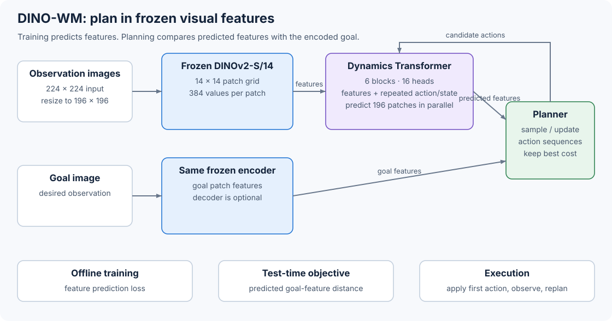

# 10.9 DINO-WM: Predict DINOv2 Features and Plan

Suppose we have a camera image of the current scene and another image showing the goal. We want to choose actions that bring the scene closer to that goal. DINO-WM does this by turning a frozen image encoder into a world model. DINOv2 converts each image into a grid of patch features, and an action-conditioned Transformer predicts how those features change. A planner tests action sequences through that Transformer and selects the sequence whose final prediction lies closest to the goal image in DINOv2 feature space.



_Figure 10.9: The transition Transformer predicts the future. The planner scores the distance between its final patch grid and the goal patch grid._

The transition model learns from an offline trajectory dataset while DINOv2 stays frozen. Planning compares the resulting features directly, without a pixel decoder or learned reward model. The [DINO-WM paper](https://arxiv.org/html/2411.04983) and its [official implementation](https://github.com/gaoyuezhou/dino_wm) describe this architecture.

## Encode an Image as a Spatial State

First, we need a representation that keeps track of where things are in the image. Let an RGB observation at time $t$ be $o\_t$. DINO-WM applies a frozen DINOv2 ViT-S/14 encoder $E$ and keeps its normalized patch tokens:

$$
z_t = E(o_t), \qquad z_t \in \mathbb{R}^{196 \times 384}.
$$

The 196 positions form a $14 \times 14$ grid. Each position holds a 384-value feature vector. DINO-WM keeps the full grid because control depends on spatial questions such as where an object is and where it should move. A single class token would discard much of that layout.

The environment supplies $224 \times 224$ observations. The released [`VWorldModel`](https://github.com/gaoyuezhou/dino_wm/blob/0a9492fa12044b852ae9e001cc74604b79c8bb0c/models/visual_world_model.py) resizes them to $196 \times 196$ before calling DINOv2-S/14. Fourteen-pixel patches then produce the $14 \times 14$ grid reported in the paper's implementation details. The [`DinoV2Encoder`](https://github.com/gaoyuezhou/dino_wm/blob/0a9492fa12044b852ae9e001cc74604b79c8bb0c/models/dino.py) requests `x_norm_patchtokens` from DINOv2 and stays frozen during training.

## Add Actions to Every Patch

DINO-WM maps the action $a\_t$ and optional proprioceptive state $s\_t$ through small encoders, then appends both vectors to every visual patch:

$$
c_t^i = [z_t^i\,\|\,\phi(a_t)\,\|\,\psi(s_t)],
\qquad i=1,\ldots,196.
$$

The released training configuration uses ten values for each encoded action and proprioceptive state. The resulting Transformer token contains $384+10+10=404$ values. Run this short example to see how the same action and state reach every patch:

```python
import torch

batch, frames, patches = 2, 3, 14 * 14
visual = torch.randn(batch, frames, patches, 384)
action = torch.randn(batch, frames, 10)
proprio = torch.randn(batch, frames, 10)

action_per_patch = action[:, :, None].expand(-1, -1, patches, -1)
proprio_per_patch = proprio[:, :, None].expand(-1, -1, patches, -1)
tokens = torch.cat([visual, action_per_patch, proprio_per_patch], dim=-1)

print(tokens.shape)
```

```
torch.Size([2, 3, 196, 404])
```

Every patch can now connect local visual content with the same controller command. The official [`train.yaml`](https://github.com/gaoyuezhou/dino_wm/blob/0a9492fa12044b852ae9e001cc74604b79c8bb0c/conf/train.yaml) selects this feature-concatenation form with `concat_dim: 1`.

## Predict a Whole Future Frame at Once

The transition model $P\_\theta$ accepts $H$ frames of conditioned patch tokens and predicts the next DINOv2 feature grid:

$$
\hat z_{t+1} = P_\theta(z_{t-H+1:t}, a_{t-H+1:t}, s_{t-H+1:t}).
$$

DINO-WM uses a ViT with its image patch embedding removed because the input already contains patch tokens. The released model has six Transformer blocks, 16 attention heads, an MLP width of 2,048, learned position embeddings, and about 19 million parameters. Its output retains one vector per input patch.

To predict the next frame, each patch can use the current scene and its history. The attention mask is causal between frames and dense inside each frame: a patch at time $t$ can attend to every patch at time $t$ and every earlier frame. Later frames remain hidden. The code below builds that pattern for three frames with four patches per frame:

```python
import torch

frames, patches = 3, 4
frame_id = torch.arange(frames).repeat_interleave(patches)
allowed = frame_id[None, :] <= frame_id[:, None]

# Reduce each 4 x 4 block to one value so the frame structure is visible.
frame_mask = allowed.reshape(frames, patches, frames, patches)
frame_mask = frame_mask.all(dim=(1, 3)).to(torch.int32)
print(frame_mask)
```

```
tensor([[1, 0, 0],
        [1, 1, 0],
        [1, 1, 1]], dtype=torch.int32)
```

This is frame-level autoregression. The model predicts all 196 patches for a future frame in parallel. IRIS, by comparison, orders the discrete tokens inside a frame and predicts them one at a time. DINO-WM's [`generate_mask_matrix`](https://github.com/gaoyuezhou/dino_wm/blob/0a9492fa12044b852ae9e001cc74604b79c8bb0c/models/vit.py) constructs the full patch-level version of this mask.

## Train the Transition in Feature Space

The training loader takes a segment of $H+1$ observations from an offline trajectory, and DINOv2 encodes them. Teacher forcing supplies the recorded feature grid and action at each input position. The Transformer predicts the feature grid one step later.

For the visual features, the objective is mean squared error:

$$
\mathcal L_{\text{pred}}
= \frac{1}{H N E}
  \sum_{h=1}^{H}\sum_{i=1}^{N}\sum_{j=1}^{E}
  \left(\hat z_{t+h}^{i,j}-z_{t+h}^{i,j}\right)^2.
$$

Here $N=196$ and $E=384$, so the loss averages over the predicted steps, patches, and feature values. The released implementation also predicts the proprioceptive part of each token and includes its error. It excludes the action fields from the prediction loss because candidate actions enter as conditions.

```python
import torch
import torch.nn.functional as F

# Three predicted future feature grids and their frozen-encoder targets.
prediction = torch.randn(2, 3, 196, 384, requires_grad=True)
target = torch.randn(2, 3, 196, 384)

loss = F.mse_loss(prediction, target)
loss.backward()
print(round(loss.item(), 3), prediction.grad.shape)
```

The gradient updates the transition Transformer while DINOv2 stays frozen. The [`VWorldModel.forward`](https://github.com/gaoyuezhou/dino_wm/blob/0a9492fa12044b852ae9e001cc74604b79c8bb0c/models/visual_world_model.py) implements the shifted source and target sequences.

If we want to see the predictions as images, DINO-WM can train a decoder from patch features to pixels. This decoder uses its own reconstruction objective, and the transition model does not receive that reconstruction gradient. Training the transition and planning both work directly with the features.

## Roll Out a Candidate Action Sequence

To assess an action sequence, we need to predict beyond the next step. At test time, the transition model feeds each prediction back into its next input. For a candidate action sequence $a\_{t:t+T-1}$, the rollout is

$$
\hat z_{t+h+1}
=P_\theta(\hat z_{t+h-H+1:t+h},a_{t+h-H+1:t+h}),
\qquad h=0,\ldots,T-1.
$$

The observed history initializes the first prediction. Each later step uses the model's own predicted feature grid. The [`rollout`](https://github.com/gaoyuezhou/dino_wm/blob/0a9492fa12044b852ae9e001cc74604b79c8bb0c/models/visual_world_model.py) method performs this recurrence and inserts the next candidate action before the following prediction.

## Score a Plan Against a Goal Image

We can now compare the predicted outcome with what we want to happen. The goal arrives as an RGB image $o\_g$, and the same frozen encoder produces $z\_g=E(o\_g)$. DINO-WM scores a candidate action sequence by comparing its terminal predicted patch grid with that goal grid:

$$
\mathcal C(a_{t:t+T-1})
= \frac{1}{N E}\left\|\hat z_{t+T}-z_g\right\|_2^2.
$$

Lower cost means the predicted final features are closer to the goal image's features. The paper uses this visual cost. The released objective can also add a weighted proprioceptive distance. The PointMaze planning configuration sets that weight, `alpha`, to zero; the PushT and Wall configurations set it to one.

The example below computes one cost for each candidate and finds the lowest:

```python
import torch

# One terminal prediction per candidate action sequence.
candidates = torch.randn(300, 196, 384)
goal = torch.randn(1, 196, 384)
cost = (candidates - goal).square().mean(dim=(1, 2))
best_candidate = cost.argmin()

print(cost.shape, best_candidate.shape)
```

```
torch.Size([300]) torch.Size([])
```

## Search with CEM and Replan

Now that we can score a sequence, we need a way to find promising sequences. DINO-WM uses the cross-entropy method (CEM) to search the continuous action space. CEM maintains a Gaussian distribution for every action coordinate and time step, then updates it using the sequences with the lowest costs.

```
encode the current image and goal image with frozen DINOv2
initialize a Gaussian over T-step action sequences

repeat for each CEM refinement:
    sample N action sequences from the Gaussian
    roll out all N sequences through the transition Transformer
    score each terminal feature grid against the goal feature grid
    keep the K sequences with the lowest cost
    replace the Gaussian mean and variance with the elite statistics

execute the first planned action or short action prefix
observe the resulting image
repeat the planning process from the new observation
```

After choosing a plan, we execute only its first action or a short prefix and observe the result. These final three lines turn open-loop CEM into model predictive control (MPC): new camera observations correct accumulated prediction error. The released task configurations use a five-step horizon, 300 candidate sequences, and 30 elites. PointMaze and Wall run ten CEM refinements; PushT and the generic CEM configuration run 30. The paper's timing table measures 100 candidates and ten refinements, so use those values when reproducing that table. See the official [`CEMPlanner`](https://github.com/gaoyuezhou/dino_wm/blob/0a9492fa12044b852ae9e001cc74604b79c8bb0c/planning/cem.py), [`MPCPlanner`](https://github.com/gaoyuezhou/dino_wm/blob/0a9492fa12044b852ae9e001cc74604b79c8bb0c/planning/mpc.py), and [planning objective](https://github.com/gaoyuezhou/dino_wm/blob/0a9492fa12044b852ae9e001cc74604b79c8bb0c/planning/objectives.py).

## What DINO-WM Adds

The useful connection in DINO-WM is that prediction and planning share the same representation. Training targets the patch features that planning later compares with a goal. Texture and lighting affect the transition only when DINOv2 encodes them into those features.

When reading the reported zero-shot results, keep track of what is new at test time. The authors train a separate transition model from offline trajectories for each environment or task family. That trained model then handles new visual goals and, in some experiments, new layouts or object configurations. Each new robot or task family still needs corresponding transition data and training.

You can trace a decision through four parts of the design:

| Role                       | Component                   | Output used by               |
| -------------------------- | --------------------------- | ---------------------------- |
| Represent an observation   | frozen DINOv2-S/14          | transition model and planner |
| Predict an action's effect | causal ViT transition model | autoregressive rollout       |
| Judge a candidate          | terminal feature MSE        | CEM                          |
| Correct prediction error   | new camera observation      | receding-horizon MPC         |

[V-JEPA 2-AC](10-v-jepa-2-ac.md) keeps this feature-space planning interface and replaces image-pretrained DINOv2 with a video-pretrained encoder.

> Try it yourself
>
> Replace the terminal cost in the candidate-scoring example with the average cost over every predicted step. Describe how this changes a plan that first moves away from the goal to pass around an obstacle.
