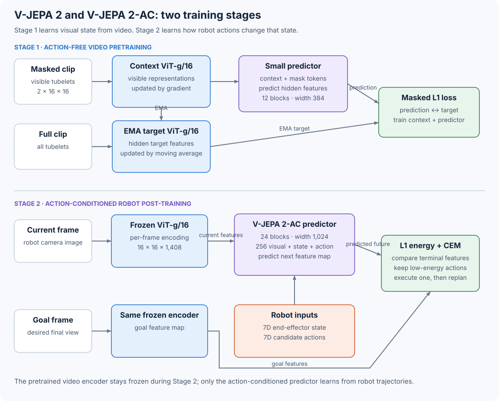

# 10.10 V-JEPA 2 and V-JEPA 2-AC: Pretrain Perception, Then Learn Actions

V-JEPA 2 first learns video representations from image and video data alone. V-JEPA 2-AC then freezes that representation and trains a new Transformer to predict how robot actions change it. The action-conditioned predictor supplies the world model used for planning.



_Figure 10.10: Action-free pretraining builds the encoder. Action-conditioned post-training builds the dynamics model that CEM queries during control._

This section follows the [V-JEPA 2 paper](https://arxiv.org/html/2506.09985) and [Meta's official PyTorch repository](https://github.com/facebookresearch/vjepa2/tree/204698b45b3712590f06245fbfba32d3be539812).

## Stage 1: Learn a Video Representation

The first stage learns by predicting features of hidden parts of a video. To organize those parts, V-JEPA 2 splits a video into non-overlapping tubelets of shape $2\times16\times16$ in time, height, and width. A 16-frame $256\times256$ clip therefore contains

$$
\frac{16}{2}\times\frac{256}{16}\times\frac{256}{16}
=8\times16\times16=2{,}048
$$

tubelet tokens. Each token covers two adjacent frames and a $16\times16$ spatial region.

Training uses two views of the same clip: a masked view for context and a complete view for the prediction targets. Three components connect them:

1. The context encoder $E\_\theta$ receives the visible tubelets after masking removes several spatial-temporal blocks.
2. The target encoder $E\_{\bar\theta}$ receives the complete clip and produces target features at the hidden positions.
3. A predictor $P\_\phi$ combines the visible context features with learned mask tokens placed at the hidden coordinates.

The predictor uses visible context to match the target encoder's features at the masked locations:

$$
\mathcal L_{\text{JEPA}}
=\left\|
P_\phi(\Delta_y,E_\theta(x))
-\operatorname{sg}(E_{\bar\theta}(y))
\right\|_1.
$$

$\Delta\_y$ contains the learned mask tokens. `sg` stops gradients through the target. After each optimizer step, an exponential moving average (EMA) updates the target encoder:

$$
\bar\theta \leftarrow m\bar\theta+(1-m)\theta.
$$

The example below lets us follow both operations: computing the masked prediction loss and updating a target weight by EMA.

```python
import torch

prediction = torch.tensor([[0.2, 0.7], [0.9, -0.1]], requires_grad=True)
target = torch.tensor([[0.0, 1.0], [1.0, 0.0]])
masked = torch.tensor([True, False])

loss = (prediction[masked] - target[masked].detach()).abs().mean()
loss.backward()

online_weight = torch.tensor([2.0])
target_weight = torch.tensor([1.0])
momentum = 0.99925
target_weight.mul_(momentum).add_(online_weight, alpha=1 - momentum)

print(loss.item(), round(target_weight.item(), 5))
```

```
0.25 1.00075
```

The momentum matches the paper's main ViT-g/16 recipe. The loss compares predicted and target features instead of reconstructed pixels. The official [`vjepa` training loop](https://github.com/facebookresearch/vjepa2/blob/204698b45b3712590f06245fbfba32d3be539812/app/vjepa/train.py) computes the masked L1 loss and then updates the target encoder by EMA.

## Scale the Encoder and Keep the Predictor Small

To connect information across a video, the pretraining networks need both spatial and temporal positions. They use Vision Transformers with 3D rotary position embeddings. V-JEPA 2 divides each attention head's features among time, height, and width coordinates, then rotates queries and keys along those three axes.

The largest V-JEPA 2 encoder in the paper is ViT-g/16:

| Component                               | Width | Blocks | Heads | MLP width |    Parameters |
| --------------------------------------- | ----: | -----: | ----: | --------: | ------------: |
| ViT-g/16 context and EMA target encoder | 1,408 |     40 |    22 |     6,144 | about 1B each |
| Pretraining predictor                   |   384 |     12 |    12 |     1,536 |     about 22M |

The two encoders have the same architecture but are updated differently. The optimizer updates the context encoder and predictor, while EMA updates the target. We will keep the encoder for the action-conditioned stage and replace the small pretraining predictor. The [paper's architecture table](https://arxiv.org/html/2506.09985) and the released [`vision_transformer.py`](https://github.com/facebookresearch/vjepa2/blob/204698b45b3712590f06245fbfba32d3be539812/src/models/vision_transformer.py) define these dimensions.

V-JEPA 2 trains on VideoMix22M, a mixture of 22 million image and video samples containing more than one million hours of video. Its cooldown phase increases clips from 16 to 64 frames and supports larger crops. These changes train a representation that captures appearance and motion before any robot trajectory enters the model.

## Stage 2: Turn the Encoder into a World Model

V-JEPA 2-AC starts from the pretrained ViT-g encoder and freezes it. The paper uses fewer than 62 hours from 23,000 DROID robot trajectories. It samples four-second clips at 4 frames per second, giving 16 RGB frames $x\_1,\ldots,x\_{16}$ at $256\times256$. It encodes each frame independently:

$$
z_k=E(x_k), \qquad z_k\in\mathbb R^{16\times16\times1408}.
$$

Each frame becomes 256 spatial tokens. The feature dimension remains 1,408. The model also receives a seven-value end-effector state

$$
s_k=[x,y,z,\alpha,\beta,\gamma,g],
$$

where the first three values describe Cartesian position, the next three describe extrinsic Euler angles, and $g$ describes the gripper. The action is the seven-value change between adjacent states:

$$
a_k=\Delta(s_k,s_{k+1}),
$$

where $\Delta$ computes translation, relative rotation, and gripper changes between states. Training uses the video and its aligned end-effector signals. It does not use task names, rewards, or success labels as inputs or targets.

To use the video encoder on individual frames, the released action-conditioned data loader duplicates each sampled frame along the time axis. ViT-g/16 normally forms tokens from two-frame tubelets, so each tubelet now contains two copies of the same frame. This makes the frozen video encoder produce one independent $16\times16$ feature map per sampled frame.

## Interleave Three Token Types

The predictor needs to connect what the robot sees with its state and action. Separate learned affine layers project these three inputs into the predictor's width of 1,024. For one time step, the token group is

```
[ action token | end-effector-state token | 256 visual patch tokens ]
```

With 15 transitions from a 16-frame clip, the predictor receives $15\times258=3{,}870$ tokens. The released model can add a camera-extrinsics token, but the published DROID configuration disables it.

The predictor has 24 Transformer blocks, 16 attention heads, GELU activations, a width of 1,024, and about 300 million parameters. A final affine layer maps the visual-token outputs from width 1,024 back to the encoder width of 1,408. After the final block, the model drops the action and state positions and keeps the 256 visual positions.

Trace the three inputs into one sequence with the shape calculation below. It mirrors the interleaving in the official [`VisionTransformerPredictorAC`](https://github.com/facebookresearch/vjepa2/blob/204698b45b3712590f06245fbfba32d3be539812/src/models/ac_predictor.py):

```python
import torch
from torch import nn

batch, transitions, patches = 2, 15, 16 * 16
features = torch.randn(batch, transitions, patches, 1408)
actions = torch.randn(batch, transitions, 7)
states = torch.randn(batch, transitions, 7)

visual_in = nn.Linear(1408, 1024)(features)
action_in = nn.Linear(7, 1024)(actions).unsqueeze(2)
state_in = nn.Linear(7, 1024)(states).unsqueeze(2)
sequence = torch.cat([action_in, state_in, visual_in], dim=2).flatten(1, 2)

print(sequence.shape)
```

```
torch.Size([2, 3870, 1024])
```

## Use Block-Causal Attention

Every token in a time-step group can attend to the complete current group and all earlier groups, while later groups remain hidden. This lets the current visual patches share information with one another and read the action and state that govern their transition.

Run this small mask example to check that the first group can read all its own tokens and none of the later ones:

```python
import torch

time_steps, tokens_per_step = 4, 258
time_id = torch.arange(time_steps).repeat_interleave(tokens_per_step)
attention_mask = time_id[None, :] <= time_id[:, None]

print(attention_mask.shape)
print(attention_mask[0, :tokens_per_step].all().item())
print(attention_mask[0, tokens_per_step:].any().item())
```

```
torch.Size([1032, 1032])
True
False
```

Visual patch queries and keys receive 3D RoPE for time, row, and column. Action and state tokens have a time coordinate but no spatial coordinate, so the implementation applies only temporal rotation to them. The official [`build_action_block_causal_attention_mask`](https://github.com/facebookresearch/vjepa2/blob/204698b45b3712590f06245fbfba32d3be539812/src/models/utils/modules.py) constructs this attention pattern.

## Predict the Next Feature Map

At each time step, V-JEPA 2-AC transforms $(a\_k,s\_k,z\_k)$ into a prediction of the next visual representation:

$$
\hat z_{k+1}
=P_\phi\left((a_t,s_t,z_t)_{t\leq k}\right).
$$

Teacher forcing provides recorded feature maps for all input steps. The loss compares each predicted next map with the frozen encoder's target:

$$
\mathcal L_{\text{TF}}
=\frac{1}{15}\sum_{k=1}^{15}
\left\|\hat z_{k+1}-z_{k+1}\right\|_1.
$$

Planning will repeatedly feed predictions back into the model, so training also includes a two-step autoregressive rollout. It feeds the first predicted feature map back into the predictor, predicts another step, and compares the result with the corresponding encoder target:

$$
\mathcal L_{\text{rollout}}
=\left\|P_\phi(a_{1:2};s_1,z_1)-z_3\right\|_1,
$$

$$
\mathcal L=\mathcal L_{\text{TF}}+\mathcal L_{\text{rollout}}.
$$

The released [`vjepa_droid` training loop](https://github.com/facebookresearch/vjepa2/blob/204698b45b3712590f06245fbfba32d3be539812/app/vjepa_droid/train.py) computes the teacher-forced and autoregressive predictions and applies the L1 loss to layer-normalized representations.

## Ask the World Model to Choose an Action

At deployment, the robot receives a current camera frame $x\_k$, its current end-effector state $s\_k$, and a goal image $x\_g$. The frozen encoder calculates $z\_k=E(x\_k)$ and $z\_g=E(x\_g)$. For a candidate action sequence $\hat a\_{1:T}$, V-JEPA 2-AC predicts a terminal representation. The planner compares it with the goal using this energy:

$$
\mathcal E(\hat a_{1:T};z_k,s_k,z_g)
=\left\|P_\phi(\hat a_{1:T};s_k,z_k)-z_g\right\|_1.
$$

This energy is the mean absolute difference between the predicted terminal feature map and the goal image's feature map. A lower value means the prediction is closer to the goal in feature space. The objective uses these features directly; it includes no decoded video, reward predictions, or language descriptions.

The example below scores 800 candidates and selects the ten lowest energies:

```python
import torch

# A small stand-in for the paper's 16 x 16 x 1408 feature maps.
terminal = torch.randn(800, 4, 4, 32)
goal = torch.randn(1, 4, 4, 32)
energy = (terminal - goal).abs().flatten(1).mean(dim=1)
elite = energy.topk(10, largest=False).indices

print(energy.shape, elite.shape)
```

```
torch.Size([800]) torch.Size([10])
```

The reduction is unchanged at the paper's full feature shape. Allocating that shape for 800 candidates requires about 1.07 GiB for `terminal` alone, so this example keeps the same candidate count and uses smaller feature maps.

## Plan with CEM in a Closed Loop

To find an action sequence with low energy, the planner uses the cross-entropy method. It samples candidates, scores their predicted outcomes, and uses the best candidates to guide the next round of sampling:

```
encode the current frame and goal frame with the frozen V-JEPA 2 encoder
initialize one Gaussian action distribution for each planning step

repeat for each CEM refinement:
    sample candidate action sequences
    roll each sequence through V-JEPA 2-AC
    compare every terminal feature map with the goal feature map using L1
    keep the candidates with the lowest energy
    update each Gaussian from the elite candidates

execute only the first action from the final mean sequence
capture a new frame and read the new end-effector state
run CEM again
```

Executing one action before replanning lets the next decision use fresh visual feedback. The paper's robot comparison uses 800 candidates, ten refinements, and a one-step horizon. It restricts sampled actions to an L1 ball of radius 0.075 around zero to keep commands near the training distribution. The official [`cem`](https://github.com/facebookresearch/vjepa2/blob/204698b45b3712590f06245fbfba32d3be539812/notebooks/utils/mpc_utils.py) and [`WorldModel`](https://github.com/facebookresearch/vjepa2/blob/204698b45b3712590f06245fbfba32d3be539812/notebooks/utils/world_model_wrapper.py) show the released planning loop.

The notebook wrapper defaults to 400 candidates, ten refinements, a two-step horizon, and `maxnorm=0.05`. Its CEM implementation clips each Cartesian coordinate independently, fixes rotation commands to zero, and searches over translation and gripper commands. Use these settings when following the released demo. To reproduce the paper's experiment, use its L1 action constraint instead.

The paper calls this deployment zero-shot because the same learned weights run on two robot arms in labs absent from DROID, guided by new image goals. An operational-space controller executes the end-effector commands selected by CEM.

## Decode Features Only When We Need to See Them

To inspect what the model predicts, we can turn its features back into images. For this analysis, the authors train a separate deterministic ViT-L frame decoder that maps a $16\times16\times1408$ feature map to a $256\times256$ RGB image. Only decoder weights receive its pixel MSE gradient. CEM continues to compare latent features and never uses the decoded pixels.

## Match the Paper to the Released Code

Before reproducing an experiment, check which configuration you are following. The paper describes 16-frame, four-second clips for action-conditioned post-training. The current official [`droid-256px-8f.yaml`](https://github.com/facebookresearch/vjepa2/blob/204698b45b3712590f06245fbfba32d3be539812/configs/train/vitg16/droid-256px-8f.yaml) sets `dataset_fpcs: 8` at 4 fps. The paper's robot table reports 800 CEM candidates, ten refinements, and horizon one. The public notebook wrapper uses the demo settings described above. Use the paper settings to reproduce the reported experiment and the YAML or notebook values to reproduce the corresponding code example.

## Follow the Prediction Path

We can now follow how learning a representation leads to choosing an action:

| Stage                     | Trainable component                 | Prediction target               | Used for robot planning? |
| ------------------------- | ----------------------------------- | ------------------------------- | ------------------------ |
| V-JEPA 2 pretraining      | context encoder and small predictor | masked EMA-encoder features     | supplies the encoder     |
| V-JEPA 2-AC post-training | 300M action-conditioned predictor   | next frozen-encoder feature map | yes                      |
| CEM at deployment         | candidate actions                   | lowest terminal feature L1      | selects the next action  |
| Optional visualization    | frame decoder                       | RGB reconstruction              | no                       |

[LeWM](11-lewm.md) keeps the same goal-image planning pattern and trains its visual encoder together with the dynamics model through SIGReg.

> Try it yourself
>
> In the energy example, compute one energy from all 256 spatial tokens and a second energy from only the center $8\times8$ tokens. Consider a goal where the gripper moves near the image edge. Which energy gives the planner a usable signal?
