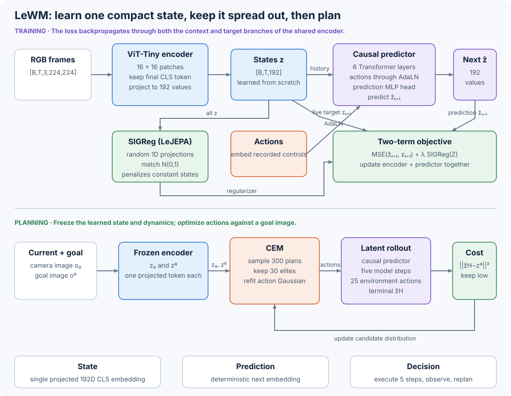

# 10.11 LeWM: Train the Encoder and Dynamics Together

LeWorldModel (LeWM) learns its representation together with the dynamics. It turns each camera frame into one 192-value state and predicts how an action changes that state.

A Vision Transformer learns the state representation from scratch, while an action-conditioned Transformer learns the dynamics. We will follow how the same two-term objective trains both networks, then see how a planner uses their predictions.



_Figure 10.11: The upper lane trains the encoder and predictor together. The lower lane freezes both networks and searches for actions in the learned state space._

The [LeWM paper](https://arxiv.org/html/2603.19312v3) presents this design as an end-to-end JEPA for control. Learning the encoder and predictor together introduces a problem: they can reduce prediction error by giving every scene the same representation. This is called representation collapse. With only a next-state prediction loss, the following constant solution is possible:

$$
E(o_t)=c, \qquad P(c,a_t)=c,
$$

It gives zero prediction error but stores no information about the scene. To keep the states useful, LeWM adopts the Sketched Isotropic Gaussian Regularizer (SIGReg) from [LeJEPA](https://arxiv.org/abs/2511.08544). This regularizer keeps the learned states distributed across the representation space.

## Encode One Frame as One State

We will start with the state that the planner uses. Let $o\_t\in\mathbb R^{3\times224\times224}$ denote an RGB observation. The encoder $E\_\theta$ uses a ViT-Tiny with 14-pixel patches to turn it into one vector:

$$
z_t=E_\theta(o_t), \qquad z_t\in\mathbb R^{192}.
$$

Inside the encoder, the image becomes a $16\times16$ grid of 256 patch tokens plus a class token. LeWM keeps the final class token, applies a projection head, and uses the resulting 192 values as the complete state. This means the temporal predictor works with just one state token per frame.

For a history of three frames, the main tensors have these shapes:

| Tensor                      | Shape              | Meaning                                             |
| --------------------------- | ------------------ | --------------------------------------------------- |
| RGB history and target      | $\[B,4,3,224,224]$ | four consecutive observations                       |
| projected encoder states    | $\[B,4,192]$       | one state per observation                           |
| loaded action blocks        | $\[B,4,5A]$        | five recorded actions grouped at each sampled frame |
| predictor action embeddings | $\[B,3,192]$       | the first three blocks condition three transitions  |
| predicted next states       | $\[B,3,192]$       | predictions for frames 2 through 4                  |

$A$ is the environment's action dimension. The five-action grouping follows the paper's frame skip of five. The released training code sets the action encoder input width to `frameskip * action_dim`.

The paper reports about 5 million parameters for the encoder. It specifies 12 ViT layers, three attention heads, and width 192. The released [`JEPA.encode`](https://github.com/lucas-maes/le-wm/blob/8edfeb336732b5f3ce7b8b210d0ba370a09e2cac/jepa.py) selects token zero from the final ViT layer. The [`lewm.yaml` model configuration](https://github.com/lucas-maes/le-wm/blob/8edfeb336732b5f3ce7b8b210d0ba370a09e2cac/config/train/model/lewm.yaml) builds a $192\rightarrow2048\rightarrow192$ projection head with BatchNorm and GELU.

## Predict the Next State Under an Action

The predictor receives a history of states and the action embeddings aligned with them:

$$
\hat z_{t+1}
=P_\phi\left(z_{t-N+1:t},e(a_{t-N+1:t})\right).
$$

To keep the prediction from reading future states, it uses a temporal causal mask. A state at time $t$ can read every state up to $t$. During training, the history comes from encoded observations. During planning, we feed each predicted state back into the next step so the model can imagine the consequences of a sequence of actions.

The released predictor has six Transformer layers, 16 attention heads, a hidden width of 192, an MLP width of 2,048, learned temporal positions, and dropout 0.1. A second $192\rightarrow2048\rightarrow192$ BatchNorm/GELU projection head maps the Transformer's outputs into the prediction space. The paper reports about 10 million predictor parameters.

The actions need to influence how each block updates the state. LeWM does this through zero-initialized adaptive layer normalization. For one hidden state $x$ and action embedding $u$, each block learns shift, scale, and residual-gate vectors:

$$
\operatorname{AdaLN}(x,u)
=\left(1+s(u)\right)\odot\operatorname{LN}(x)+b(u).
$$

The attention and MLP branches each receive their own shift, scale, and gate. Zero initialization starts each residual gate at zero. Training then learns where and how strongly the action should change the state. The official [`ConditionalBlock`](https://github.com/lucas-maes/le-wm/blob/8edfeb336732b5f3ce7b8b210d0ba370a09e2cac/module.py) shows the six vectors and their two gated residual updates.

## Train the Encoder and Predictor Together

We can train the predictor by asking it to predict the next encoded frame at each step of a recorded trajectory. This uses teacher forcing: the predictor sees $z\_{1:N}$ with actions $a\_{1:N}$ and predicts $z\_{2:N+1}$:

$$
\mathcal L_{\text{pred}}
=\frac{1}{BND}
\sum_{i=1}^{B}\sum_{t=1}^{N}
\left\|\hat z_{t+1}^{(i)}-z_{t+1}^{(i)}\right\|_2^2.
$$

Here $D=192$. The division by $D$ matches the released elementwise `mean()` over batch, time, and feature dimensions.

The same encoder produces both the input states and the targets. We keep the target $z\_{t+1}$ in the gradient graph, so learning can change the representation on both sides. One backward pass updates the frame encoder, both projection heads, the action encoder, and the temporal predictor:

```
frames, actions = next offline trajectory batch

z = projection(class_token(frame_encoder(frames)))
u = action_encoder(actions)

context = z[:, :-1]
action_context = u[:, :context.shape[1]]
predicted = prediction_projection(
    temporal_predictor(context, action_context)
)
targets = z[:, 1:]

prediction_loss = mean_squared_error(predicted, targets)
regularizer = SIGReg(transpose_to_time_batch_feature(z))
loss = prediction_loss + lambda * regularizer

loss.backward()
optimizer.step()
```

This training loop uses pixels and actions, with no task reward or success label. You can follow the steps in the [`training forward pass`](https://github.com/lucas-maes/le-wm/blob/8edfeb336732b5f3ce7b8b210d0ba370a09e2cac/train.py), which contains the shift, prediction MSE, SIGReg term, and combined loss.

## Keep the Learned State Informative with SIGReg

The prediction loss alone still allows the constant solution we saw earlier. SIGReg gives the encoder a second task: make the batch of states resemble an isotropic Gaussian. It checks this through one-dimensional projections:

1. Draw $M$ random unit vectors $u^{(1)},\ldots,u^{(M)}$.
2. Project every state onto each direction: $h^{(m)}=Zu^{(m)}$.
3. Compare the empirical characteristic function of each projection with the characteristic function of $\mathcal N(0,1)$.
4. Average the Epps-Pulley statistics over time and projection directions.

For encoded time $t$ and direction $m$, the statistic is

$$
S_t^{(m)}
=B\int w(r)
\left|
\frac{1}{B}\sum_{i=1}^{B}e^{irh_{t,i}^{(m)}}
-e^{-r^2/2}
\right|^2dr.
$$

Using random directions lets us test combinations of features, including their correlations. The Cramér-Wold theorem identifies a joint distribution when all one-dimensional projections agree. SIGReg approximates that condition with a finite sample of $M$ directions. We combine these tests with the prediction loss to get the complete objective:

$$
\mathcal L_{\text{LeWM}}
=\mathcal L_{\text{pred}}
+\lambda\frac{1}{(N+1)M}
\sum_{t=1}^{N+1}\sum_{m=1}^{M}S_t^{(m)}.
$$

SIGReg uses all $N+1$ encoded frames, including the final prediction target.

The reusable [`sketched_isotropic_gaussian_regularizer`](https://github.com/nahidalam/world_model_from_scratch_private/tree/main/src/world_models/architecture_examples.py) follows the released [`SIGReg`](https://github.com/lucas-maes/le-wm/blob/8edfeb336732b5f3ce7b8b210d0ba370a09e2cac/module.py). We can see what it penalizes by comparing a collapsed batch with samples from the target distribution:

```python
import torch
from world_models.architecture_examples import (
    sketched_isotropic_gaussian_regularizer,
)


time, batch, features = 3, 256, 192

generator = torch.Generator().manual_seed(0)
gaussian = torch.randn(time, batch, features, generator=generator)
directions = torch.randn(features, 256, generator=generator)

collapsed_score = sketched_isotropic_gaussian_regularizer(
    torch.zeros_like(gaussian), num_projections=256, directions=directions
)
gaussian_score = sketched_isotropic_gaussian_regularizer(
    gaussian, num_projections=256, directions=directions
)

print(round(collapsed_score.item(), 2), round(gaussian_score.item(), 2))
```

```
102.92 1.04
```

The constant representation receives a much larger penalty. The Gaussian score need not be exactly zero because we used a finite sample. When trying other distributions, keep the batch size fixed: the implementation multiplies each statistic by the number of batch samples.

The paper uses 1,024 random projections and reports $\lambda=0.1$ as its default. The pinned training configuration uses 17 integration knots, 1,024 projections, and `weight: 0.09`, which matches the best value in the paper's PushT coefficient ablation.

## Plan Toward an Encoded Goal

Planning uses the cross-entropy method (CEM). First, encode the current observation $o\_0$ and the goal image $o\_g$:

$$
z_0=E_\theta(o_0), \qquad z_g=E_\theta(o_g).
$$

Next, try a candidate action sequence $a\_{0:H-1}$. The predictor applies $H$ transitions to imagine where that sequence leads:

$$
\hat z_{h+1}=P_\phi(\hat z_{\leq h},a_{\leq h}),
\qquad \hat z_0=z_0,\quad h=0,\ldots,H-1.
$$

The predictor keeps at most the most recent $N$ states and aligned actions in each call.

To rank the candidates, measure how far each final predicted state is from the encoded goal. The terminal cost uses squared distance:

$$
\mathcal C(a_{0:H-1})
=\left\|\hat z_H-z_g\right\|_2^2.
$$

This is where the learned representation affects control. The encoder decides how visual differences appear in latent space, and the planner uses those differences to judge progress toward the goal. The full search loop looks like this:

```
encode the current image and the goal image
initialize a Gaussian distribution over H-step action sequences

repeat for each CEM refinement:
    sample candidate action sequences from the Gaussian
    roll every sequence through the latent predictor
    compute squared distance from each terminal state to the goal state
    retain the K candidates with the lowest cost
    set the Gaussian mean and variance from those elite candidates

execute the entire five-step mean sequence (25 environment actions)
capture a new observation
encode it and run CEM again
```

The paper's implementation details specify a five-step planning horizon and a frame skip of five, so each plan covers 25 environment actions. Each CEM refinement samples 300 action sequences and keeps 30 elites. PushT uses at most 30 refinements; the other environments use at most ten. The published setup executes the entire optimized sequence, obtains a new observation, and plans again. The world-model parameters stay fixed during this search. See the released [`rollout` and `criterion`](https://github.com/lucas-maes/le-wm/blob/8edfeb336732b5f3ce7b8b210d0ba370a09e2cac/jepa.py) and the paper's CEM algorithm for the two halves of this loop.

## Read the Reported Evidence

To understand whether this compact state is useful, we need to look at both control performance and what the state retains. The paper evaluates continuous control in TwoRoom, Reacher, PushT, and OGBench-Cube. We can read its results through five questions:

| Question                                            | Measurement                                           | Reported evidence                                                                                                                                        |
| --------------------------------------------------- | ----------------------------------------------------- | -------------------------------------------------------------------------------------------------------------------------------------------------------- |
| Can the state guide control?                        | CEM success from image start and image goal           | On PushT, LeWM reports $96.0\pm2.83$ success across three training seeds, compared with $92.0\pm1.63$ for DINO-WM and $78.0\pm5.0$ for PLDM              |
| Does the small state reduce planning work?          | wall-clock planning with the paper's fixed setup      | The paper reports planning in under one second and up to a $48\times$ speedup over DINO-WM                                                               |
| Does the state retain physical variables?           | linear and MLP probes                                 | PushT probes recover agent position, block position, and block angle with results competitive with the paper's DINO-WM and PLDM baselines                |
| Does prediction error identify an impossible event? | latent surprise after a color change or teleportation | Teleportation raises surprise across TwoRoom, PushT, and OGBench-Cube with paired-test $p<0.01$; color changes produce weaker, non-significant increases |
| Does pixel reconstruction improve control?          | add a decoder loss during training                    | PushT falls from $96.0\pm2.83$ without the decoder loss to $86.0\pm7.54$ with it                                                                         |

Read these results alongside the full task tables and their evaluation budgets. LeWM performs less well in TwoRoom, and DINO-WM retains an advantage on the visually complex OGBench-Cube task. The datasets and planner settings are part of each comparison.

## Locate the Architecture's Limits

The compact state and training objective also shape where LeWM can struggle. Keep these limits in mind when choosing a task:

* The published planner uses a five-step latent horizon, equal to 25 environment actions with frame skip five. Longer open-loop rollouts feed prediction errors back into the model.
* SIGReg needs a dataset with enough state diversity. The paper connects LeWM's weaker TwoRoom result with fitting a high-dimensional Gaussian to a task that has low intrinsic dimension.
* Training requires action labels aligned with the frames.
* The predictor maps each history and action sequence to one future state. It does not parameterize multiple possible futures.
* One global state token reduces planning cost and can omit local detail. The paper's decoded OGBench-Cube rollouts preserve the scene layout but lose some end-effector-angle detail.
* The published control objective requires an image goal. Language-only goals and reward-only goals need another scoring function.

The [paper's limitations section](https://arxiv.org/html/2603.19312v3) specifically calls out short horizons, dataset coverage, low-diversity tasks, and dependence on action labels.

## Compare Three Feature-Space World Models

We can now compare LeWM with DINO-WM and V-JEPA 2-AC. All three predict future visual features and plan against an encoded image goal. The main difference to track is how they obtain and use those features:

| Choice                      | LeWM                                    | DINO-WM                                                      | V-JEPA 2-AC                                              |
| --------------------------- | --------------------------------------- | ------------------------------------------------------------ | -------------------------------------------------------- |
| Encoder training            | learns from scratch with the dynamics   | freezes pretrained DINOv2                                    | freezes a video-pretrained V-JEPA 2 encoder              |
| State per frame             | one projected 192-value CLS state       | $196\times384$ patch features                                | $256\times1408$ patch features                           |
| Collapse control            | SIGReg on jointly trained states        | fixed pretrained features                                    | masked JEPA pretraining with an EMA target               |
| Action-conditioned dynamics | six-layer causal Transformer with AdaLN | six-layer causal Transformer with action features on patches | 24-layer Transformer with action and end-effector tokens |
| Published terminal score    | squared latent distance                 | mean squared feature distance                                | mean absolute feature distance                           |

Dreamer also learns a state and dynamics from pixels, then learns reward, value, and policy heads for imagination training. LeWM keeps the learned world model task-agnostic and performs action search when it receives a goal image.

## Trace the Paper and Code

To follow the design in more detail, use the paper for the experiments and the linked code for the operations we traced above:

* [LeWorldModel paper, arXiv v3](https://arxiv.org/abs/2603.19312v3)
* [LeJEPA paper, which introduces SIGReg](https://arxiv.org/abs/2511.08544)
* [Official project page](https://le-wm.github.io/)
* [Official repository at revision `8edfeb3`](https://github.com/lucas-maes/le-wm/tree/8edfeb336732b5f3ce7b8b210d0ba370a09e2cac)
* [`jepa.py`: encode, predict, rollout, and goal cost](https://github.com/lucas-maes/le-wm/blob/8edfeb336732b5f3ce7b8b210d0ba370a09e2cac/jepa.py)
* [`module.py`: SIGReg, AdaLN blocks, and temporal predictor](https://github.com/lucas-maes/le-wm/blob/8edfeb336732b5f3ce7b8b210d0ba370a09e2cac/module.py)
* [`train.py`: shifted targets and the two-term loss](https://github.com/lucas-maes/le-wm/blob/8edfeb336732b5f3ce7b8b210d0ba370a09e2cac/train.py)
* [`config/train/model/lewm.yaml`: released model dimensions](https://github.com/lucas-maes/le-wm/blob/8edfeb336732b5f3ce7b8b210d0ba370a09e2cac/config/train/model/lewm.yaml)
* [`config/train/lewm.yaml`: released optimizer and SIGReg settings](https://github.com/lucas-maes/le-wm/blob/8edfeb336732b5f3ce7b8b210d0ba370a09e2cac/config/train/lewm.yaml)

The repository revision matters because current configuration values can change after publication.

[Section 10.13](13-compare-architectures.md) places LeWM's learned compact state beside the chapter's generative, task-directed, and pretrained-feature architectures.

> Try it yourself
>
> Replace the Gaussian states in the SIGReg example with a two-cluster distribution whose coordinates still have mean zero and variance one. Run several random seeds. Explain why tests of only coordinate means and variances can accept that representation while random projected normality tests can detect its structure.
