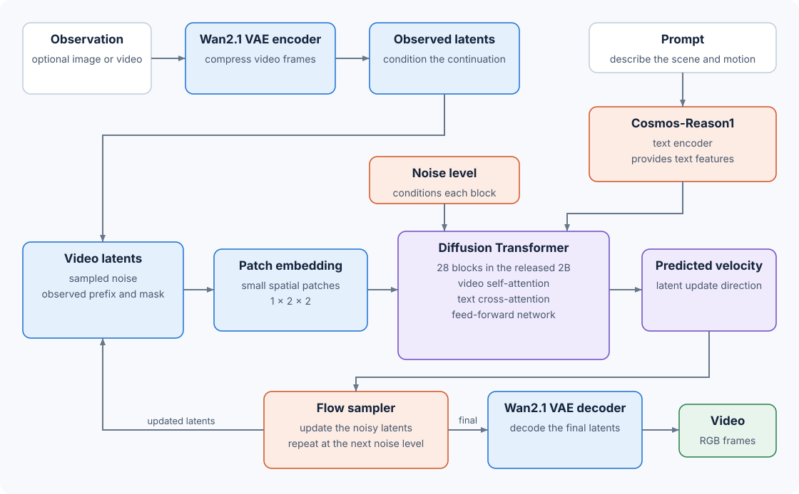

# 10.12 NVIDIA Cosmos: Generate a Future Video in Latent Space

We have used Cosmos to generate videos. Now we will look at how it turns a starting image and a prompt into a possible future. We will follow the video through the model and see what each part contributes.

This section focuses on Cosmos-Predict2.5-2B, the model behind our [Chapter 3 videos](../chapter_03/). NVIDIA describes its architecture in [_World Simulation with Video Foundation Models for Physical AI_, Section 3.2](https://arxiv.org/html/2511.00062v1#S3.SS2) and the [official Hugging Face model card](https://huggingface.co/nvidia/Cosmos-Predict2.5-2B#model-architecture). We use the released 2B configuration when discussing layer counts.

## Follow the Main Components

Suppose we provide a picture of an excavator and ask Cosmos to continue the scene as the bucket moves through the water. The picture supplies the starting scene, while the prompt describes what we want to happen.

Three learned components do most of the work:

| Component                            | What it does                                                                                                            |
| ------------------------------------ | ----------------------------------------------------------------------------------------------------------------------- |
| Wan2.1 variational autoencoder (VAE) | Compresses the observed frames into a smaller representation and later decodes the generated representation into video. |
| Text encoder, Cosmos-Reason1         | Converts the prompt into features the video model can read.                                                             |
| Diffusion Transformer (DiT)          | Uses the scene, prompt features, and current noise level to predict how the video representation should change.         |

The paper describes these components in [Section 3.2](https://arxiv.org/html/2511.00062v1#S3.SS2) and shows the text encoder and Transformer in [Figure 2](https://arxiv.org/html/2511.00062v1#S3.F2). A sampler repeatedly applies the Transformer's predictions until the video is ready to decode.



_Figure 10.12: Cosmos-Predict2.5 uses the observed scene and prompt to guide repeated updates to a noisy video latent. The VAE decoder turns the final latent into video frames. The diagram follows the released 2B model._

You can also follow these connections in the [architecture explorer](https://github.com/nahidalam/world_model_from_scratch_private/tree/main/interactive/chapter_10/architecture_explorer.html#left%3Dcosmos%26right%3Ddreamer4). Select Cosmos-Predict2.5.

## Compress the Video Before Predicting It

Processing every pixel throughout generation would be expensive. The VAE first turns the video into a smaller tensor called a latent. Its encoder compresses the frames; its decoder reconstructs frames from the latent. Wan's VAE is causal: encoding the observed prefix does not require future frames. [Wan2.1 VAE description](https://github.com/Wan-Video/Wan2.1#1-3d-variational-autoencoders).

Cosmos uses compression factors of 4 in time and 8 in each spatial dimension, followed by 1 × 2 × 2 latent patches for the Transformer. The paper's 93-frame clip becomes 24 latent frames. [Paper, Section 3.2](https://arxiv.org/html/2511.00062v1#S3.SS2).

The first frame has its own latent frame; the remaining 92 frames compress to 23. We then group each 2 × 2 spatial patch into one video token.

For a 93-frame video at 704 × 1280, we can trace the dimensions:

```
Video:        93 frames, each 704 × 1280 pixels
Latent grid:  24 frames, each  88 × 160 positions
Token grid:   24 frames, each  44 ×  80 patches
```

That gives us 84,480 video tokens per Transformer call. This is a shape calculation using the pipeline's [latent dimensions](https://github.com/huggingface/diffusers/blob/v0.39.0/src/diffusers/pipelines/cosmos/pipeline_cosmos2_5_predict.py) and the patch size above. It helps explain why generating longer or larger videos requires more computation.

## Give the Model the Prompt and Starting Scene

The two inputs enter through different paths. Cosmos-Reason1 encodes the prompt. Features from several of its layers are combined and projected to 1,024 values per text token. The video Transformer reads them through cross-attention. In this architecture, the observed image or video enters through the VAE; using Reason1's vision encoder is left for future work in the paper. [Paper, Section 3.2](https://arxiv.org/html/2511.00062v1#S3.SS2).

The observed frames anchor the beginning of the clip. At each model call, the pipeline inserts their latents into the input and supplies a mask marking those positions as known. The remaining positions contain the current noisy estimate of the future. [Hugging Face conditioning implementation](https://github.com/huggingface/diffusers/blob/v0.39.0/src/diffusers/pipelines/cosmos/pipeline_cosmos2_5_predict.py).

This supports three ways to use the model:

* Text2World: provide a prompt and generate the whole clip.
* Image2World: provide a prompt and a starting image.
* Video2World: provide a prompt and a short video prefix.

NVIDIA lists these input modes in the [model card](https://huggingface.co/nvidia/Cosmos-Predict2.5-2B#model-versions). In our excavator example, a video prefix can supply motion context as well as the appearance of the scene.

## Look Inside the Transformer

The Transformer needs to connect objects across the clip, read the prompt, and account for how much noise remains. Each block has three main operations:

1. Video self-attention lets video tokens exchange information across spatial positions and frames.
2. Text cross-attention lets those tokens read the prompt features.
3. A feed-forward network transforms the features at each token.

Before these operations, adaptive layer normalization (AdaLN) adjusts features using the current noise level. Gates control how much each branch adds to the token representation. NVIDIA describes this block structure in its [Hugging Face architecture overview](https://huggingface.co/nvidia/Cosmos-Predict2.5-2B#model-architecture) and the paper's [Figure 2](https://arxiv.org/html/2511.00062v1#S3.F2).

The model also needs to know where each token belongs. 3D rotary position embeddings (RoPE) represent its frame, row, and column. Video position and noise level carry different information: one locates the token in the clip; the other locates the current stage of generation. Video self-attention can read across the whole latent clip, including noisy future positions. [Hugging Face Transformer implementation](https://github.com/huggingface/diffusers/blob/v0.39.0/src/diffusers/models/transformers/transformer_cosmos.py).

The released 2B model uses these dimensions:

| Setting                  | Value |
| ------------------------ | ----: |
| Transformer blocks       |    28 |
| Features per video token | 2,048 |
| Attention heads          |    16 |
| Features per head        |   128 |

These values follow [NVIDIA's released network configuration](https://github.com/nvidia-cosmos/cosmos-predict2.5/blob/main/cosmos_predict2/_src/predict2/configs/video2world/defaults/net.py). The first version of the paper lists 32 blocks for the 2B model in [Table 3](https://arxiv.org/html/2511.00062v1#S3.T3); the released configuration uses 28. Our diagram and [Chapter 4 implementation](../chapter_04/) follow the release.

## Learn How the Latent Should Change

Cosmos-Predict2.5 trains with flow matching. Training mixes a clean video latent with random noise and teaches the Transformer to predict the velocity along the path between them. Here, velocity describes change in latent values. It does not measure how fast the excavator moves. [Paper, Section 3.1](https://arxiv.org/html/2511.00062v1#S3.SS1).

The output layer converts the Transformer's tokens back into a velocity tensor with the same video grid and 16 channels as the latent. This gives the sampler an update for every latent position. [Hugging Face output projection](https://github.com/huggingface/diffusers/blob/v0.39.0/src/diffusers/models/transformers/transformer_cosmos.py).

## Generate the Video Through Repeated Updates

At generation time, we start with random noise and repeatedly use the model's predictions to move toward a video:

1. Encode the prompt and any observed frames.
2. Initialize the latent video with Gaussian noise.
3. Insert the observed prefix into the model input and predict velocity.
4. Let the sampler update the latent, then repeat at the next noise level.
5. Decode the final latent into RGB frames.

The book's [Hugging Face pipeline](https://github.com/huggingface/diffusers/blob/v0.39.0/src/diffusers/pipelines/cosmos/pipeline_cosmos2_5_predict.py) uses a UniPC multistep sampler. With prompt guidance enabled, it combines predictions for the prompt and negative prompt before each update.

This explains the controls we used earlier: the seed changes the starting noise, guidance changes how the prompt predictions are combined, and sampling steps change the number of updates. Each update processes the whole clip, so a sampling step does not mean advancing one video frame.

We still need to watch the result. NVIDIA's [model limitations](https://huggingface.co/nvidia/Cosmos-Predict2.5-2B#limitations) include unstable motion and incorrect physical interactions. For our excavator, we should check whether the bucket, ground, and water behave as requested—the same checks we practiced in Chapter 3.

To build these components and trace their tensors, continue with [Chapter 4](../chapter_04/). You can also run the small CPU examples with `python scripts/chapter_10_architecture_examples.py`; the `cosmos` result checks token counts, observed-frame replacement, and a velocity update.
