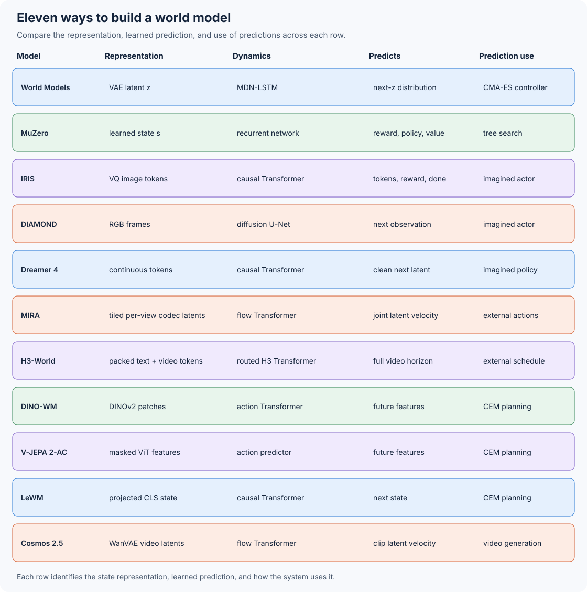

# Chapter 10: Architectures of Modern World Models

What does a world model need to predict, and how will we use its predictions? The answer shapes what the model stores, how it predicts a future, and how that future helps us choose an action. In this chapter, we will explore those choices through eleven models. We will also follow the Dreamer family across four generations to see why its architecture changed.



_Architecture map: Each row solves the prediction problem in a different space and connects that prediction to a different decision procedure._

Open the [architecture explorer](https://github.com/nahidalam/world_model_from_scratch_private/tree/main/interactive/chapter_10/architecture_explorer.html) and select two models. Compare what each model stores, predicts, and supplies to its controller or planner. These four questions will guide us through each architecture:

1. What information forms the model's state?
2. What computation advances that state?
3. What target trains the dynamics?
4. How does a prediction change an action?

## Eleven Models and the Dreamer Lineage

The table below shows how each design uses its predictions:

| Model                  | Core architecture                                                                  | Decision mechanism                                                                    |
| ---------------------- | ---------------------------------------------------------------------------------- | ------------------------------------------------------------------------------------- |
| World Models           | VAE + MDN-RNN                                                                      | Linear controller evolved with CMA-ES; fitness from real CarRacing or learned VizDoom |
| MuZero                 | Representation + recurrent dynamics + prediction networks                          | Monte Carlo tree search                                                               |
| IRIS                   | Discrete autoencoder + autoregressive Transformer                                  | Actor-critic learning in imagination                                                  |
| DIAMOND                | Action-conditioned diffusion U-Net                                                 | Actor-critic learning in generated observations                                       |
| Dreamer 4              | Causal tokenizer + shortcut-forcing Transformer                                    | Policy and value learning in imagination                                              |
| MIRA                   | Shared per-view codec + tiled latent grid + flow-matching Transformer              | External players act inside the generated world                                       |
| H3-World               | Frozen MiniMax-H3 backbone + per-latent language actions + routed attention + LoRA | External system supplies the complete action schedule                                 |
| DINO-WM                | Frozen DINOv2 patch features + dynamics Transformer                                | Test-time action-sequence optimization                                                |
| V-JEPA 2 + V-JEPA 2-AC | Masked video pretraining + frozen encoder + action-conditioned predictor           | Energy-based model-predictive control                                                 |
| LeWM                   | End-to-end ViT encoder + action-conditioned Transformer + SIGReg                   | Goal-image CEM in one compact learned state                                           |
| Cosmos-Predict2.5      | WAN2.1 causal VAE + text-conditioned diffusion Transformer                         | Generate a future video for an external consumer                                      |

Before studying Dreamer 4, we will follow the family's earlier designs in Section 10.5. This helps us understand the move from a Gaussian RSSM to categorical states, scale-robust training, and a causal video Transformer.

[Section 10.12](12-cosmos.md) studies Cosmos-Predict2.5's architecture and connects its generation controls to the videos evaluated in [Chapter 3](../chapter_03/). It can be read independently of the other architecture studies. To build its diffusion Transformer and flow sampler, continue with [Chapter 4](../chapter_04/).

## Run the Small Calculations

We will use small PyTorch calculations to see how the main ideas work. These cover mixture-density dynamics, MuZero unrolling, Dreamer's lambda returns, block-causal attention, MIRA's multiplayer tensor layout, H3-World's action routing, shortcut updates, SIGReg, planning in a representation space, and Cosmos's conditioning, patch shapes, and velocity update. Install the chapter environment, then run them:

```bash
python -m venv .venv
source .venv/bin/activate
pip install -r requirements-chapter-10.txt
pip install -e .
python scripts/chapter_10_architecture_examples.py
python -m pytest -q tests/test_architecture_examples.py
```

When you want to train or run a full model, use its linked paper and repository for the training configuration and checkpoints.

## Contents

* [10.1 World Models: Separate Vision, Memory, and Control](01-world-models.md)
* [10.2 MuZero: Learn Only What Search Uses](02-muzero.md)
* [10.3 IRIS: Predict the World as Tokens](03-iris.md)
* [10.4 DIAMOND: Denoise the Next Frame](04-diamond.md)
* [10.5 Dreamer 1 to 4: Follow the Architecture Changes](05-dreamer-lineage.md)
* [10.6 Dreamer 4: Generate and Act in One Transformer](06-dreamer-4.md)
* [10.7 MIRA: Generate Four Player Views from Joint Actions](07-mira.md)
* [10.8 H3-World: Route Language Actions to Video Latents](08-h3-world.md)
* [10.9 DINO-WM: Predict DINOv2 Features and Plan](09-dino-wm.md)
* [10.10 V-JEPA 2 and V-JEPA 2-AC: Pretrain Perception, Then Learn Actions](10-v-jepa-2-ac.md)
* [10.11 LeWM: Train the Encoder and Dynamics Together](11-lewm.md)
* [10.12 NVIDIA Cosmos: Generate a Future Video in Latent Space](12-cosmos.md)
* [10.13 Compare the Architectures](13-compare-architectures.md)
