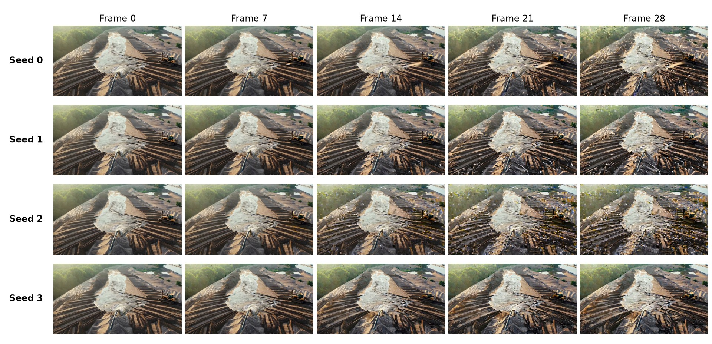

# 3.4 Evaluate Our Rollouts with VBench

We will run VBench on the four sand-mining rollouts prepared in Section 3.3.
They share the same observation, prompt, and generation settings, with a
different random seed for each one.

## The Four Rollouts



*Figure 3.2: Each row shows one rollout from its first frame to its last.*

Watch each video before looking at its scores. Track the excavator, the ground,
and the water from the first frame to the last. The
[explorer](https://nahidalam.github.io/world_model_from_scratch/interactive/chapter_03/evaluation_explorer.html#compare) lets
you compare the videos frame by frame.

## Measure Three Properties

| Dimension | What it measures | How to interpret |
|---|---|---|
| `subject_consistency` | Similarity between DINO frame features, using the first frame and neighboring frames. | Larger similarity indicates more stable visual features; inspect the subject to see what remained stable. |
| `motion_smoothness` | Agreement between intermediate video frames and frames reconstructed by an interpolation model. | Larger agreement indicates more predictable intermediate appearance. |
| `dynamic_degree` | Optical flow followed by a movement threshold. | Each video receives a Boolean movement decision; the aggregate is the fraction classified as dynamic. |

The definitions come from the official
[subject-consistency](https://github.com/Vchitect/VBench/blob/fd18b3d055cb0fc6f066ca90fe2c3c8cbb698490/vbench/subject_consistency.py),
[motion-smoothness](https://github.com/Vchitect/VBench/blob/fd18b3d055cb0fc6f066ca90fe2c3c8cbb698490/vbench/motion_smoothness.py),
and [dynamic-degree](https://github.com/Vchitect/VBench/blob/fd18b3d055cb0fc6f066ca90fe2c3c8cbb698490/vbench/dynamic_degree.py)
implementations.

## Set Up the Evaluator

Set up VBench's pretrained evaluators on a Linux CUDA machine in a separate
environment so their dependencies do not conflict with the rest of the book's
setup. VBench's installer requires a CUDA-enabled PyTorch build from its
supported CUDA range and pins
`transformers==4.33.2`.
[Installer](https://github.com/Vchitect/VBench/blob/fd18b3d055cb0fc6f066ca90fe2c3c8cbb698490/setup.py),
[dependencies](https://github.com/Vchitect/VBench/blob/fd18b3d055cb0fc6f066ca90fe2c3c8cbb698490/requirements.txt)

From the repository root, create the evaluator environment:

```bash
BOOK_ROOT="$(pwd)"
VBENCH_ROOT="$BOOK_ROOT/outputs/chapter_03/tools/VBench"
VBENCH_ENV="$BOOK_ROOT/outputs/chapter_03/envs/vbench"

mkdir -p "$BOOK_ROOT/outputs/chapter_03/tools"
sudo apt-get update
sudo apt-get install -y unzip
git clone https://github.com/Vchitect/VBench.git "$VBENCH_ROOT"
git -C "$VBENCH_ROOT" checkout fd18b3d055cb0fc6f066ca90fe2c3c8cbb698490
python3.10 -m venv "$VBENCH_ENV"
VBENCH_PY="$VBENCH_ENV/bin/python"

"$VBENCH_PY" -m pip install --upgrade pip setuptools wheel
"$VBENCH_PY" -m pip install torch==2.5.1 torchvision==0.20.1 \
  --index-url https://download.pytorch.org/whl/cu118
"$VBENCH_PY" -m pip install --no-build-isolation "$VBENCH_ROOT"

git -C "$VBENCH_ROOT" rev-parse HEAD \
  > "$BOOK_ROOT/outputs/chapter_03/vbench/evaluator_revision.txt"
"$VBENCH_PY" -m pip freeze \
  > "$BOOK_ROOT/outputs/chapter_03/vbench/evaluator_environment.txt"
```

## Run the Command

We can now evaluate the videos in the directory we prepared in Section 3.3.
The command below runs all three measurements.

```bash
VBENCH_TMP="$(mktemp -d)"
VBENCH_RAW="$BOOK_ROOT/outputs/chapter_03/vbench/raw"

"$VBENCH_PY" "$VBENCH_ROOT/evaluate.py" \
  --videos_path "$BOOK_ROOT/outputs/chapter_03/vbench/videos" \
  --mode custom_input \
  --dimension subject_consistency motion_smoothness dynamic_degree \
  --output_path "$VBENCH_TMP"
```


VBench puts colons in its timestamped filenames, which some filesystems do not support. The next block copies the results from the temporary directory into the raw-results folder, replacing colons with hyphens.


```bash
mkdir -p "$VBENCH_RAW"
for RESULT in "$VBENCH_TMP"/*.json; do
  SAFE_NAME="$(basename "$RESULT" | tr ':' '-')"
  cp "$RESULT" "$VBENCH_RAW/$SAFE_NAME"
done

# Select the result from this evaluation's temporary directory.
python - "$VBENCH_TMP" "$VBENCH_RAW" <<'PY'
import sys
from pathlib import Path

temporary, raw = map(Path, sys.argv[1:])
results = sorted(temporary.glob("*_eval_results.json"))
if len(results) != 1:
    raise SystemExit(f"Expected one result from this run, found {len(results)}")
selected = raw / results[0].name.replace(":", "-")
(raw.parent / "result_path.txt").write_text(str(selected.resolve()) + "\n")
print(selected)
PY
```

The first run downloads the evaluator checkpoints. When the evaluation
finishes, confirm that `outputs/chapter_03/vbench/raw` contains a
`*_eval_results.json` file. We save the path to this result in
`result_path.txt` so the next step can find this latest run, even if `raw` also contains
results from earlier evaluations.
[Evaluator CLI](https://github.com/Vchitect/VBench/blob/fd18b3d055cb0fc6f066ca90fe2c3c8cbb698490/evaluate.py),
[result writing](https://github.com/Vchitect/VBench/blob/fd18b3d055cb0fc6f066ca90fe2c3c8cbb698490/vbench/__init__.py)

## Create the Evaluation Report

VBench saves its scores by video filename. The command below matches
each filename to its seed in `index.json` and creates a report we can open in
the evaluation explorer.

```bash
python scripts/chapter_03_evaluate.py collect \
  --index outputs/chapter_03/vbench/index.json \
  --results "$(cat outputs/chapter_03/vbench/result_path.txt)" \
  --dimensions subject_consistency motion_smoothness dynamic_degree \
  --evaluator-revision "$(cat outputs/chapter_03/vbench/evaluator_revision.txt)" \
  --output outputs/chapter_03/report
```

The command creates:

```text
outputs/chapter_03/report/
  report.json
  scores.csv
```

The book includes the completed [report](../../../assets/chapter_03/results/vbench_report.json)
and [score table](../../../assets/chapter_03/results/vbench_scores.csv) from this
run.

View the first rows of the table:

```bash
head outputs/chapter_03/report/scores.csv
```

Each row contains a VBench dimension and score together with the rollout's
run ID, seed, generation settings, video path, and checksum.

Our run produced these scores:

| Seed | Subject consistency | Motion smoothness | Dynamic degree |
|---:|---:|---:|---:|
| 0 | 0.9555 | 0.9931 | 0 |
| 1 | 0.9508 | 0.9932 | 0 |
| 2 | 0.9071 | 0.9925 | 0 |
| 3 | 0.9422 | 0.9928 | 0 |
| Aggregate | 0.9389 | 0.9929 | 0 |

All four videos receive a dynamic-degree score of 0 because their movement falls below VBench’s threshold. Small movements may still be visible, so a zero score does not mean the video is frozen.

Open the [evaluation explorer](https://nahidalam.github.io/world_model_from_scratch/interactive/chapter_03/evaluation_explorer.html#scores).
Under **Inspect evaluator scores**, select
`outputs/chapter_03/report/report.json`, or the included
`assets/chapter_03/results/vbench_report.json` when reviewing without running
the evaluator. Choose seeds 0 and 1 as Video A and
Video B. The explorer shows their three scores side by side while you play the
two rollouts.

> **Try it yourself**
>
> 1. Compare seeds 0 and 1 in the explorer before showing their scores. Does the score ordering match your visual notes?
> 2. Compare seeds 2 and 3. Identify one visual event that a whole-video score might obscure.

## Compare the Videos with the Disagreement Map

The [disagreement map](https://nahidalam.github.io/world_model_from_scratch/interactive/chapter_02/rollout_explorer.html#disagreement)
shows where the four seed videos differ at the same frame. Bright areas look
different; dark areas look similar. The video beside the map shows seed 0,
while the map uses all four seeds.

The map starts mostly dark because all four videos share the same starting
image. At frame 20, about 1.25 seconds in, bright areas appear across the
foreground sand and machinery on the right. Open the
[four-video comparison](https://nahidalam.github.io/world_model_from_scratch/interactive/chapter_02/rollout_explorer.html#seeds)
at this frame. The blocky distortions are most noticeable in seed 2.

All four videos score around 0.993 on motion smoothness. Seed 2's
subject-consistency score is lower: 0.9071, compared with 0.9555 for seed 0.
The videos can have similar motion scores while differing in appearance.

A bright area can also come from an object moving or a texture changing
between seeds. Watch the videos to judge what those differences mean.
Export your notes and timestamps from the evaluation explorer and keep them
with the scores so someone else can check your observations.

Next, we will evaluate the supplied PAI-Bench-G videos.
