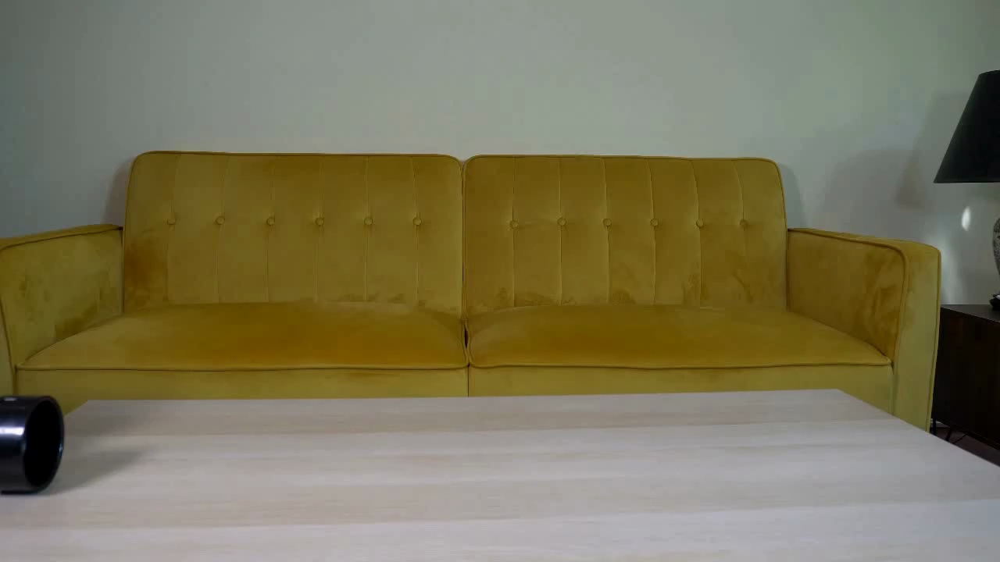

# 3.5 Evaluate with PAI-Bench-G

In this section, we will use
[PAI-Bench-G](https://arxiv.org/html/2512.01989v1#S3.SS1) to check how objects
move and interact. We will follow the [tennis-ball example](#read-the-tennis-ball-example). PAI-Bench-G provides questions for this example, including:

- Does the tennis ball emerge from the black pipe before rolling across the table?
- Does the tennis ball maintain a spherical shape as it rolls across the table?

For each example, PAI-Bench-G provides a starting image, a prompt, and
questions with expected answers.

We selected 14 examples, two from each of the seven categories. We used
Cosmos-Predict2.5 to generate videos from their images and prompts. For each
example, we used seeds 0 and 1 at guidance 7 and guidance 3. This gives us
56 videos, included in the [video gallery](../../../assets/chapter_03/pai/).

We will evaluate these Cosmos videos using Qwen2.5-VL-72B-Instruct. Qwen
watches each video and answers the benchmark's questions. We compare its
answers with the expected answers to calculate the **Domain Score**.

We will evaluate the 28 guidance-7 videos first, then repeat with guidance 3.
If you do not have a GPU, use the results included with the book.

PAI-Bench-G also measures video quality. The
[supplement at the end of this section](#supplement-measure-video-quality)
contains that workflow and its scores.

## Read the Tennis-Ball Example

The tennis-ball example is `physics_002`. This is its starting image:



Source: [the pinned PAI-Bench-G dataset](https://huggingface.co/datasets/shi-labs/physical-ai-bench-generation/blob/c36b7beb69bd7c4adcedc1431407fce98f9dfe44/condition_image/physics_002.jpg).

The [prompt](../../../assets/chapter_03/results/pai_subset_full_info.json) asks a
grey tennis ball to emerge from the black pipe. The ball should roll across
the table to the right and leave the frame. The pipe should remain in place.

The benchmark asks 18 questions about this example. Here are four, shortened
for readability. The expected answers come from the benchmark.

| Check | Question | Expected answer |
|---|---|---|
| Spatial relationship | Is the yellow sofa against the white wall? | Yes |
| Event order | Does the ball emerge from the pipe before rolling across the table? | Yes |
| Motion | Does the ball bounce off the table before rolling out of view? | No |
| Physical behavior | Does the ball deform or flatten while rolling? | No |

A correct answer can be Yes or No. For example, the ball should keep its
shape, so the expected answer to the last question is **No**.

Open the [guidance-7, seed-1 video](../../../assets/chapter_03/pai/guidance7/videos/physics_002__1.mp4).
Watch the ball and answer these questions before looking at Qwen's answers.
We will return to this video in Section 3.6.

## Download the Images, Prompts, and Questions

To evaluate each video, we need the starting image and prompt it was
generated from, along with the benchmark's questions. The `prepare` command
downloads these for all 14 examples. Run it from the book's repository
root:

```bash
BOOK_ROOT="$(pwd)"
PAI_SUBSET="$BOOK_ROOT/outputs/chapter_03/pai/subset"
PAI_VIDEOS="$BOOK_ROOT/assets/chapter_03/pai/guidance7/videos"
PAI_RECORD="$BOOK_ROOT/assets/chapter_03/results/pai_guidance7_generation.json"
PAI_RUN="$BOOK_ROOT/outputs/chapter_03/pai/guidance7"

python -m pip install huggingface_hub
python scripts/chapter_03_generate_pai.py prepare \
  --per-category 2 \
  --output "$PAI_SUBSET"
```

The command downloads a fixed version of the
[PAI-Bench-G dataset](https://huggingface.co/datasets/shi-labs/physical-ai-bench-generation/tree/c36b7beb69bd7c4adcedc1431407fce98f9dfe44)
into this directory:

```text
subset/
  subset.json
  full_info.json
  condition_image/
  vqa/
```

The files contain:

* `full_info.json`: the prompts.
* `condition_image/`: the starting images.
* `vqa/`: the benchmark questions and expected answers.
* `subset.json`: the selected examples and dataset version.

The book also includes a copy of the
[example list](../../../assets/chapter_03/results/pai_subset.json) and
[prompts](../../../assets/chapter_03/results/pai_subset_full_info.json).

The code below prints the full prompt for `physics_002` and the paths to its
starting image and questions:

```bash
python - "$PAI_SUBSET" <<'PY'
import json
import sys
from pathlib import Path

subset = Path(sys.argv[1])
examples = json.loads((subset / "full_info.json").read_text())
example = next(item for item in examples if item["video_id"] == "physics_002")

print("examples:", len(examples))
print("example:", example["video_id"])
print("image:", subset / "condition_image" / example["image_name"])
print("prompt:", example["prompt_en"])
print("questions:", subset / "vqa" / f"{example['video_id']}.json")
PY
```

Open the question file. Find the four checks above and read their full
wording.

Before running the evaluators, let's check that each of our 14 examples has a
video for seed 0 and seed 1. The command below should find 28 videos:

```bash
python - "$PAI_VIDEOS" "$PAI_RECORD" "$PAI_SUBSET" <<'PY'
import json
import sys
from pathlib import Path

videos, record, subset = map(Path, sys.argv[1:])
plan = json.loads(record.read_text())
examples = json.loads((subset / "full_info.json").read_text())
if {example["video_id"] for example in examples} != set(plan["video_ids"]):
    raise SystemExit("Downloaded examples do not match the generated videos")
expected = {
    f"{video_id}__{seed}.mp4"
    for video_id in plan["video_ids"] for seed in plan["seeds"]
}
actual = {path.name for path in videos.glob("*.mp4")}

if actual != expected:
    raise SystemExit(
        f"Missing: {sorted(expected - actual)}; extra: {sorted(actual - expected)}"
    )

print(f"Complete: {len(actual)} videos for {len(plan['video_ids'])} examples")
PY
```

The command prints:

```text
Complete: 28 videos for 14 examples
```

## Set Up the Evaluators

We will install the evaluators in their own environment so that
[PAI-Bench-G's dependencies](https://github.com/SHI-Labs/physical-ai-bench/blob/2f3b687410029b98397fbc51fa4de36bfd45627d/generation/pyproject.toml),
including vLLM and Detectron2, do not conflict with our VBench setup. Run
these commands on a Linux CUDA machine:

```bash
PAI_ROOT="$BOOK_ROOT/outputs/chapter_03/tools/physical-ai-bench"
PAI_EVALUATOR="$BOOK_ROOT/outputs/chapter_03/pai/evaluator"
mkdir -p "$BOOK_ROOT/outputs/chapter_03/tools" "$PAI_EVALUATOR" \
  "$PAI_RUN/evaluation"
python -m pip install uv
git clone https://github.com/SHI-Labs/physical-ai-bench.git "$PAI_ROOT"
git -C "$PAI_ROOT" checkout 2f3b687410029b98397fbc51fa4de36bfd45627d
cd "$PAI_ROOT/generation"

uv sync
uv pip install --python "$PAI_ROOT/generation/.venv/bin/python" \
  --no-build-isolation \
  "git+https://github.com/facebookresearch/detectron2.git@a2f4a8771ab77e8411c26b27f24f9489a28a2453"

# vLLM 0.14 rejects expert parallelism for this dense Qwen checkpoint.
sed -i \
  's/"enable_expert_parallel": True/"enable_expert_parallel": False/' \
  "$PAI_ROOT/generation/pbench/vqa_evaluation.py"

git rev-parse HEAD > "$PAI_EVALUATOR/evaluator_revision.txt"
git -C "$PAI_ROOT" diff -- generation/pbench/vqa_evaluation.py \
  > "$PAI_EVALUATOR/vqa_vllm_compat.patch"
uv pip freeze --python "$PAI_ROOT/generation/.venv/bin/python" \
  > "$PAI_EVALUATOR/evaluator_environment.txt"
cp uv.lock "$PAI_EVALUATOR/uv.lock"
"$PAI_ROOT/generation/.venv/bin/python" - "$PAI_EVALUATOR" <<'PY' \
  > "$PAI_EVALUATOR/judge_snapshot.txt"
import sys
from pathlib import Path
from huggingface_hub import snapshot_download

revision = "89c86200743eec961a297729e7990e8f2ddbc4c5"
snapshot = snapshot_download("Qwen/Qwen2.5-VL-72B-Instruct", revision=revision)
(Path(sys.argv[1]) / "judge_revision.txt").write_text(revision + "\n")
print(snapshot)
PY

cp "$PAI_EVALUATOR"/* "$PAI_RUN/evaluation/"
```

The setup downloads Qwen to answer the benchmark's questions. It also records
the model, code, and package versions so we can repeat the evaluation. The
[vLLM compatibility patch](../../../assets/chapter_03/results/pai_vqa_vllm_compat.patch)
shows the one-line change needed to run Qwen with our version of vLLM.

## Evaluate Physical and Semantic Constraints

We use `Qwen/Qwen2.5-VL-72B-Instruct` to answer the questions about our
Cosmos videos. This is the default judge in the
[pinned evaluator](https://github.com/SHI-Labs/physical-ai-bench/blob/2f3b687410029b98397fbc51fa4de36bfd45627d/generation/pbench/vqa_evaluation.py).
The [paper](https://arxiv.org/html/2512.01989v1#A1.SS3) reports
`Qwen3-VL-235B-A22B-Instruct` as its Domain Score judge. Our scores use a
different judge and only 14 examples, so they are not directly comparable to
the paper's full-benchmark results.

The command below runs `Qwen/Qwen2.5-VL-72B-Instruct` across eight GPUs:

```bash
(
  cd "$PAI_ROOT/generation" || exit 1
  uv run python evaluate_vqa.py \
    --prompt_file "$PAI_SUBSET/full_info.json" \
    --vqa_questions_dir "$PAI_SUBSET/vqa" \
    --video_dir "$PAI_VIDEOS" \
    --model_name "$(cat "$PAI_EVALUATOR/judge_snapshot.txt")" \
    --device cuda --tensor_parallel_size 8 \
    --output_dir "$PAI_RUN/evaluation/vqa"
)
```

The evaluator creates two files:

* `vqa_summary.json`: the Domain Score in `overall_accuracy`, plus scores
  for each category.
* `vqa_detailed_results.json`: each question, its expected answer, Qwen's
  answers for both seeds, and the question's accuracy.

Check that both files are present:

```bash
ls "$PAI_RUN/evaluation/vqa/vqa_summary.json" \
   "$PAI_RUN/evaluation/vqa/vqa_detailed_results.json"
```

## Read the Domain Score

Let's return to the four questions about the tennis ball. These are Qwen's
answers for the guidance-7 videos:

| Question | Expected | Qwen, seed 0 | Qwen, seed 1 | Question score |
|---|---|---|---|---:|
| Is the yellow sofa against the white wall? | Yes | Yes | Yes | 1.0 |
| Does the ball emerge from the pipe before rolling across the table? | Yes | No | No | 0.0 |
| Does the ball bounce off the table before rolling out of view? | No | Yes | Yes | 0.0 |
| Does the ball deform or flatten while rolling? | No | No | No | 1.0 |

Each answer receives **1** if it matches the expected answer and **0**
otherwise. We average the two seed scores for each question. The shape
question scores 1.0 because both answers match the expected **No**. The
bounce question scores 0.0 because both answers are **Yes**.

The full tennis-ball example has 18 questions. For both seeds, Qwen matches
14 of the 18 expected answers. The score for this example is
**14 / 18 = 0.7778**. The four rows above show only part of that calculation.

We then calculate the Domain Score across all 14 examples. Together, they
contain 111 questions. With two seeds, Qwen provides 222 answers. The
evaluator averages the scores in three steps:

1. Average the two seed scores for each question.
2. Average the question scores within each example.
3. Average the 14 example scores to get the Domain Score.

Each example gets equal weight. The guidance-7 Domain Score is **0.8824**
on a 0–1 scale. This is the result for all 14 examples, including the
tennis-ball example.

A mismatch can come from the video or from Qwen missing what happened.
In Section 3.6, we will watch the tennis-ball video to check the bounce
answer. Questions about the sofa and other scene details also contribute
to the score. A high score does not mean every action is correct.

The [detailed results](../../../assets/chapter_03/results/pai_guidance7_vqa_detailed.json)
contain the full questions, example IDs, and answers. The
[summary](../../../assets/chapter_03/results/pai_guidance7_vqa_summary.json)
also reports the average score within each category. Each category here
has only two examples. Read its questions before drawing a conclusion.

## Repeat the Evaluation with Guidance 3

Now evaluate the guidance-3 videos. Use the same 14 examples, seeds 0 and 1,
questions, and judge. All other generation settings remain the same.

```bash
PAI_VIDEOS="$BOOK_ROOT/assets/chapter_03/pai/guidance3/videos"
PAI_RECORD="$BOOK_ROOT/assets/chapter_03/results/pai_guidance3_generation.json"
PAI_RUN="$BOOK_ROOT/outputs/chapter_03/pai/guidance3"
mkdir -p "$PAI_RUN/evaluation"
cp "$PAI_EVALUATOR"/* "$PAI_RUN/evaluation/"
```

Repeat the video check, then run the question-answering evaluator with
these paths.

You can also use the guidance-3
[Domain Score summary](../../../assets/chapter_03/results/pai_guidance3_vqa_summary.json)
and [individual answers](../../../assets/chapter_03/results/pai_guidance3_vqa_detailed.json).
The Domain Score across all 14 examples is **0.8231**, compared with
**0.8824** at guidance 7.

For the tennis-ball bounce question, Qwen answers **Yes** for seed 0 and
**No** for seed 1 at guidance 3. The expected answer is **No**, so one of the
two answers matches. This question scores **(0 + 1) / 2 = 0.5**, compared
with 0.0 at guidance 7.

The tennis-ball example's score is **0.8056** at guidance 3 and **0.7778**
at guidance 7. It scores higher at guidance 3 even though the average across
all 14 examples is lower. We will inspect the videos in Section 3.6.

The [generation settings](../../../assets/chapter_03/results/pai_guidance3_generation.json)
and [run index](../../../assets/chapter_03/results/pai_guidance3_run_index.jsonl)
record how these videos were made and which files were evaluated.

## Supplement: Measure Video Quality

PAI-Bench-G also reports video quality using eight measurements adapted
from VBench and VBench++. These check clarity, consistency, motion, prompt
alignment, and similarity to the starting image. They are separate from
the Domain Score.

Use this supplement to reproduce and compare the quality scores for the
report in Section 3.7. You can also use the results linked below.

The [quality evaluator](https://github.com/SHI-Labs/physical-ai-bench/blob/2f3b687410029b98397fbc51fa4de36bfd45627d/generation/evaluate.py)
uses the environment we installed above. The loop sets the paths for each
guidance setting and scores its 28 videos:

```bash
for PAI_GUIDANCE in 7 3; do
  (
    PAI_VIDEOS="$BOOK_ROOT/assets/chapter_03/pai/guidance$PAI_GUIDANCE/videos"
    PAI_RUN="$BOOK_ROOT/outputs/chapter_03/pai/guidance$PAI_GUIDANCE"
    mkdir -p "$PAI_RUN/evaluation"
    cp "$PAI_EVALUATOR"/* "$PAI_RUN/evaluation/"
    cd "$PAI_ROOT/generation" || exit 1
    uv run python -m torch.distributed.run \
      --standalone --nproc_per_node 1 evaluate.py \
      --mode custom_input \
      --prompt_file "$PAI_SUBSET/full_info.json" \
      --custom_image_folder "$PAI_SUBSET/condition_image" \
      --dimension aesthetic_quality background_consistency imaging_quality \
        motion_smoothness overall_consistency subject_consistency \
        i2v_background i2v_subject \
      --videos_path "$PAI_VIDEOS" \
      --output_path "$PAI_RUN/evaluation/quality"
  ) || break
done
```

The evaluator saves results for individual videos and for the full set
under each run's `evaluation/quality/` directory. Find the result files with:

```bash
find "$BOOK_ROOT/outputs/chapter_03/pai" -name 'results_*.json' -print
```

Here are the aggregate scores from our guidance-7 run. All 28 videos were
scored on each dimension:

| Dimension | Aggregate |
|---|---:|
| Aesthetic quality | 0.5133 |
| Background consistency | 0.9377 |
| Imaging quality | 0.7328 |
| Motion smoothness | 0.9896 |
| Overall consistency | 0.2195 |
| Subject consistency | 0.9188 |
| Image-to-video background | 0.9710 |
| Image-to-video subject | 0.9602 |

The quality results contain the scores for each video and each
dimension: [guidance 7](../../../assets/chapter_03/results/pai_guidance7_quality.json)
and [guidance 3](../../../assets/chapter_03/results/pai_guidance3_quality.json).

### Compare Quality at Guidance 7 and Guidance 3

Use the same 14 examples and seeds 0 and 1 at both settings. Only guidance
changed; the starting images, prompts, and other generation settings stayed
the same.

First, divide each video's imaging-quality score by 100 to convert it from
0–100 to 0–1. The aggregate imaging-quality scores above already use 0–1.
The other seven measurements need no conversion. Keep the original JSON
files unchanged.

Choose one quality measurement, such as imaging quality:

1. For one example, average the scores for seeds 0 and 1 at guidance 7.
   Do the same for guidance 3.
2. Subtract the guidance-3 average from the guidance-7 average.
3. Repeat for all 14 examples, then average those differences. This gives
   each example equal weight.

Repeat for each quality measurement. Check individual examples too: an
overall improvement may hide worse results for some examples. Keep the
evaluator's aggregate scores alongside your calculations, since some
measurements may combine results differently.

For these 14 examples, the average imaging-quality score is **0.7328 at
guidance 7** and **0.7288 at guidance 3**. Guidance 7 scores slightly higher.
Watch the videos to see whether you notice a difference.

We would need more examples to see whether this pattern holds more broadly.
More seeds would show how much scores vary for the same image and prompt.
