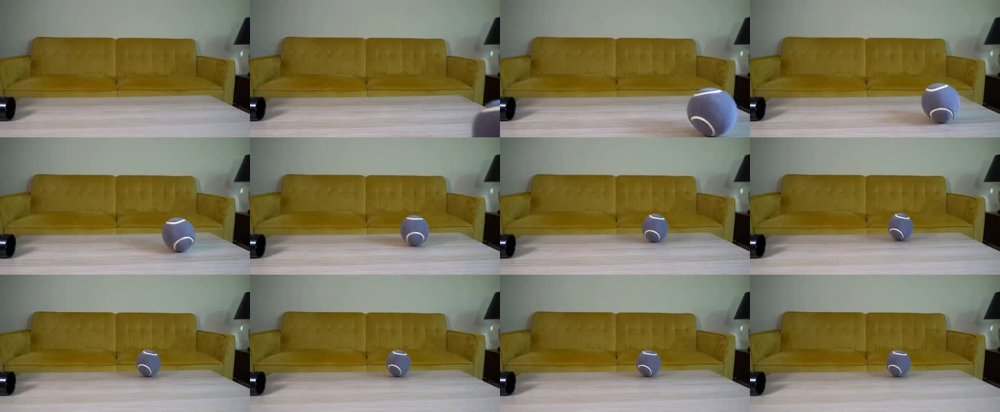

# 3.6 Interpret Results

We now have scores for our videos. Let's see whether those scores match what we notice when we watch them.

* **For the Chapter 2 sand-mining videos,** open the [evaluation explorer](https://nahidalam.github.io/world_model_from_scratch/interactive/chapter_03/evaluation_explorer.html#review) to compare the videos with their VBench scores.
* **For the 14 PAI-Bench-G scenarios from Section 3.5,** check Qwen's answers against what happens in the Cosmos videos.

## Watch the Video Behind the Score

Start with a result you want to understand:

* **High consistency, little movement:** does the movement requested in the prompt happen?
* **Smooth motion:** do objects keep their shape and appearance?
* **One seed scores much higher:** does that video look better when you watch both?

Let's look at the tennis-ball scenario, `physics_002`, from PAI-Bench-G. For the videos generated with guidance 7:

* The question asks whether the ball bounces off the coffee table before rolling out of view.
* The expected answer is **no**, but Qwen answered **yes** for both seeds.
* The seed-1 frames below show no clear bounce or exit. The ball remains on the tabletop in the last frame shown.

These frames are 0.5 seconds apart, so they may miss a brief event. Watch the [full seed-1 video](../../../assets/chapter_03/pai/guidance7/videos/physics_002__1.mp4) before deciding whether Qwen's answer is wrong. The other seeds and guidance settings are in the [video gallery](../../../assets/chapter_03/pai/).

Note what you see and include a timestamp so someone else can find it.

## Compare the Same Cases

Let's compare guidance 7 and guidance 3 for the same 14 PAI-Bench-G scenarios. We used seeds 0 and 1 at both settings. Only guidance changed; the starting images, prompts, and other generation settings stayed the same.

First, divide each video's imaging-quality score by 100. This converts it from 0–100 to the benchmark's overall 0–1 scale. The other seven quality measurements need no conversion. Keep the original JSON files unchanged.

Choose one quality measurement, such as imaging quality:

1. For one scenario, average the scores for seeds 0 and 1 at guidance 7. Do the same for guidance 3.
2. Record how much higher or lower guidance 7 scored than guidance 3.
3. Repeat for all 14 scenarios, then average those differences. This gives each scenario equal weight.

Repeat for each quality measurement. Check individual scenarios too: an overall improvement may hide worse results for some scenarios. Keep the benchmark's overall score, since it may combine the scores differently.

For these 14 scenarios, the average imaging-quality score is **0.7328 at guidance 7** and **0.7288 at guidance 3**. Guidance 7 scores slightly higher. Watch the videos to see whether you notice a difference.

We would need more scenarios to see whether this pattern holds more broadly. More seeds would show how much scores vary for the same image and prompt.

## Record How the Evaluation Was Run

To repeat the evaluation or investigate a score, keep these details:

* **Evaluator version and settings.** For the [question-answering evaluator](https://github.com/SHI-Labs/physical-ai-bench/blob/2f3b687410029b98397fbc51fa4de36bfd45627d/generation/evaluate_vqa.py), also keep the questions and Qwen's answers.
* **Videos evaluated or missing.** Record the expected and actual counts. Include unreadable videos, evaluator errors, and failed or blocked generation runs. Leaving out difficult examples can make the scores look better.
* **How videos were selected.** If you chose the best video from several attempts, record how many, how you chose, and the generation cost.

Use the benchmark's evaluation procedure when comparing with published results. Report any changes to the model, prompts, or score calculation.

## What the Disagreement Map Shows

Return to the Chapter 2 sand-mining videos. The [disagreement map](https://nahidalam.github.io/world_model_from_scratch/interactive/chapter_02/rollout_explorer.html#disagreement) shows where the four seed videos differ at the same frame.

Bright areas look different; dark areas look similar. The video beside the map shows seed 0, while the map uses all four seeds.

* **The videos start similarly, then differ.** The map starts mostly dark because all four videos share the same starting image.
* **Seed 2 shows blocky distortions.** At frame 20, about 1.25 seconds in, bright areas appear across the foreground sand and machinery on the right. In the [four-video comparison](https://nahidalam.github.io/world_model_from_scratch/interactive/chapter_02/rollout_explorer.html#seeds) at this frame, the distortions are most noticeable in seed 2.
* **Similar motion scores, different appearance.** All four videos score around 0.993 on motion smoothness. Seed 2's subject-consistency score is lower: 0.9071, compared with 0.9555 for seed 0. This is why we need both measurements.

A bright area can also come from an object moving or a texture changing between seeds. Watch the videos to judge what those differences mean.

Export your notes and timestamps from the explorer and save them with the scores. Use both to explain which settings you would choose and why.
